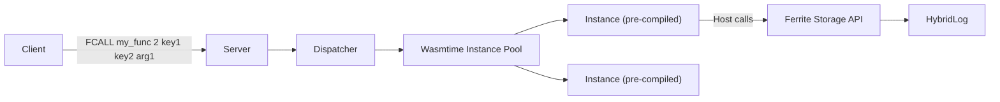

Server-side scripting has always been one of Redis's most powerful and most misused features. Today we are introducing an experimental alternative: WebAssembly user-defined functions (UDFs) in Ferrite, powered by Wasmtime.

<!-- truncate -->

## Why User-Defined Functions Matter

A key-value store is fundamentally a remote data structure. Every time your application needs to read-modify-write a value, it pays the round-trip cost twice: once to read, once to write. Multiply that by thousands of keys and you get latency budgets eaten alive by network hops.

Server-side functions solve this by moving the logic to the data. Instead of two round trips, you send one function call that executes atomically on the server. Redis has offered this through Lua scripting (`EVAL` / `EVALSHA`) since version 2.6, and later through Redis Functions in 7.0.

The problem is not the concept -- it is the runtime.

## The Case for WASM over Lua

Lua served Redis well for over a decade, but it carries limitations that matter for modern workloads:

**Sandboxing.** Lua's sandbox in Redis is ad-hoc. Dangerous functions are removed from the global table, but the boundary is fragile. CVEs related to Lua sandbox escapes have appeared more than once. WebAssembly, by design, runs in a capability-based sandbox with no access to the host system unless explicitly granted.

**Language choice.** Lua is a fine language, but teams building in Rust, Go, TypeScript, or Python should not be forced to maintain a separate Lua codebase for their server-side logic. WASM is a compilation target, not a language. You write in whatever you know and compile to `.wasm`.

**Performance.** Wasmtime compiles WASM modules to native code ahead of time. For compute-heavy UDFs -- JSON parsing, aggregation, bitwise operations -- WASM consistently outperforms interpreted Lua.

**Ecosystem.** The WASM ecosystem is growing rapidly. Libraries, tooling, and developer knowledge are broadly available and improving fast.

## Ferrite's WASM Runtime Design

Ferrite embeds [Wasmtime](https://wasmtime.dev/), the production-grade WASM runtime from the Bytecode Alliance. The integration follows a deliberate set of design principles:



**Pre-compilation.** When you register a WASM module, Ferrite compiles it to native code once and caches the artifact. Subsequent invocations skip compilation entirely.

**Instance pooling.** Each function call gets a fresh WASM instance from a pre-allocated pool. Instances are cheap (microseconds to instantiate) and fully isolated from each other.

**Host function interface.** The WASM module interacts with Ferrite through a narrow set of host-provided functions:

```rust
// Host functions available to WASM UDFs
fn ferrite_get(key_ptr: i32, key_len: i32) -> i64;
fn ferrite_set(key_ptr: i32, key_len: i32, val_ptr: i32, val_len: i32) -> i32;
fn ferrite_del(key_ptr: i32, key_len: i32) -> i32;
fn ferrite_log(level: i32, msg_ptr: i32, msg_len: i32);
```

No filesystem access. No network access. No threads. The UDF can only talk to Ferrite's key-value store through these functions.

## Writing a Custom UDF in Rust

Let us walk through a practical example: a UDF that atomically increments a counter and returns the new value only if it is below a rate limit threshold.

```rust
// rate_limit.rs -- compiled to WASM
use ferrite_udf_sdk::prelude::*;

#[ferrite_udf]
fn rate_limit(key: &str, limit: i64, window_secs: i64) -> UdfResult {
    let current: i64 = ferrite::get(key)
        .and_then(|v| v.parse().ok())
        .unwrap_or(0);

    if current >= limit {
        return UdfResult::error("rate limit exceeded");
    }

    let new_val = current + 1;
    ferrite::set(key, &new_val.to_string());

    // Set TTL to window duration if this is the first increment
    if current == 0 {
        ferrite::expire(key, window_secs);
    }

    UdfResult::ok(new_val)
}
```

Compile and register:

```bash
# Compile to WASM
cargo build --target wasm32-wasip1 --release

# Register with Ferrite
redis-cli FUNCTION LOAD WASM ./target/wasm32-wasip1/release/rate_limit.wasm

# Invoke
redis-cli FCALL rate_limit 1 api:user:42 100 60
# Returns: (integer) 1
```

The entire read-check-increment-expire sequence executes atomically on the server in a single round trip.

## Security Sandbox Model

Security is non-negotiable when executing user-provided code inside a database process. Ferrite's WASM sandbox enforces the following constraints:

| Constraint | Mechanism |
|------------|-----------|
| No filesystem access | WASI capabilities not granted |
| No network access | No socket host functions |
| Memory limit per instance | Wasmtime linear memory cap (default: 16 MB) |
| CPU time limit | Fuel-based metering (default: 1B instructions) |
| No shared state between calls | Fresh instance per invocation |
| No ambient authority | Capability-based host function access |

If a UDF exceeds its fuel budget, Wasmtime traps the execution and Ferrite returns an error to the client. The server process is never at risk.

## Performance: WASM vs Native vs Lua

We benchmarked three implementations of the same JSON-parse-and-aggregate function across runtimes. The function parses a JSON string stored in a key, sums a numeric field across 100 array elements, and writes the result.

| Runtime | Ops/sec | P50 latency | P99 latency |
|---------|---------|-------------|-------------|
| Native Rust (baseline) | 820K | 1.1 us | 2.4 us |
| WASM (Wasmtime, AOT) | 610K | 1.5 us | 3.1 us |
| Lua 5.4 (interpreted) | 185K | 5.0 us | 12.3 us |

WASM delivers roughly 75% of native performance while maintaining full sandboxing. Compared to Lua, WASM is 3.3x faster for this compute-bound workload. For simple key lookups where the bottleneck is I/O rather than computation, the difference narrows, but WASM never falls behind Lua.

The overhead of WASM instance creation from the pre-compiled module is approximately 4 microseconds, which is amortized over the function execution time.

## Compatibility with Redis Functions

Ferrite's WASM UDFs use the same client-facing protocol as Redis Functions. You register modules with `FUNCTION LOAD`, invoke them with `FCALL`, and list them with `FUNCTION LIST`. Existing Redis client libraries that support the Functions API work without modification.

The difference is the runtime: where Redis accepts Lua, Ferrite accepts both Lua (for compatibility) and WASM (for performance and security).

## Current Limitations

This feature ships behind the `wasm` feature flag and is marked experimental. Known limitations we are working on:

- **No async host functions yet.** Cold-tier reads inside a UDF block the WASM instance until the I/O completes. We plan to add async suspension support using Wasmtime's async fuel API.
- **Limited SDK languages.** The `ferrite-udf-sdk` currently supports Rust and C. AssemblyScript and Go (TinyGo) support is in progress.
- **No module-to-module calls.** Each WASM module is isolated. Shared library functionality requires duplicating code across modules for now.

## Try It Out

Enable the feature and build from source:

```bash
cargo build --release --features wasm
```

Check out the [WASM UDF guide](/docs/extensibility/wasm-functions) for a full walkthrough, including the SDK setup, debugging tips, and more examples.

We want your feedback. This is an experimental feature, and the API surface is still evolving. Open an issue on [GitHub](https://github.com/ferrite-rs/ferrite) or join the discussion on [Discord](https://discord.gg/ferrite).

---

*The speed of memory, the capacity of disk, the economics of cloud.*
