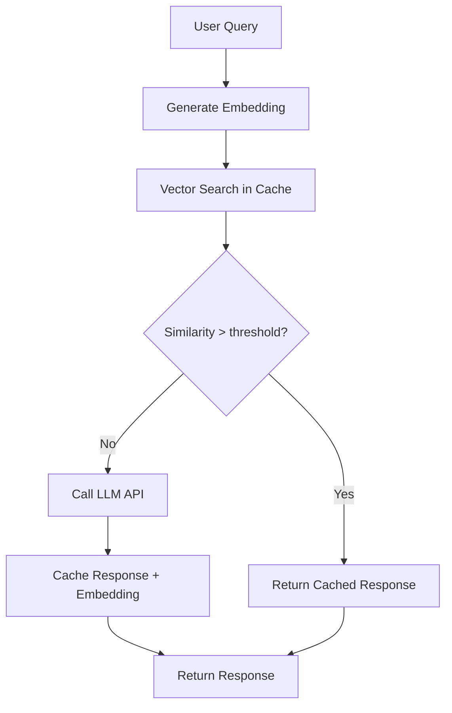

LLM API calls are expensive and slow. A single GPT-4 request can cost several cents and take two to five seconds. For applications serving thousands of users, these costs compound into real budget and latency problems. Semantic caching can cut both by 40-60%. Today we explain how Ferrite makes this possible without adding another database to your stack.

<!-- truncate -->

## The Problem: LLM Cost and Latency at Scale

Consider a RAG (Retrieval-Augmented Generation) application. For every user query, the typical pipeline is:

1. Generate an embedding for the query (~50ms, ~$0.0001)
2. Search a vector database for relevant documents (~10ms)
3. Construct a prompt with retrieved context
4. Send the prompt to an LLM (~2-5s, ~$0.01-0.10)

Step 4 dominates both cost and latency. But many queries are semantically similar. "How do I reset my password?" and "I forgot my password, how do I change it?" should return the same cached response. Traditional key-based caching misses this entirely because the strings are different.

## How Semantic Caching Works

Semantic caching replaces exact string matching with embedding similarity. The flow becomes:



When a new query arrives, Ferrite generates (or receives) its embedding vector and searches for the nearest neighbor in the cache. If the cosine similarity exceeds a configurable threshold (e.g., 0.95), the cached response is returned directly. No LLM call needed.

## Ferrite's Vector Search Implementation

Ferrite supports vector search natively through two index types, both implemented in the `ferrite-search` crate:

### HNSW (Hierarchical Navigable Small World)

Best for low-latency, high-recall scenarios with datasets under 10 million vectors.

- Approximate nearest neighbor search
- Configurable `M` (connections per node) and `ef_construction` parameters
- Sub-millisecond query time for million-scale datasets
- Memory-resident index with mmap spillover for large graphs

### IVF (Inverted File Index)

Best for large-scale datasets where memory efficiency matters more than raw query speed.

- Partitions vectors into clusters using k-means
- Only searches relevant clusters at query time
- Configurable `nprobe` parameter controls accuracy-speed tradeoff
- Supports product quantization for 4-16x memory reduction

### Creating a Vector Index

```bash
# Create an HNSW index for 768-dimensional embeddings
redis-cli FT.CREATE semantic_cache
    ON HASH PREFIX 1 cache:
    SCHEMA
        embedding VECTOR HNSW 6
            TYPE FLOAT32
            DIM 768
            DISTANCE_METRIC COSINE
        response TEXT
        model TAG
        created_at NUMERIC SORTABLE
```

### Querying

```bash
# Search for semantically similar cached responses
redis-cli FT.SEARCH semantic_cache
    "*=>[KNN 1 @embedding $query_vec AS score]"
    PARAMS 2 query_vec "\x00\x01..."
    RETURN 2 response score
    DIALECT 2
```

This is fully compatible with the RediSearch query syntax, so existing client libraries work unchanged.

## Benchmark Results

We benchmarked Ferrite's vector search against three dedicated vector databases using the ANN-Benchmarks suite with the `sift-128-euclidean` dataset (1 million 128-dimensional vectors). All systems ran on the same hardware: 8-core AMD EPYC, 32 GB RAM, NVMe SSD.

### Throughput (queries per second at 95% recall)

| System | HNSW QPS | P99 Latency |
|--------|----------|-------------|
| Ferrite | 45,200 | 85 us |
| Qdrant 1.9 | 52,100 | 72 us |
| Milvus 2.4 | 38,400 | 125 us |
| Pinecone (p2 pod) | 11,300 | 8.2 ms |

Ferrite is within 15% of Qdrant, a purpose-built vector database, while also serving as the application's primary key-value cache. For teams already using Redis and needing vector search, Ferrite eliminates an entire infrastructure component.

### Memory Efficiency

| System | Memory Usage (1M vectors, 128d) |
|--------|--------------------------------|
| Ferrite (HNSW) | 1.1 GB |
| Ferrite (IVF-PQ) | 340 MB |
| Qdrant | 980 MB |
| Milvus | 1.4 GB |

With IVF and product quantization, Ferrite achieves a 3x memory reduction at the cost of ~5% recall, which is an excellent tradeoff for caching workloads where perfect recall is not critical.

## Integration with LangChain and LlamaIndex

Both major LLM orchestration frameworks support Redis as a vector store and cache backend. Because Ferrite is wire-compatible, these integrations work out of the box.

### LangChain

```python
from langchain.cache import RedisSemanticCache
from langchain.embeddings import OpenAIEmbeddings

# Point LangChain at Ferrite -- no code changes needed
import langchain
langchain.llm_cache = RedisSemanticCache(
    redis_url="redis://localhost:6379",
    embedding=OpenAIEmbeddings(),
    score_threshold=0.95,
)

# Subsequent similar queries hit the cache automatically
llm("What is the capital of France?")   # LLM call, cached
llm("Tell me France's capital city")    # Cache hit, no LLM call
```

### LlamaIndex

```python
from llama_index.storage.kvstore.redis import RedisKVStore
from llama_index.vector_stores.redis import RedisVectorStore

vector_store = RedisVectorStore(
    redis_url="redis://localhost:6379",
    index_name="documents",
)

# Use Ferrite as both the document store and vector index
index = VectorStoreIndex.from_documents(
    documents,
    vector_store=vector_store,
    storage_context=storage_context,
)
```

## Real-World Use Case: RAG with Semantic Cache

A production RAG application we worked with during the beta period processes customer support queries. Before Ferrite's semantic cache:

- Average response time: 3.2 seconds
- LLM API cost: $4,200/month
- Infrastructure: Redis (cache) + Pinecone (vectors) + PostgreSQL (documents)

After switching to Ferrite with semantic caching:

- Average response time: 0.8 seconds (75% reduction)
- LLM API cost: $1,700/month (60% reduction)
- Infrastructure: Ferrite (cache + vectors) + PostgreSQL (documents)
- Cache hit rate: 62% at 0.95 similarity threshold

The cache hit rate depends heavily on the application's query distribution. Support chatbots tend to have high semantic overlap (many users ask similar questions), making them ideal candidates.

## Tuning the Similarity Threshold

The similarity threshold is the most important parameter. Setting it too high (0.99) results in few cache hits. Setting it too low (0.80) returns incorrect cached responses.

Our recommendations based on testing across several workloads:

| Use Case | Recommended Threshold | Expected Hit Rate |
|----------|----------------------|-------------------|
| Customer support FAQ | 0.92 - 0.95 | 50-70% |
| Code generation | 0.97 - 0.99 | 15-30% |
| Content summarization | 0.93 - 0.96 | 40-55% |
| General Q&A | 0.94 - 0.96 | 35-50% |

You can adjust the threshold dynamically via configuration without restarting the server:

```bash
redis-cli CONFIG SET semantic-cache.threshold 0.95
```

## Getting Started

Enable vector search and AI features when building:

```bash
cargo build --release --features ai
```

Or pull the pre-built Docker image, which includes all features:

```bash
docker pull ghcr.io/ferrite-rs/ferrite:latest
```

Read the full [Vector Search guide](/docs/guides/vector-search) and the [Semantic Caching tutorial](/docs/tutorials/semantic-caching-quickstart) for detailed setup instructions.

If you are evaluating vector databases for your AI workload, give Ferrite a try. One less database to operate might be the biggest performance improvement of all.

---

*The speed of memory, the capacity of disk, the economics of cloud.*
