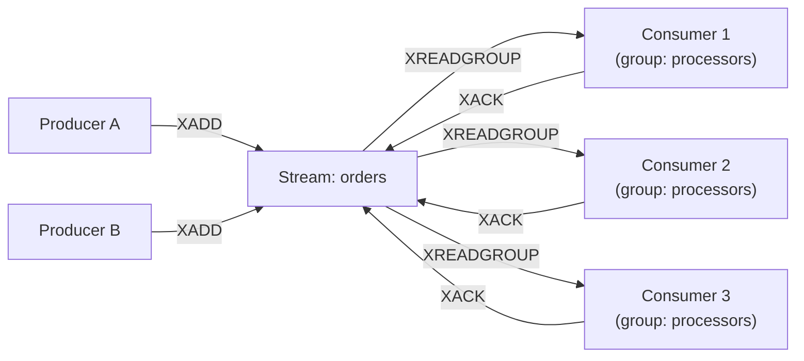
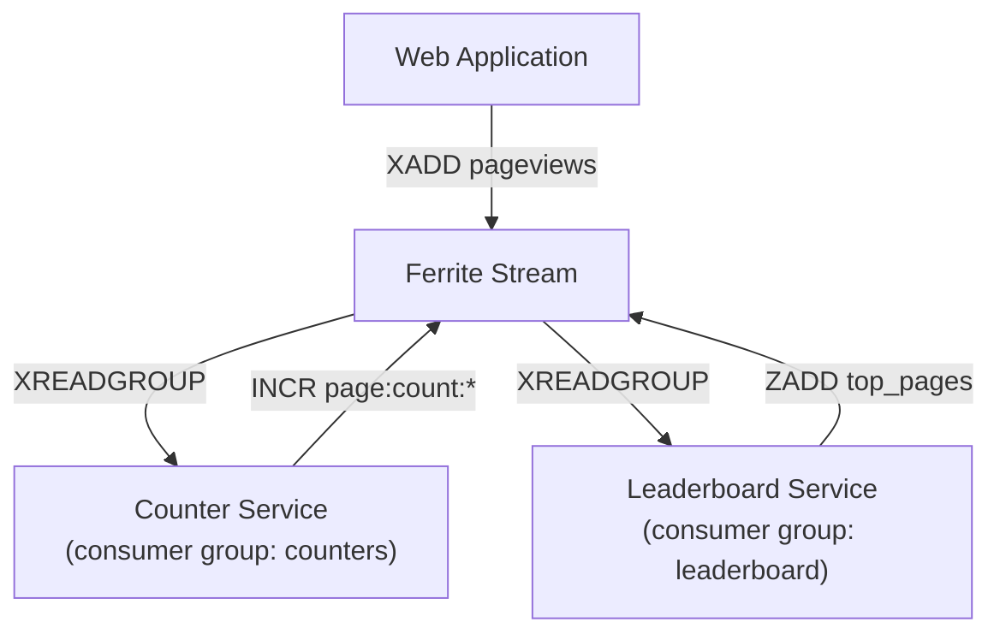

Event-driven architecture has become the default for building scalable, decoupled systems. But not every event pipeline needs the operational overhead of a full Kafka cluster. Ferrite Streams brings Redis-compatible stream processing with the performance and durability guarantees that production workloads demand.

<!-- truncate -->

## Redis Streams Compatibility

Ferrite implements the full Redis Streams command set: `XADD`, `XREAD`, `XRANGE`, `XLEN`, `XTRIM`, `XDEL`, `XINFO`, and the consumer group commands `XGROUP`, `XREADGROUP`, `XACK`, `XCLAIM`, and `XPENDING`. If your application uses Redis Streams today, it works with Ferrite without code changes.

What Ferrite adds on top of the Redis protocol:

- **Tiered stream storage.** Old stream entries automatically migrate from memory to mmap to disk, so streams can grow far beyond available RAM without manual trimming.
- **Persistent consumer offsets.** Consumer group state survives server restarts, not just failovers.
- **Backpressure signaling.** Producers receive backpressure when consumers fall too far behind, preventing unbounded memory growth.

## Consumer Groups for Reliable Processing

Consumer groups are the key abstraction for building reliable, scalable event processors. Multiple consumers in a group divide the work, and each message is delivered to exactly one consumer in the group.



### Setting Up a Consumer Group

```bash
# Create a stream and consumer group
redis-cli XGROUP CREATE orders processors $ MKSTREAM

# Producer: add events
redis-cli XADD orders '*' \
    event_type "order.created" \
    order_id "ord-12345" \
    amount "99.99" \
    customer_id "cust-789"

# Consumer 1: read and process
redis-cli XREADGROUP GROUP processors consumer-1 COUNT 10 BLOCK 5000 STREAMS orders >

# After processing, acknowledge
redis-cli XACK orders processors 1697000000000-0
```

### Handling Failures

When a consumer crashes without acknowledging messages, those messages enter the Pending Entries List (PEL). Another consumer can claim them after a timeout:

```bash
# Check for pending messages older than 60 seconds
redis-cli XPENDING orders processors - + 10

# Claim stale messages for reprocessing
redis-cli XCLAIM orders processors consumer-2 60000 1697000000000-0
```

Ferrite tracks the delivery count for each pending message. After a configurable number of failed deliveries, messages can be routed to a dead-letter stream for manual inspection:

```bash
# Configure dead-letter routing (Ferrite extension)
redis-cli XGROUP SETDLQ orders processors dead_letters MAX_RETRIES 3
```

## Building a Real-Time Analytics Pipeline

Let us walk through a concrete example: a real-time analytics pipeline that tracks page views, computes per-page counters, and maintains a rolling top-10 leaderboard.

### Architecture



### Producer (Node.js)

```javascript
import Redis from "ioredis";

const redis = new Redis(6379, "localhost");

async function trackPageView(userId, pageUrl, timestamp) {
  await redis.xadd(
    "pageviews",
    "*",
    "user_id", userId,
    "page_url", pageUrl,
    "timestamp", timestamp.toISOString(),
    "user_agent", "Mozilla/5.0..."
  );
}
```

### Counter Consumer (Python)

```python
import redis

r = redis.Redis(host='localhost', port=6379)

# Create consumer group (idempotent)
try:
    r.xgroup_create('pageviews', 'counters', id='0', mkstream=True)
except redis.ResponseError:
    pass  # Group already exists

while True:
    messages = r.xreadgroup(
        'counters', 'counter-1',
        {'pageviews': '>'},
        count=100,
        block=5000,
    )

    for stream, entries in messages:
        pipe = r.pipeline()
        for msg_id, fields in entries:
            page_url = fields[b'page_url'].decode()
            pipe.incr(f'page:count:{page_url}')
            pipe.xack('pageviews', 'counters', msg_id)
        pipe.execute()
```

### Leaderboard Consumer (Rust)

```rust
use redis::AsyncCommands;

async fn run_leaderboard(client: redis::Client) -> anyhow::Result<()> {
    let mut con = client.get_multiplexed_async_connection().await?;

    loop {
        let result: Vec<(String, Vec<(String, Vec<(String, String)>)>)> =
            redis::cmd("XREADGROUP")
                .arg("GROUP").arg("leaderboard").arg("lb-1")
                .arg("COUNT").arg(100)
                .arg("BLOCK").arg(5000)
                .arg("STREAMS").arg("pageviews").arg(">")
                .query_async(&mut con)
                .await?;

        for (_stream, entries) in &result {
            for (msg_id, fields) in entries {
                let page_url = fields.iter()
                    .find(|(k, _)| k == "page_url")
                    .map(|(_, v)| v.as_str())
                    .unwrap_or_default();

                // Increment score in sorted set
                con.zincr("top_pages", page_url, 1.0).await?;

                // Trim to top 10
                con.zremrangebyrank("top_pages", 0, -11i64).await?;

                // Acknowledge
                con.xack("pageviews", "leaderboard", &[msg_id]).await?;
            }
        }
    }
}
```

Two independent consumer groups process the same stream for different purposes. Each group maintains its own position and acknowledgment state. Adding a third consumer group (e.g., for anomaly detection) requires zero changes to existing consumers.

## Ferrite Streams vs Kafka: When to Use What

Kafka is the gold standard for event streaming at massive scale. Ferrite Streams is not a Kafka replacement. Instead, it fills a specific niche: lightweight, low-latency event processing where operational simplicity matters more than infinite horizontal scale.

| Dimension | Ferrite Streams | Apache Kafka |
|-----------|----------------|--------------|
| Setup complexity | Single binary, zero config | ZooKeeper/KRaft + brokers |
| Message ordering | Per-stream FIFO | Per-partition FIFO |
| Throughput (single node) | 1.2M msgs/sec | 800K msgs/sec |
| Latency (P99) | 0.3 ms | 2-5 ms |
| Max consumers per group | Practical limit ~100 | Thousands |
| Message retention | Tiered (memory/disk), TTL or size based | Disk, time or size based |
| Replayability | Full replay with XRANGE | Full replay with offset seek |
| Multi-datacenter | Replication (planned) | MirrorMaker / Confluent Replicator |
| Ideal message size | < 1 MB | < 1 MB (configurable) |

### Use Ferrite Streams when:

- You already run Ferrite or Redis for caching
- You need low-latency, single-digit millisecond event delivery
- Your pipeline has fewer than ~50 consumer instances
- You want one fewer infrastructure component to operate

### Use Kafka when:

- You need multi-datacenter replication today
- Your pipeline processes millions of events per second across many partitions
- You need the Kafka Connect ecosystem for data integration
- You need exactly-once semantics across multiple topics

## Performance: Throughput and Latency

Benchmarked on a single node (8-core AMD EPYC, 32 GB RAM, NVMe SSD), 256-byte messages:

### Producer Throughput

| Configuration | Ferrite | Redis 7.2 |
|---------------|---------|-----------|
| Single producer | 1.2M msgs/sec | 890K msgs/sec |
| 8 concurrent producers | 4.1M msgs/sec | 2.8M msgs/sec |

### Consumer Latency (XREADGROUP, batch size 100)

| Percentile | Ferrite | Redis 7.2 |
|------------|---------|-----------|
| P50 | 0.12 ms | 0.15 ms |
| P99 | 0.31 ms | 0.48 ms |
| P99.9 | 0.85 ms | 2.1 ms |

Ferrite's advantage at P99.9 comes from its epoch-based memory management. Redis's jemalloc allocator occasionally triggers compaction that causes latency spikes. Ferrite's append-only log avoids this entirely.

## Getting Started

Ferrite Streams are available in the default build with no additional feature flags:

```bash
cargo build --release
```

See the [Streams guide](/docs/event-driven/streams) for detailed documentation, including patterns for exactly-once processing, stream partitioning, and monitoring consumer group lag.

Join us on [Discord](https://discord.gg/ferrite) to share your event-driven architecture patterns and help shape the roadmap for Ferrite Streams.

---

*The speed of memory, the capacity of disk, the economics of cloud.*
