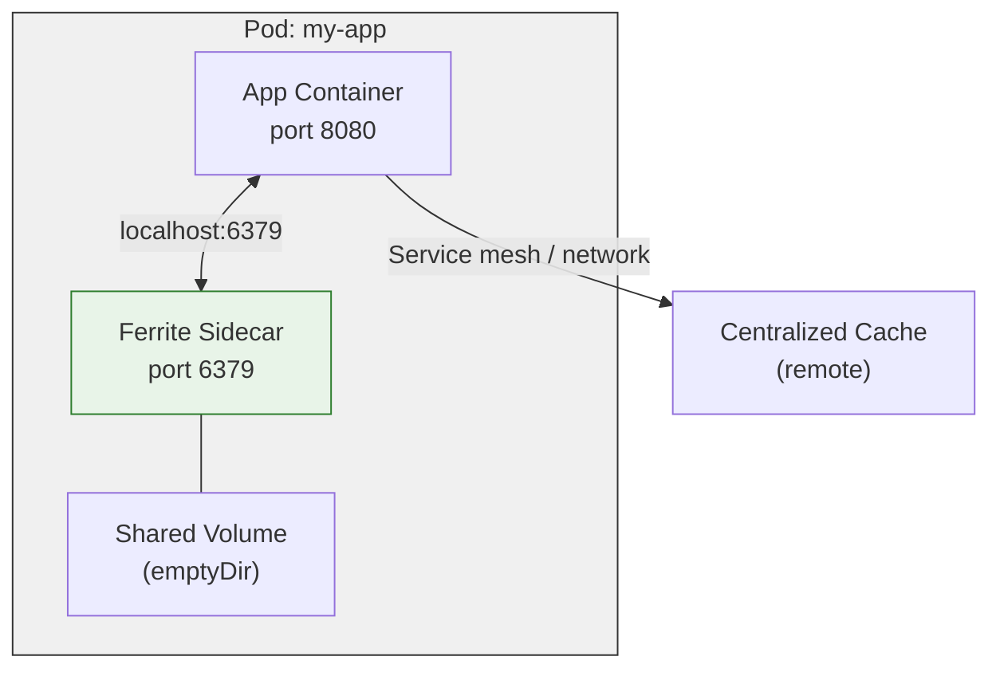

Every network hop adds latency. When your application talks to a centralized Redis cluster, each cache lookup crosses the pod network, potentially hitting multiple hops through a service mesh. For latency-sensitive workloads, this overhead dominates the total request time. Deploying Ferrite as a sidecar container eliminates the network entirely and brings cache latency down to sub-millisecond P99.

<!-- truncate -->

## The Sidecar Pattern for Caching

A sidecar is a container that runs alongside your application container in the same Kubernetes pod. Containers in a pod share the same network namespace, meaning they communicate over `localhost` with no network traversal.



The sidecar pattern is not new. Envoy and Istio popularized it for service mesh proxies. The same principle applies to caching: co-locate the cache with the consumer to eliminate the dominant latency contributor.

## Why Co-Located Cache Beats Network Cache

We measured cache read latency across three deployment topologies on a GKE cluster (e2-standard-8 nodes, single availability zone):

| Topology | P50 | P99 | P99.9 |
|----------|-----|-----|-------|
| Ferrite sidecar (localhost) | 0.04 ms | 0.09 ms | 0.18 ms |
| Ferrite in same AZ (ClusterIP) | 0.21 ms | 0.48 ms | 1.2 ms |
| Ferrite cross-AZ (ClusterIP) | 0.35 ms | 1.1 ms | 3.8 ms |
| ElastiCache Redis (VPC peering) | 0.42 ms | 1.4 ms | 4.5 ms |

The sidecar topology delivers a 5x improvement at P99 and a 6.7x improvement at P99.9 compared to same-AZ network access. At the tail, the difference is even more dramatic because network jitter -- TCP retransmits, kernel scheduling delays, service mesh proxy overhead -- is eliminated entirely.

For applications that perform multiple cache lookups per request (e.g., session validation, feature flags, rate limiting, user preferences), the savings compound. A request that makes 5 cache lookups saves 2 ms at P99 with the sidecar pattern.

## Ferrite's Sidecar Helm Chart

The `ferrite-ops` repository includes a Helm chart specifically designed for sidecar deployments. It injects a Ferrite container into your existing pod spec with sensible defaults for resource limits, health checks, and persistence.

### Basic Deployment

Add the sidecar to your application's Helm values:

```yaml
# values.yaml
ferriteSidecar:
  enabled: true
  image:
    repository: ghcr.io/ferrite-rs/ferrite
    tag: "latest"
  resources:
    requests:
      memory: "128Mi"
      cpu: "100m"
    limits:
      memory: "512Mi"
      cpu: "500m"
  config:
    maxmemory: "256mb"
    maxmemory-policy: "allkeys-lru"
    save: ""  # Disable RDB persistence for pure cache
  persistence:
    enabled: false  # Pure cache, no durability needed
  metrics:
    enabled: true
    port: 9121
```

The resulting pod spec includes both your application and the Ferrite sidecar:

```yaml
# Generated pod spec (simplified)
apiVersion: v1
kind: Pod
spec:
  containers:
    - name: my-app
      image: my-app:latest
      env:
        - name: REDIS_URL
          value: "redis://localhost:6379"

    - name: ferrite
      image: ghcr.io/ferrite-rs/ferrite:latest
      ports:
        - containerPort: 6379
          name: ferrite
      resources:
        requests:
          memory: "128Mi"
          cpu: "100m"
        limits:
          memory: "512Mi"
          cpu: "500m"
      readinessProbe:
        tcpSocket:
          port: 6379
        initialDelaySeconds: 2
        periodSeconds: 5
      livenessProbe:
        exec:
          command: ["ferrite-cli", "ping"]
        initialDelaySeconds: 5
        periodSeconds: 10
```

Your application connects to `localhost:6379` instead of a remote service endpoint. No client library changes are needed.

## Auto-Injection Webhook

For organizations that want sidecar injection without modifying every application's Helm chart, Ferrite provides a mutating admission webhook. Annotate your namespace or deployment, and the webhook automatically injects the sidecar container.

### Installing the Webhook

```bash
# Install the Ferrite sidecar injector
helm install ferrite-injector ferrite-ops/charts/ferrite-injector \
  --namespace ferrite-system \
  --create-namespace \
  --set webhook.failurePolicy=Ignore
```

### Enabling Injection

```yaml
# Annotate a namespace for auto-injection
apiVersion: v1
kind: Namespace
metadata:
  name: my-app
  labels:
    ferrite-sidecar-injection: enabled
```

Or annotate individual deployments:

```yaml
apiVersion: apps/v1
kind: Deployment
metadata:
  name: my-app
  annotations:
    ferrite.dev/inject-sidecar: "true"
    ferrite.dev/sidecar-memory: "256Mi"
    ferrite.dev/sidecar-maxmemory: "200mb"
```

The webhook reads annotation values to customize the sidecar's resource limits and configuration. Pods without the annotation are left untouched.

## When Sidecar Caching Makes Sense

The sidecar pattern is not universally superior to centralized caching. Each topology has its strengths:

### Use a sidecar when:

- **Latency is critical.** Sub-millisecond P99 is required for cache hits.
- **Cache data is local to the pod.** Session state, request-scoped caches, computed results that are specific to the application instance.
- **Cache misses are acceptable.** A cold-start pod has an empty cache. If your application can tolerate cache warming time, the sidecar works well.
- **Data duplication is acceptable.** Each pod has its own cache, so the same key may be cached in multiple pods.

### Use centralized cache when:

- **Cache consistency matters.** A single write must invalidate all readers immediately.
- **Cache capacity is large.** A 50 GB shared cache is more efficient than 50 pods each with 1 GB.
- **Cross-service cache sharing.** Multiple services need to read the same cached data.

A common hybrid pattern uses both: a sidecar for hot, latency-critical lookups (session tokens, feature flags) and a centralized Ferrite cluster for shared, consistency-sensitive data (user profiles, inventory counts).

## Production Deployment Guide

### Resource Sizing

For pure caching workloads, size the sidecar based on your working set:

| Working Set Size | Memory Request | Memory Limit | CPU Request |
|-----------------|---------------|--------------|-------------|
| < 50 MB | 64 Mi | 128 Mi | 50m |
| 50 - 200 MB | 128 Mi | 384 Mi | 100m |
| 200 MB - 1 GB | 384 Mi | 1.2 Gi | 200m |
| 1 - 4 GB | 1 Gi | 5 Gi | 500m |

Set `maxmemory` to 80% of the memory limit to leave headroom for Ferrite's internal overhead (connection buffers, command processing).

### Health Checks

The Helm chart configures both readiness and liveness probes by default. The readiness probe ensures traffic is not routed to the pod until Ferrite is accepting connections. The liveness probe detects deadlocks or hangs and triggers a container restart.

### Monitoring

Each sidecar exposes Prometheus metrics on a configurable port. Use the following `ServiceMonitor` to scrape all sidecars:

```yaml
apiVersion: monitoring.coreos.com/v1
kind: ServiceMonitor
metadata:
  name: ferrite-sidecar
spec:
  selector:
    matchLabels:
      ferrite-sidecar: "true"
  endpoints:
    - port: ferrite-metrics
      interval: 15s
```

The `ferrite-ops` repository includes a Grafana dashboard designed for sidecar deployments, showing per-pod cache hit rates, memory usage, and command latency distributions.

### Graceful Shutdown

Ferrite handles `SIGTERM` gracefully, draining active connections before exiting. Set the `terminationGracePeriodSeconds` on the pod to at least 10 seconds to allow in-flight commands to complete.

## Migrating from Centralized Cache

If you are currently using a centralized Redis or Ferrite deployment and want to move specific workloads to the sidecar pattern:

1. **Identify local-only cache keys.** Keys that are written and read by the same service instance are ideal candidates.
2. **Update connection configuration.** Point the application at `localhost:6379` for sidecar-eligible keys.
3. **Deploy with both.** Run the sidecar alongside your existing centralized cache during the transition. Route sidecar-eligible keys to localhost and everything else to the central cluster.
4. **Monitor and tune.** Watch hit rates and latency on the sidecar. Adjust `maxmemory` and eviction policy based on observed working set size.

## Get Started

Install the sidecar Helm chart from the `ferrite-ops` repository:

```bash
helm repo add ferrite https://charts.ferrite.dev
helm install ferrite-sidecar ferrite/ferrite-sidecar -f values.yaml
```

Read the full [Kubernetes Sidecar guide](/docs/deployment/kubernetes-sidecar) for advanced configuration, including TLS between sidecar and application, persistent sidecars for durable caching, and multi-container init ordering.

Have questions or want to share your sidecar deployment experience? Join us on [Discord](https://discord.gg/ferrite) or open a discussion on [GitHub](https://github.com/ferrite-rs/ferrite/discussions).

---

*The speed of memory, the capacity of disk, the economics of cloud.*
