:::info Beta Feature
This feature is in **beta**. It is feature-complete but still undergoing testing. APIs may change in minor ways before stabilization.
:::

# Clustering

Ferrite supports Redis Cluster-compatible sharding with 16384 hash slots.

## Architecture

```mermaid
flowchart LR
    subgraph Cluster["Ferrite Cluster"]
        subgraph NodeA["Node A"]
            A["🟢 Primary<br/>Slots: 0-5460"]
            AR["🔵 Replica"]
        end
        subgraph NodeB["Node B"]
            B["🟢 Primary<br/>Slots: 5461-10922"]
            BR["🔵 Replica"]
        end
        subgraph NodeC["Node C"]
            C["🟢 Primary<br/>Slots: 10923-16383"]
            CR["🔵 Replica"]
        end
    end

    A -.->|replicates| BR
    B -.->|replicates| CR
    C -.->|replicates| AR

    style A fill:#27ae60,stroke:#1e8449,color:#fff
    style B fill:#27ae60,stroke:#1e8449,color:#fff
    style C fill:#27ae60,stroke:#1e8449,color:#fff
    style AR fill:#3498db,stroke:#2980b9,color:#fff
    style BR fill:#3498db,stroke:#2980b9,color:#fff
    style CR fill:#3498db,stroke:#2980b9,color:#fff
```



## Setting Up a Cluster

### 1. Start Cluster Nodes

Start each node with cluster mode enabled:

```bash
# Node 1
./ferrite --config ferrite-7000.toml

# Node 2
./ferrite --config ferrite-7001.toml

# Node 3
./ferrite --config ferrite-7002.toml
```

Or with config files:

```toml
# ferrite-7000.toml
[server]
port = 7000

[cluster]
enabled = true
node_addr = "127.0.0.1:7000"
bus_port_offset = 10000
```

### 2. Create the Cluster

Use redis-cli to create the cluster:

```bash
redis-cli --cluster create \
    127.0.0.1:7000 \
    127.0.0.1:7001 \
    127.0.0.1:7002 \
    --cluster-replicas 0
```

With replicas (6 nodes total, 3 primary + 3 replica):

```bash
redis-cli --cluster create \
    127.0.0.1:7000 127.0.0.1:7001 127.0.0.1:7002 \
    127.0.0.1:7003 127.0.0.1:7004 127.0.0.1:7005 \
    --cluster-replicas 1
```

### 3. Verify Cluster

```bash
redis-cli -p 7000 CLUSTER NODES
redis-cli -p 7000 CLUSTER INFO
```

## Cluster Commands

```bash
# Cluster state
CLUSTER INFO
CLUSTER NODES
CLUSTER SLOTS
CLUSTER MYID

# Slot management
CLUSTER ADDSLOTS slot [slot ...]
CLUSTER DELSLOTS slot [slot ...]
CLUSTER SETSLOT slot IMPORTING node-id
CLUSTER SETSLOT slot MIGRATING node-id
CLUSTER SETSLOT slot NODE node-id

# Node management
CLUSTER MEET ip port
CLUSTER FORGET node-id
CLUSTER REPLICATE node-id
CLUSTER FAILOVER [FORCE|TAKEOVER]

# Key slot info
CLUSTER KEYSLOT key
CLUSTER COUNTKEYSINSLOT slot
CLUSTER GETKEYSINSLOT slot count
```

## Client Configuration

### redis-cli

```bash
# Connect in cluster mode
redis-cli -c -p 7000

# Operations will follow redirects automatically
127.0.0.1:7000> SET foo bar
-> Redirected to slot [12182] located at 127.0.0.1:7002
OK
```

### Python (redis-py-cluster)

```python
from redis.cluster import RedisCluster

rc = RedisCluster(
    host='127.0.0.1',
    port=7000,
    decode_responses=True
)

rc.set('foo', 'bar')
print(rc.get('foo'))
```

### Node.js (ioredis)

```javascript
const Redis = require('ioredis');

const cluster = new Redis.Cluster([
    { host: '127.0.0.1', port: 7000 },
    { host: '127.0.0.1', port: 7001 },
    { host: '127.0.0.1', port: 7002 },
]);

await cluster.set('foo', 'bar');
```

## Hash Tags

Use hash tags to ensure related keys are on the same slot:

```bash
# These keys will be on the same slot
SET {user:1}:name "Alice"
SET {user:1}:email "alice@example.com"

# Multi-key operations work within same slot
MGET {user:1}:name {user:1}:email
```

## Resharding

### Add a Node

```bash
# Start new node
./ferrite --config ferrite-7003.toml

# Add to cluster
redis-cli --cluster add-node 127.0.0.1:7003 127.0.0.1:7000

# Reshard slots to new node
redis-cli --cluster reshard 127.0.0.1:7000 \
    --cluster-from all \
    --cluster-to <new-node-id> \
    --cluster-slots 4096 \
    --cluster-yes
```

### Remove a Node

```bash
# Reshard slots away first
redis-cli --cluster reshard 127.0.0.1:7000 \
    --cluster-from <node-id> \
    --cluster-to <other-node-id> \
    --cluster-slots 4096 \
    --cluster-yes

# Remove the node
redis-cli --cluster del-node 127.0.0.1:7000 <node-id>
```

## Failover

### Automatic Failover

When a primary fails, its replica automatically promotes:

```bash
# Check cluster status
redis-cli -p 7001 CLUSTER INFO
# cluster_state:ok means failover succeeded
```

### Manual Failover

Gracefully switch primary and replica:

```bash
# On replica node
redis-cli -p 7003 CLUSTER FAILOVER
```

Force failover (even if primary is up):

```bash
redis-cli -p 7003 CLUSTER FAILOVER FORCE
```

## Configuration Reference

```toml
[cluster]
enabled = true
config_file = "nodes.conf"        # Cluster state file
node_timeout = 15000              # Node failure detection (ms)
announce_ip = ""                  # IP to announce
announce_port = 0                 # Port to announce
announce_bus_port = 0             # Cluster bus port
replica_validity_factor = 10
migration_barrier = 1
require_full_coverage = true      # Require all slots covered
allow_reads_when_down = false
```

## Monitoring

Key metrics for cluster health:

```bash
# Check all nodes
redis-cli --cluster check 127.0.0.1:7000

# Node info
redis-cli -p 7000 CLUSTER INFO
```

Prometheus metrics:
- `ferrite_cluster_state` - Cluster state (ok/fail)
- `ferrite_cluster_slots_ok` - Number of slots assigned
- `ferrite_cluster_known_nodes` - Number of known nodes

## Best Practices

1. **Minimum 3 primary nodes** for fault tolerance
2. **Use replicas** - At least 1 replica per primary
3. **Monitor slot coverage** - Ensure all 16384 slots are assigned
4. **Use hash tags** for multi-key operations
5. **Plan for resharding** - Add capacity before hitting limits

## Next Steps

- [Replication](/docs/advanced/replication) - Primary-replica setup
- [Security](/docs/advanced/security) - Secure your cluster
