# Architecture

Ferrite is a high-performance, tiered-storage key-value store built in Rust with epoch-based concurrency and io_uring-first persistence.

## Design Philosophy

Ferrite is built on three core principles:

1. **Memory efficiency** - Hot data in memory, warm data memory-mapped, cold data on disk
2. **Predictable latency** - Lock-free data structures, async I/O, no stop-the-world GC
3. **Redis compatibility** - Drop-in replacement with the same protocol and semantics

## High-Level Architecture

```mermaid
flowchart TB
    subgraph Clients["Client Connections"]
        C1[Client 1]
        C2[Client 2]
        C3[Client N]
    end

    subgraph Protocol["Protocol Layer"]
        Parser[RESP2/RESP3 Parser]
        Auth[Authentication]
        Pipeline[Pipelining]
    end

    subgraph Executor["Command Executor"]
        Router[Command Router]
        ACL[ACL Checks]
        TX[Transaction Handler]
    end

    subgraph Engines["Processing Engines"]
        Core[Core Engine<br/>Strings, Lists, Hashes<br/>Sets, Sorted Sets]
        Extensions[Extensions<br/>Vector Store, Time Series<br/>Search, RAG, CDC]
        Models[Data Models<br/>Documents, Graphs<br/>CRDTs, Triggers]
    end

    subgraph Storage["HybridLog Storage"]
        Hot[🔥 Mutable Region<br/>Hot RAM]
        Warm[📦 Read-Only Region<br/>Warm mmap]
        Cold[❄️ Disk Region<br/>Cold io_uring]
    end

    subgraph Persistence["Persistence Layer"]
        AOF[AOF Writer]
        Checkpoint[Checkpointer]
    end

    Clients --> Protocol
    Protocol --> Executor
    Executor --> Engines
    Engines --> Storage
    Storage --> Persistence

    style Hot fill:#ff6b6b,stroke:#c0392b,color:#fff
    style Warm fill:#f39c12,stroke:#d68910,color:#fff
    style Cold fill:#3498db,stroke:#2980b9,color:#fff
```



## HybridLog Storage Engine

Ferrite's storage engine is inspired by Microsoft's FASTER, using a three-tier log structure:

```mermaid
flowchart LR
    subgraph Memory["Memory"]
        Mutable["🔥 Mutable Region<br/>(Hot Tier)<br/>In-place updates<br/>Lock-free reads"]
    end

    subgraph MMAP["Memory-Mapped"]
        ReadOnly["📦 Read-Only Region<br/>(Warm Tier)<br/>Zero-copy reads<br/>Copy-on-write"]
    end

    subgraph Disk["Disk/Cloud"]
        DiskRegion["❄️ Disk Region<br/>(Cold Tier)<br/>io_uring async I/O<br/>Compressed"]
    end

    Write([New Write]) --> Mutable
    Mutable -->|"Eviction"| ReadOnly
    ReadOnly -->|"Eviction"| DiskRegion
    DiskRegion -->|"Access"| ReadOnly
    ReadOnly -->|"Update"| Mutable

    style Mutable fill:#ff6b6b,stroke:#c0392b,color:#fff
    style ReadOnly fill:#f39c12,stroke:#d68910,color:#fff
    style DiskRegion fill:#3498db,stroke:#2980b9,color:#fff
```



### Mutable Region (Hot Tier)

- **In-memory only** - All recent data lives here
- **In-place updates** - Direct modification without copying
- **Lock-free reads** - Using epoch-based protection
- **Automatic promotion** - New writes always go here

### Read-Only Region (Warm Tier)

- **Memory-mapped files** - Zero-copy reads via mmap
- **Copy-on-write** - Modifications create new versions
- **Bounded size** - Configurable memory limit
- **Automatic demotion** - Data moves here when mutable region is full

### Disk Region (Cold Tier)

- **io_uring I/O** - Asynchronous, batched disk operations
- **Sequential layout** - Optimized for SSDs
- **On-demand loading** - Data fetched only when accessed
- **Compression** - Optional LZ4/Zstd compression

```rust
// Configuration example
let engine = HybridLog::builder()
    .mutable_size(512 * 1024 * 1024)    // 512 MB hot tier
    .readonly_size(2 * 1024 * 1024 * 1024) // 2 GB warm tier
    .segment_size(1 * 1024 * 1024 * 1024)  // 1 GB disk segments
    .build();
```

## Epoch-Based Reclamation

Ferrite uses epoch-based memory reclamation for safe, lock-free concurrent access:


### How It Works

1. **Global epoch** - A monotonically increasing counter
2. **Thread pinning** - Each thread "pins" the current epoch when accessing data
3. **Safe reclamation** - Memory is freed only when all threads have moved past that epoch

### Benefits

- **No garbage collection** - Deterministic memory management
- **No locks for reads** - Readers never block writers
- **No stop-the-world pauses** - Continuous operation
- **Bounded memory** - Reclamation happens in bounded time

## Thread-Per-Core Model

Ferrite uses a thread-per-core architecture for predictable performance:


### Design

- **One thread per CPU core** - No context switching overhead
- **Dedicated io_uring instance** - Each thread has its own submission queue
- **Sharded data** - Keys are partitioned across threads
- **Lock-free communication** - SPSC queues between threads

### Key Routing

```
shard = hash(key) % num_shards
thread = shard % num_threads
```

### Benefits

- **No lock contention** - Each thread owns its data
- **CPU cache efficiency** - Data stays on the same core
- **Predictable latency** - No thread scheduling jitter
- **Linear scalability** - More cores = more throughput

## Index Structure

### Hash Index

The primary index is a concurrent hash map (DashMap):


## Network Layer

### Connection Handling


### Pipelining

Ferrite supports request pipelining for high throughput:


## Persistence

### Append-Only File (AOF)

Commands are logged to an append-only file for durability:


### Sync Policies

| Policy | Durability | Performance |
|--------|-----------|-------------|
| `no` | Data loss on crash | Highest |
| `everysec` | Up to 1 second loss | Balanced |
| `always` | No data loss | Lowest |

### Fork-less Checkpoints

Unlike Redis, Ferrite creates checkpoints without forking:

1. **Freeze mutable region** - New writes go to a new region
2. **Background serialization** - Write frozen data to disk
3. **Atomic swap** - Replace old checkpoint with new one

## Replication

### Primary-Replica Model


### Replication Stream

- **Full sync** - Initial bulk transfer
- **Partial sync** - Incremental updates via replication buffer
- **Backlog** - Survives brief disconnections

## Clustering

### Hash Slots

Data is partitioned across 16,384 hash slots:

```
slot = CRC16(key) % 16384
```

### Cluster Topology


## Extension Architecture

### Module System

Extensions are loaded as separate modules:

```rust
pub trait FerriteModule {
    fn name(&self) -> &str;
    fn commands(&self) -> Vec<Command>;
    fn on_load(&self, ctx: &ModuleContext);
    fn on_unload(&self);
}
```

### Available Extensions

| Module | Description |
|--------|-------------|
| Vector Store | HNSW, IVF indexes for similarity search |
| Time Series | High-performance time-series data |
| Document Store | MongoDB-compatible JSON documents |
| Graph Database | Property graphs with traversals |
| Search | Full-text search with BM25 |
| RAG Pipeline | Document ingestion and retrieval |
| CDC | Change Data Capture |
| Triggers | Event-driven functions |
| WASM | WebAssembly user functions |

## Performance Characteristics

| Metric | Target |
|--------|--------|
| GET throughput | \>500K ops/sec/core |
| SET throughput | \>400K ops/sec/core |
| P50 latency | \<0.3ms |
| P99 latency | \<1ms |
| P99.9 latency | \<2ms |
| Memory overhead | \<20% vs data size |

## Next Steps

- [Data Types](/docs/core-concepts/data-types) - Redis data types
- [Persistence Model](/docs/core-concepts/persistence-model) - Durability options
- [Consistency Model](/docs/core-concepts/consistency-model) - Consistency guarantees
