# Consistency Model

Understanding Ferrite's consistency guarantees helps you design reliable applications.

## Single-Node Guarantees

### Linearizability

On a single node, Ferrite provides **linearizable** operations:

- Every operation appears to execute atomically
- Operations are ordered by their real-time order
- Reads see the most recent write

```
Client A:     SET key "A" ────────────────▶
Client B:                    GET key ─────▶ "A"
Client C:                           SET key "C" ──▶
Client D:                                  GET key ──▶ "C"

Timeline: ──────────────────────────────────────────────────▶
```

### Atomicity

Single-key operations are always atomic:

```bash
# Atomic increment
INCR counter  # Read + increment + write is atomic

# Atomic list operations
LPUSH mylist "item"  # Never partially inserted

# Atomic hash operations
HSET user:123 name "Alice" age 30  # Both fields or neither
```

### Multi-Key Operations

Operations on multiple keys are **not atomic** by default:

```bash
# These two operations can interleave with other clients
SET key1 "value1"
SET key2 "value2"
```

Use transactions for atomicity:

```bash
MULTI
SET key1 "value1"
SET key2 "value2"
EXEC
```

## Transactions

### MULTI/EXEC

Commands between `MULTI` and `EXEC` execute atomically:

```bash
MULTI
INCR counter
LPUSH log "incremented"
EXEC
```

**Guarantees:**
- All commands execute or none do (on syntax error)
- No interleaving with other clients
- Results returned together

**Non-guarantees:**
- No rollback on runtime errors (e.g., wrong type)
- Commands are not executed until EXEC

### WATCH for Optimistic Locking

```bash
WATCH balance
val = GET balance
new_val = val - 100

MULTI
SET balance new_val
EXEC
# EXEC returns nil if balance changed since WATCH
```

### Lua Scripts

Scripts execute atomically with all commands:

```bash
EVAL "
  local balance = tonumber(redis.call('GET', KEYS[1]))
  if balance >= tonumber(ARGV[1]) then
    redis.call('DECRBY', KEYS[1], ARGV[1])
    return 1
  end
  return 0
" 1 balance 100
```

## Replication Consistency

### Asynchronous Replication (Default)


**Guarantees:**
- Writes acknowledged by primary immediately
- Replicas eventually consistent
- Replica may be behind by milliseconds

**Risks:**
- Data loss if primary fails before replication
- Stale reads from replicas

### Semi-Synchronous Replication

```bash
# Wait for at least 1 replica to acknowledge
SET key "value"
WAIT 1 5000  # Wait for 1 replica, timeout 5 seconds
# Returns number of replicas that acknowledged
```

### WAIT Command

```bash
# After write, wait for replicas
SET important_key "critical_value"
WAIT 2 10000  # Wait for 2 replicas, 10 second timeout
```

| Replicas | Behavior |
|----------|----------|
| WAIT 0 | No waiting (default) |
| WAIT 1 | One replica must ack |
| WAIT N | N replicas must ack |
| WAIT &lt;replicas&gt; timeout | Wait up to timeout ms |

## Cluster Consistency

### Hash Slot Partitioning

Data is partitioned across nodes by hash slot:

```
slot = CRC16(key) % 16384
```

### Strong Consistency Within Slot

Operations on keys in the same slot are consistent:

```bash
# Same slot (use hash tags)
SET {user:123}:name "Alice"
SET {user:123}:email "alice@example.com"

# These can be in a transaction
MULTI
SET {user:123}:name "Bob"
SET {user:123}:email "bob@example.com"
EXEC
```

### Cross-Slot Limitations

Keys in different slots may be on different nodes:

```bash
# These keys may be on different nodes
SET user:123:name "Alice"    # slot 5678
SET user:456:name "Bob"      # slot 1234

# Cannot use MULTI/EXEC across slots
```

### Failover Consistency

During failover:

1. Primary fails
2. Replica promoted (may have lost some writes)
3. Old primary reconnects as replica

**Data loss window:**
- Asynchronous: Up to replication lag
- Semi-sync (WAIT 1): Minimal

## Read Consistency

### Read-Your-Writes

Single connection always reads its own writes:

```bash
# Same connection
SET mykey "value"
GET mykey  # Always returns "value"
```

### Read from Replica

Reading from replicas may return stale data:

```bash
# On replica
READONLY
GET mykey  # May return old value
```

### Configuring Read Preference

```toml
[replication]
# Options: primary, replica, prefer_replica
read_preference = "primary"
max_replica_lag_ms = 1000  # Reject replicas too far behind
```

## CRDT Consistency

For [CRDTs](/docs/data-models/crdt), Ferrite provides **strong eventual consistency**:

- All replicas converge to the same state
- Convergence happens automatically
- No coordination required

```bash
# Site 1 increments
CRDT.PNCOUNTER INCR inventory 10

# Site 2 decrements (concurrent)
CRDT.PNCOUNTER DECR inventory 3

# After sync, both sites see: 7
```

## Consistency Patterns

### Strong Consistency Pattern

For critical operations:

```bash
# Write to primary
SET critical_key "value"
# Wait for replication
WAIT 2 10000
# Read from primary only
GET critical_key
```

### Eventual Consistency Pattern

For high-throughput, less critical data:

```bash
# Write without waiting
SET cache_key "value"
# Read from any node (may be replica)
GET cache_key
```

### Session Consistency Pattern

For user sessions, use sticky routing:

```python
# Route all requests from same user to same node
def get_connection(user_id):
    node = hash(user_id) % num_nodes
    return connections[node]
```

## Failure Scenarios

### Network Partition

```mermaid
flowchart LR
    subgraph Partition["Network Partition"]
        Primary["🟢 Primary<br/>(writes)"]
        X["❌"]
        Replica["🟡 Replica<br/>(stale)"]
    end

    Primary -.->|"broken"| X
    X -.->|"broken"| Replica

    style Primary fill:#27ae60,stroke:#1e8449,color:#fff
    style Replica fill:#f39c12,stroke:#d68910,color:#fff
    style X fill:#e74c3c,stroke:#c0392b,color:#fff
```



**Behavior:**
- Primary continues accepting writes
- Replica serves stale reads
- After partition heals, replica catches up

### Primary Failure

```mermaid
flowchart TB
    Primary["❌ Primary<br/>(fails)"]
    Replica["🟢 Replica<br/>becomes new primary"]

    Primary -->|"failover"| Replica

    style Primary fill:#e74c3c,stroke:#c0392b,color:#fff
    style Replica fill:#27ae60,stroke:#1e8449,color:#fff
```



**Data loss:**
- Writes not yet replicated are lost
- Use WAIT to minimize window

## Configuration Reference

```toml
[consistency]
# Single-node consistency
linearizable = true

[replication]
# Replication mode
mode = "async"  # or "semi-sync"
min_replicas_to_write = 0  # Require N replicas for writes
replica_lag_timeout_ms = 10000

[cluster]
# Cluster behavior during partition
require_full_coverage = true
node_timeout_ms = 15000
```

## Summary

| Scenario | Consistency | Data Loss Risk |
|----------|-------------|----------------|
| Single node | Linearizable | Node failure |
| Async replication | Eventual | Primary failure |
| Semi-sync (WAIT) | Strong | Timeout scenarios |
| Cluster | Per-slot | Failover |
| CRDTs | Strong eventual | None |

## Best Practices

1. **Use WAIT for critical writes** - Ensure replication before acknowledging
2. **Use hash tags for related keys** - Keep them on same node
3. **Design for idempotency** - Handle retries gracefully
4. **Monitor replication lag** - Alert on excessive lag
5. **Test failure scenarios** - Verify your application handles them

## Next Steps

- [Replication](/docs/advanced/replication) - Configure replication
- [Clustering](/docs/advanced/clustering) - Set up cluster
- [CRDTs](/docs/data-models/crdt) - Conflict-free data types
