# Persistence Model

Ferrite provides multiple persistence options to balance durability, performance, and recovery time.

## Overview

Ferrite supports three persistence mechanisms:

| Mechanism | Description | Durability | Recovery Time |
|-----------|-------------|------------|---------------|
| **AOF** | Append-only log of operations | Configurable | Slower |
| **Checkpoint** | Point-in-time snapshots | Periodic | Faster |
| **Hybrid** | AOF + Checkpoints | Best | Optimal |

## Append-Only File (AOF)

The AOF logs every write operation to disk, allowing replay on restart.

### How It Works


Each command is appended to the AOF file in RESP format:

```
*3\r\n$3\r\nSET\r\n$4\r\nkey1\r\n$6\r\nvalue1\r\n
*3\r\n$3\r\nSET\r\n$4\r\nkey2\r\n$6\r\nvalue2\r\n
*2\r\n$3\r\nDEL\r\n$4\r\nkey1\r\n
```

### Configuration

```toml
[persistence]
aof_enabled = true
aof_file = "ferrite.aof"
aof_sync_policy = "everysec"  # "no", "everysec", or "always"
```

### Sync Policies

| Policy | Description | Data Loss Risk | Performance |
|--------|-------------|----------------|-------------|
| `no` | OS handles flushing | Up to OS buffer | Highest |
| `everysec` | Sync every second | Up to 1 second | Balanced |
| `always` | Sync every write | None | Lowest |

### AOF Rewriting

Over time, the AOF file grows. Rewriting compacts it:

```bash
# Trigger manual rewrite
BGREWRITEAOF

# Configuration for auto-rewrite
[persistence]
aof_rewrite_percentage = 100    # Rewrite when 100% larger
aof_rewrite_min_size = "64MB"   # Minimum size to trigger
```

**Before rewriting:**
```
SET counter 0
INCR counter
INCR counter
INCR counter
DEL oldkey
```

**After rewriting:**
```
SET counter 3
```

## Checkpoints (Snapshots)

Checkpoints capture a point-in-time snapshot of all data.

### Fork-less Checkpointing

Unlike Redis, Ferrite creates checkpoints without forking:

```mermaid
flowchart TB
    subgraph Step1["1️⃣ Freeze Current Mutable Region"]
        Mutable1["🔓 Mutable<br/>Region"] --> Frozen["🔒 Frozen<br/>Region"]
    end

    subgraph Step2["2️⃣ New Writes Go to New Region"]
        Writes["✍️ Writes"] --> NewMutable["🔓 New<br/>Mutable"]
    end

    subgraph Step3["3️⃣ Background Serialization"]
        Frozen2["🔒 Frozen<br/>Region"] --> Checkpoint["💾 Checkpoint<br/>File"]
    end

    subgraph Step4["4️⃣ Atomic Swap"]
        TmpFile["checkpoint.tmp"] --> FinalFile["checkpoint.rdb"]
    end

    Step1 --> Step2 --> Step3 --> Step4

    style Mutable1 fill:#f39c12,stroke:#d68910,color:#fff
    style Frozen fill:#3498db,stroke:#2980b9,color:#fff
    style Frozen2 fill:#3498db,stroke:#2980b9,color:#fff
    style NewMutable fill:#f39c12,stroke:#d68910,color:#fff
    style Checkpoint fill:#27ae60,stroke:#1e8449,color:#fff
    style FinalFile fill:#27ae60,stroke:#1e8449,color:#fff
```



### Benefits Over Fork-Based

- **No memory spike** - Fork doubles memory temporarily
- **No copy-on-write overhead** - No page table duplication
- **Predictable latency** - No fork() system call blocking
- **Works on all platforms** - No OS-specific fork behavior

### Configuration

```toml
[persistence]
checkpoint_enabled = true
checkpoint_file = "ferrite.rdb"
checkpoint_interval = "15min"    # Time-based
checkpoint_changes = 1000        # Or change-based

# Save after 900 seconds if at least 1 key changed
# Save after 300 seconds if at least 10 keys changed
# Save after 60 seconds if at least 10000 keys changed
checkpoint_rules = [
    { seconds = 900, changes = 1 },
    { seconds = 300, changes = 10 },
    { seconds = 60, changes = 10000 }
]
```

### Manual Checkpoints

```bash
# Blocking checkpoint (waits for completion)
SAVE

# Background checkpoint
BGSAVE

# Get checkpoint status
LASTSAVE
```

## Hybrid Persistence

Combine AOF and checkpoints for optimal durability and recovery:

```mermaid
flowchart TB
    subgraph Recovery["Recovery Process"]
        Step1["1️⃣ Load checkpoint<br/><small>Fast bulk load</small>"]
        Step2["2️⃣ Replay AOF<br/><small>From checkpoint timestamp</small>"]
        Step3["3️⃣ Ready to serve"]
    end

    Checkpoint["💾 Checkpoint<br/>(T=0)"] --> Step1
    AOF["📜 AOF Entries<br/>(T>0)"] --> Step2
    Step1 --> Memory1["🧠 Memory"]
    Step2 --> Memory2["🧠 Memory"]
    Memory1 --> Step2
    Memory2 --> Step3

    style Checkpoint fill:#3498db,stroke:#2980b9,color:#fff
    style AOF fill:#9b59b6,stroke:#8e44ad,color:#fff
    style Step3 fill:#27ae60,stroke:#1e8449,color:#fff
```



### Configuration

```toml
[persistence]
# Enable both
aof_enabled = true
checkpoint_enabled = true

# AOF settings
aof_sync_policy = "everysec"
aof_rewrite_percentage = 100

# Checkpoint settings
checkpoint_interval = "1h"

# Recovery order
recovery_priority = "checkpoint"  # Load checkpoint first
aof_use_checkpoint_preamble = true
```

## Tiered Storage

Ferrite can tier data across storage types:

```mermaid
flowchart TB
    subgraph Tiers["Tiered Storage"]
        Hot["🔥 <b>Hot Tier</b> (RAM)<br/>512 MB<br/><small>• Recent data<br/>• Microsecond access</small>"]
        Warm["♨️ <b>Warm Tier</b> (mmap)<br/>2 GB<br/><small>• Frequently accessed<br/>• Zero-copy reads<br/>• Millisecond access</small>"]
        Cold["❄️ <b>Cold Tier</b> (SSD)<br/>100 GB<br/><small>• Infrequently accessed<br/>• On-demand loading<br/>• Optional compression</small>"]
        Archive["🗄️ <b>Archive Tier</b> (S3/GCS)<br/>Unlimited<br/><small>• Historical data<br/>• Batch access</small>"]
    end

    Hot --> Warm --> Cold --> Archive

    style Hot fill:#e74c3c,stroke:#c0392b,color:#fff
    style Warm fill:#f39c12,stroke:#d68910,color:#fff
    style Cold fill:#3498db,stroke:#2980b9,color:#fff
    style Archive fill:#9b59b6,stroke:#8e44ad,color:#fff
```



| Tier | Storage | Capacity | Access Time | Use Case |
|------|---------|----------|-------------|----------|
| **Hot** | RAM | 512 MB | µs | Active working set |
| **Warm** | mmap | 2 GB | sub-ms | Frequent reads |
| **Cold** | SSD | 100 GB | ms | Infrequent access |
| **Archive** | S3/GCS | Unlimited | seconds | Historical data |

### Configuration

```toml
[storage]
hot_tier_size = "512MB"
warm_tier_size = "2GB"
cold_tier_path = "/data/ferrite/cold"
cold_tier_compression = "lz4"

[storage.archive]
enabled = true
provider = "s3"
bucket = "ferrite-archive"
archive_after = "30d"
```

## Recovery

### Startup Recovery

```mermaid
flowchart TB
    Start["🚀 Startup"] --> CheckRDB{"Checkpoint<br/>exists?"}
    CheckRDB -->|Yes| LoadRDB["📥 Load checkpoint"]
    CheckRDB -->|No| CheckAOF

    LoadRDB --> CheckAOF{"AOF<br/>exists?"}
    CheckAOF -->|Yes| ReplayAOF["🔄 Replay AOF<br/><small>from checkpoint timestamp</small>"]
    CheckAOF -->|No| Verify

    ReplayAOF --> Verify["✅ Verify integrity<br/><small>CRC + key count</small>"]
    Verify --> Ready["🟢 Open for<br/>connections"]

    style Start fill:#3498db,stroke:#2980b9,color:#fff
    style Ready fill:#27ae60,stroke:#1e8449,color:#fff
    style LoadRDB fill:#9b59b6,stroke:#8e44ad,color:#fff
    style ReplayAOF fill:#f39c12,stroke:#d68910,color:#fff
```



### Recovery Configuration

```toml
[recovery]
verify_checksum = true
max_recovery_time = "5min"
on_corruption = "truncate"  # or "abort"
```

### Repair Tools

```bash
# Check AOF integrity
ferrite-check-aof ferrite.aof

# Repair truncated AOF
ferrite-check-aof --fix ferrite.aof

# Check checkpoint
ferrite-check-rdb ferrite.rdb
```

## Backup Strategies

### Hot Backup

```bash
# Copy checkpoint during operation
cp ferrite.rdb backup/ferrite-$(date +%Y%m%d).rdb

# Or use BGSAVE + copy
redis-cli BGSAVE
while [ $(redis-cli LASTSAVE) == $last ]; do sleep 1; done
cp ferrite.rdb backup/
```

### Streaming Backup

Ferrite does not yet stream RDB snapshots via replication. Use BGSAVE + file
copy or AOF-based backups until replication streaming is implemented.

### Point-in-Time Recovery

With AOF, you can recover to any point:

```bash
# Find target timestamp in AOF
grep -n "1705312800" ferrite.aof

# Truncate AOF at that point
head -n 1000 ferrite.aof > ferrite-recovered.aof
```

## Performance Considerations

### Write Amplification

```
                 Write Amplification

  ┌──────────────────────────────────────┐
  │  In-Memory Update        1x          │
  │  + AOF Append            2x          │
  │  + AOF Rewrite           2x-3x       │
  │  + Checkpoint            2x          │
  │  ──────────────────────────────      │
  │  Total                   5x-7x       │
  └──────────────────────────────────────┘
```

### I/O Patterns

| Operation | I/O Pattern | Optimization |
|-----------|-------------|--------------|
| AOF append | Sequential write | Buffering |
| AOF rewrite | Sequential R/W | Background |
| Checkpoint | Sequential write | Streaming |
| Cold read | Random read | Prefetching |

### Recommendations

| Workload | Configuration |
|----------|---------------|
| Cache only | No persistence |
| Low durability | Checkpoint only |
| Balanced | AOF everysec + checkpoint |
| High durability | AOF always + checkpoint |
| Large datasets | Tiered storage |

## Monitoring

### Metrics

```bash
# Persistence info
INFO persistence

# Key metrics
aof_enabled: 1
aof_current_size: 1048576
aof_buffer_length: 0
rdb_last_save_time: 1705312800
rdb_last_bgsave_status: ok
rdb_last_bgsave_time_sec: 2
```

### Alerts

```yaml
# Example Prometheus alerts
- alert: AOFWriteLatencyHigh
  expr: ferrite_aof_write_latency_seconds > 0.1
  for: 5m

- alert: CheckpointStale
  expr: time() - ferrite_rdb_last_save_time > 7200
  for: 10m
```

## Next Steps

- [Consistency Model](/docs/core-concepts/consistency-model) - Consistency guarantees
- [Backup & Restore](/docs/operations/backup-restore) - Backup strategies
- [High Availability](/docs/deployment/high-availability) - HA setup

## Performance Tuning

When using the Hybrid persistence mode, consider the following tuning parameters:

- `checkpoint_interval`: Controls how frequently snapshots are taken (default: 300s)
- `aof_fsync_policy`: Set to `everysec` for a balance between durability and throughput
