:::caution Experimental Feature
This feature is **experimental** and subject to change. APIs, behavior, and performance characteristics may evolve significantly between releases. Use with caution in production environments.
:::

# Graph Database

Ferrite includes a native property graph database for storing and querying connected data with vertices, edges, and properties.

```mermaid
graph LR
    subgraph SocialGraph["Example: Social Graph"]
        Alice((👤 Alice<br/><small>Person</small>))
        Bob((👤 Bob<br/><small>Person</small>))
        Charlie((👤 Charlie<br/><small>Person</small>))
        Acme[🏢 Acme Corp<br/><small>Company</small>]

        Alice -->|KNOWS| Bob
        Alice -->|WORKS_AT| Acme
        Bob -->|KNOWS| Charlie
        Charlie -->|WORKS_AT| Acme
    end

    style Alice fill:#3498db,stroke:#2980b9,color:#fff
    style Bob fill:#3498db,stroke:#2980b9,color:#fff
    style Charlie fill:#3498db,stroke:#2980b9,color:#fff
    style Acme fill:#27ae60,stroke:#1e8449,color:#fff
```



## Overview

The graph database provides:
- **Property graph model** - Vertices and edges with arbitrary properties
- **Graph traversals** - BFS, DFS with fluent API
- **Path finding** - Shortest path, all paths algorithms
- **Graph algorithms** - PageRank, connected components, betweenness centrality
- **Cypher-like queries** - Pattern matching with SQL-like syntax
- **Secondary indexes** - Fast lookups by label and property

## Quick Start

### Creating a Graph

```bash
# Create a new graph
GRAPH.CREATE social

# List all graphs
GRAPH.LIST

# Get graph info
GRAPH.INFO social
```

### Adding Vertices

```bash
# Add a vertex with label and properties
GRAPH.ADDNODE social Person '{"name": "Alice", "age": 30}'
# Returns: 1 (vertex ID)

GRAPH.ADDNODE social Person '{"name": "Bob", "age": 25}'
# Returns: 2

GRAPH.ADDNODE social Company '{"name": "Acme Corp", "industry": "Technology"}'
# Returns: 3
```

### Adding Edges

```bash
# Add an edge between vertices
GRAPH.ADDEDGE social 1 2 KNOWS '{"since": 2020}'
# Returns: 1 (edge ID)

GRAPH.ADDEDGE social 1 3 WORKS_AT '{"role": "Engineer", "since": 2019}'
# Returns: 2
```

### Querying Vertices and Edges

```bash
# Get a vertex
GRAPH.GETNODE social 1
# Returns: {"id": 1, "label": "Person", "properties": {"name": "Alice", "age": 30}}

# Get an edge
GRAPH.GETEDGE social 1
# Returns: {"id": 1, "source": 1, "target": 2, "label": "KNOWS", "properties": {"since": 2020}}

# Get neighbors
GRAPH.NEIGHBORS social 1 OUT KNOWS
# Returns: [2]

GRAPH.NEIGHBORS social 1 BOTH
# Returns: [2, 3]
```

## Graph Queries (Cypher-like)

Execute pattern matching queries with a Cypher-like syntax:

```bash
# Find all people who work at a company
GRAPH.QUERY social "MATCH (p:Person)-[:WORKS_AT]->(c:Company) RETURN p.name, c.name"

# Find friends of friends
GRAPH.QUERY social "MATCH (a:Person {name: 'Alice'})-[:KNOWS]->()-[:KNOWS]->(fof:Person) RETURN DISTINCT fof.name"

# Find shortest path between two people
GRAPH.QUERY social "MATCH path = shortestPath((a:Person {name: 'Alice'})-[*]-(b:Person {name: 'Charlie'})) RETURN path"

# Complex filtering
GRAPH.QUERY social "MATCH (p:Person)-[w:WORKS_AT]->(c:Company)
WHERE p.age >= 25 AND c.industry = 'Technology'
RETURN p.name, w.role, c.name
ORDER BY p.name
LIMIT 10"
```

### Query Syntax

```sql
MATCH <pattern>
[WHERE <conditions>]
RETURN <expressions>
[ORDER BY <field> [ASC|DESC]]
[LIMIT <n>]
[SKIP <n>]
```

### Pattern Syntax

```sql
-- Vertex pattern
(variable:Label {property: value})

-- Edge pattern
-[variable:TYPE {property: value}]->  -- directed
-[variable:TYPE]-                      -- undirected

-- Path pattern
(a)-[:KNOWS]->(b)-[:WORKS_AT]->(c)

-- Variable-length paths
(a)-[:KNOWS*1..3]->(b)  -- 1 to 3 hops
(a)-[:KNOWS*]->(b)      -- any number of hops
```

## Traversals

### Fluent Traversal API

```rust
use ferrite::graph::Graph;

let graph = Graph::new();

// Basic traversal
let friends = graph.traverse(alice_id)
    .out("KNOWS")
    .collect();

// Multi-hop traversal
let friends_of_friends = graph.traverse(alice_id)
    .out("KNOWS")
    .out("KNOWS")
    .dedup()  // Remove duplicates
    .collect();

// Filtered traversal
let young_friends = graph.traverse(alice_id)
    .out("KNOWS")
    .has_label("Person")
    .has("age", |age: i64| age < 30)
    .collect();

// Complex traversal
let colleagues = graph.traverse(alice_id)
    .out("WORKS_AT")
    .in_("WORKS_AT")
    .has_label("Person")
    .filter_vertex(|v| v.id != alice_id)
    .limit(10)
    .order_by("name", true)  // ascending
    .collect();
```

### Traversal Steps

| Step | Description |
|------|-------------|
| `out(label)` | Follow outgoing edges |
| `in_(label)` | Follow incoming edges |
| `both(label)` | Follow edges in both directions |
| `has_label(label)` | Filter by vertex label |
| `has(property, value)` | Filter by property value |
| `filter_vertex(fn)` | Custom vertex filter |
| `filter_edge(fn)` | Custom edge filter |
| `limit(n)` | Limit results |
| `skip(n)` | Skip results |
| `dedup()` | Remove duplicates |
| `order_by(field, asc)` | Sort results |
| `values(property)` | Extract property values |
| `count()` | Count results |

## Graph Algorithms

### Shortest Path

```bash
# Unweighted shortest path (BFS)
GRAPH.SHORTESTPATH social 1 5
# Returns: [1, 3, 5]

# Weighted shortest path (Dijkstra)
GRAPH.SHORTESTPATH social 1 5 WEIGHTED
```

```rust
// Find shortest path between two vertices
let path = graph.shortest_path(alice_id, charlie_id)?;

// With edge weights
let path = graph.shortest_path_weighted(alice_id, charlie_id)?;

// All shortest paths
let paths = graph.all_shortest_paths(alice_id, charlie_id)?;
```

### PageRank

```bash
# Compute PageRank
GRAPH.PAGERANK social
# Returns: [(vertex_id, score), ...]

# With custom parameters
GRAPH.PAGERANK social ITERATIONS 50 DAMPING 0.85
```

```rust
// Compute PageRank with default parameters (20 iterations, 0.85 damping)
let scores = graph.pagerank()?;

// With custom parameters
let scores = graph.pagerank_with_options(50, 0.85)?;

// Get top 10 influential vertices
let top_vertices = scores.into_iter()
    .sorted_by(|a, b| b.1.partial_cmp(&a.1).unwrap())
    .take(10)
    .collect::<Vec<_>>();
```

### Connected Components

```rust
// Weakly connected components
let components = graph.weakly_connected_components()?;

// Strongly connected components (Tarjan's algorithm)
let components = graph.strongly_connected_components()?;
```

### Betweenness Centrality

```rust
// Measure node importance in paths
let centrality = graph.betweenness_centrality()?;
```

### Clustering Coefficient

```rust
// Local clustering coefficient for a vertex
let coefficient = graph.local_clustering_coefficient(vertex_id)?;

// Global clustering coefficient
let global = graph.global_clustering_coefficient()?;
```

### Triangle Counting

```rust
// Count triangles in the graph
let count = graph.triangle_count()?;
```

### Graph Diameter

```rust
// Compute longest shortest path
let diameter = graph.diameter()?;
```

## Filtering

### Vertex Filters

```rust
use ferrite::graph::VertexFilter;

// By label
let filter = VertexFilter::label("Person");

// By property equality
let filter = VertexFilter::property("age", 30i64);

// By property comparison
let filter = VertexFilter::property_compare("age", Comparison::Gte, 18i64);

// Compound filters
let filter = VertexFilter::label("Person")
    .and(VertexFilter::property_compare("age", Comparison::Gte, 18i64))
    .and(VertexFilter::property("status", "active"));

// Negation
let filter = VertexFilter::label("Person").not();
```

### Edge Filters

```rust
use ferrite::graph::EdgeFilter;

// By label
let filter = EdgeFilter::label("KNOWS");

// Multiple labels
let filter = EdgeFilter::labels(&["KNOWS", "FOLLOWS"]);

// By property
let filter = EdgeFilter::property("weight", 1.0f64);

// By weight range
let filter = EdgeFilter::weight_range(0.5, 1.0);

// Compound filters
let filter = EdgeFilter::label("KNOWS")
    .and(EdgeFilter::property_compare("since", Comparison::Gte, 2020i64));
```

## Pattern Matching

```rust
use ferrite::graph::Pattern;

// Define a pattern
let pattern = Pattern::new()
    .vertex("a", "Person")
    .vertex("b", "Person")
    .vertex("c", "Company")
    .edge("a", "KNOWS", "b")
    .edge("a", "WORKS_AT", "c")
    .edge("b", "WORKS_AT", "c")
    .with_constraint("a", "age", Comparison::Gte, 25i64);

// Find all matches
let matches = graph.find_pattern(&pattern)?;

for m in matches {
    let person_a = m.get_vertex("a")?;
    let person_b = m.get_vertex("b")?;
    let company = m.get_vertex("c")?;
    println!("{} and {} both work at {}",
        person_a.get("name"),
        person_b.get("name"),
        company.get("name"));
}
```

## Indexing

### Automatic Indexing

```rust
// Enable auto-indexing
let graph = Graph::builder()
    .auto_index(true)
    .build();
```

### Manual Indexes

```rust
// Create label index
graph.create_label_index("Person")?;

// Create property index
graph.create_property_index("Person", "email")?;

// Create composite index
graph.create_composite_index("Person", &["status", "created_at"])?;

// Create unique constraint
graph.create_unique_index("Person", "email")?;
```

## Configuration

```rust
let graph = Graph::builder()
    .max_vertices(10_000_000)     // Up to 10M vertices
    .max_edges(100_000_000)       // Up to 100M edges
    .auto_index(true)             // Enable auto-indexing
    .storage(StorageType::AdjacencyList)
    .build();
```

### Storage Formats

| Format | Description | Use Case |
|--------|-------------|----------|
| `HashMap` | Standard adjacency list | General purpose |
| `AdjacencyList` | Explicit neighbor lists | Write-heavy |
| `CompressedGraph` | CSR format | Read-heavy, algorithms |

## Use Cases

### Social Network

```bash
# Find mutual friends
GRAPH.QUERY social "
MATCH (a:Person {name: 'Alice'})-[:KNOWS]->(friend)<-[:KNOWS]-(b:Person {name: 'Bob'})
RETURN friend.name
"

# Friend recommendations (friends of friends not yet connected)
GRAPH.QUERY social "
MATCH (me:Person {name: 'Alice'})-[:KNOWS]->(friend)-[:KNOWS]->(fof:Person)
WHERE NOT (me)-[:KNOWS]->(fof) AND me <> fof
RETURN fof.name, COUNT(*) as mutual_friends
ORDER BY mutual_friends DESC
LIMIT 10
"
```

### Knowledge Graph

```bash
# Find related concepts
GRAPH.QUERY knowledge "
MATCH (c:Concept {name: 'Machine Learning'})-[:RELATED_TO*1..2]->(related:Concept)
RETURN DISTINCT related.name, related.category
"
```

### Fraud Detection

```bash
# Find circular money transfers
GRAPH.QUERY transactions "
MATCH path = (a:Account)-[:TRANSFER*3..5]->(a)
WHERE ALL(t IN relationships(path) WHERE t.amount > 10000)
RETURN path
"
```

### Recommendation System

```bash
# Content-based recommendations
GRAPH.QUERY products "
MATCH (u:User {id: 'user123'})-[:PURCHASED]->(p:Product)-[:IN_CATEGORY]->(c:Category)<-[:IN_CATEGORY]-(rec:Product)
WHERE NOT (u)-[:PURCHASED]->(rec)
RETURN rec.name, COUNT(*) as score
ORDER BY score DESC
LIMIT 10
"
```

## Performance

| Operation | Complexity | Typical Latency |
|-----------|-----------|-----------------|
| Add vertex | O(1) | &lt;1μs |
| Add edge | O(1) | &lt;1μs |
| Get vertex | O(1) | &lt;1μs |
| Traverse (per hop) | O(degree) | 1-10μs |
| Pattern match | O(n × m) | 1-100ms |
| PageRank (per iter) | O(V + E) | 10-100ms |
| Shortest path (BFS) | O(V + E) | 1-50ms |

## Best Practices

1. **Use meaningful labels** - Choose descriptive labels for vertices and edges
2. **Index frequently queried properties** - Create indexes for filter fields
3. **Limit traversal depth** - Use `limit()` to prevent runaway queries
4. **Use bidirectional edges carefully** - Consider if you need `BOTH` direction
5. **Batch operations** - Group inserts for better performance
6. **Denormalize when needed** - Store computed values on vertices

## Next Steps

- [Document Store](/docs/data-models/document-store) - JSON document queries
- [Time Series](/docs/data-models/time-series) - Time-based data
- [FerriteQL](/docs/query/ferriteql) - Advanced query language
