# Time Series

Ferrite includes a high-performance time-series engine for storing and querying time-stamped data with automatic downsampling and retention management.

## Overview

The time-series engine provides:
- **High-throughput ingestion** - Millions of samples per second
- **Efficient compression** - Gorilla, Delta-of-Delta, LZ4, Zstd codecs
- **Automatic downsampling** - Reduce data volume over time
- **Retention policies** - Tiered storage with automatic cleanup
- **Rich aggregations** - 18+ aggregation functions
- **Label-based queries** - Filter by metadata tags

## Quick Start

### Creating a Time Series

```bash
# Create a simple time series
TS.CREATE temperature

# Create with retention (30 days in milliseconds)
TS.CREATE cpu_usage RETENTION 2592000000

# Create with labels for filtering
TS.CREATE server:cpu LABELS host server1 region us-east
```

### Adding Data Points

```bash
# Add a sample with current timestamp (*)
TS.ADD temperature * 23.5
# Returns: 1705312800000 (timestamp)

# Add with specific timestamp (milliseconds)
TS.ADD temperature 1705312800000 23.5

# Bulk add to multiple series
TS.MADD cpu:server1 * 45.2 cpu:server2 * 38.7 cpu:server3 * 52.1
```

### Querying Data

```bash
# Get latest value
TS.GET temperature
# Returns: [1705312800000, "23.5"]

# Range query (last hour)
TS.RANGE temperature 1705309200000 1705312800000
# Returns: [[1705309200000, "22.1"], [1705310100000, "22.5"], ...]

# Range with aggregation (1-minute averages)
TS.RANGE temperature 1705309200000 1705312800000 AGGREGATION avg 60000

# Range with count limit
TS.RANGE temperature 1705309200000 1705312800000 COUNT 100

# Multi-series query with label filter
TS.MRANGE 1705309200000 1705312800000 FILTER host=server1 region=us-east
```

### Time Series Info

```bash
TS.INFO temperature
# Returns:
# totalSamples: 1000
# memoryUsage: 8192
# firstTimestamp: 1705309200000
# lastTimestamp: 1705312800000
# retentionTime: 2592000000
# labels: [["host", "sensor1"], ["type", "indoor"]]
```

## Aggregation Functions

| Function | Description | Example |
|----------|-------------|---------|
| `sum` | Sum of values | `AGGREGATION sum 60000` |
| `count` | Number of samples | `AGGREGATION count 60000` |
| `min` | Minimum value | `AGGREGATION min 60000` |
| `max` | Maximum value | `AGGREGATION max 60000` |
| `avg` | Average value | `AGGREGATION avg 60000` |
| `first` | First value in bucket | `AGGREGATION first 60000` |
| `last` | Last value in bucket | `AGGREGATION last 60000` |
| `stddev` | Standard deviation | `AGGREGATION stddev 60000` |
| `variance` | Variance | `AGGREGATION variance 60000` |
| `median` | Median (P50) | `AGGREGATION median 60000` |
| `p90` | 90th percentile | `AGGREGATION p90 60000` |
| `p95` | 95th percentile | `AGGREGATION p95 60000` |
| `p99` | 99th percentile | `AGGREGATION p99 60000` |
| `rate` | Rate of change per second | `AGGREGATION rate 60000` |
| `increase` | Total increase | `AGGREGATION increase 60000` |
| `delta` | Difference first to last | `AGGREGATION delta 60000` |

## Downsampling Rules

Automatically reduce data granularity over time:

```bash
# Create downsampling rule: 1-minute averages to another series
TS.CREATERULE temperature temperature:1m AGGREGATION avg 60000

# Multiple rules for tiered downsampling
TS.CREATERULE cpu_raw cpu_1min AGGREGATION avg 60000      # 1-minute
TS.CREATERULE cpu_raw cpu_5min AGGREGATION avg 300000     # 5-minute
TS.CREATERULE cpu_raw cpu_1hour AGGREGATION avg 3600000   # 1-hour

# Delete a rule
TS.DELETERULE temperature temperature:1m
```

### Preset Downsampling Configurations

```rust
use ferrite::timeseries::DownsampleConfig;

// Minimal: 1-minute after 1 day
let config = DownsampleConfig::minimal();

// Balanced: 5-minute after 1 day, 1-hour after 7 days
let config = DownsampleConfig::balanced();

// Aggressive: Multi-tier
// - 1-minute after 3 hours
// - 5-minute after 1 day
// - 1-hour after 7 days
// - 1-day after 30 days
let config = DownsampleConfig::aggressive();
```

## Retention Policies

```bash
# Set retention on existing series (30 days)
TS.ALTER temperature RETENTION 2592000000
```

### Tiered Retention

```rust
use ferrite::timeseries::{RetentionPolicy, RetentionTier};

// Define tiered retention
let policy = RetentionPolicy::new()
    .tier(RetentionTier {
        name: "raw".to_string(),
        after: Duration::ZERO,
        keep_for: Duration::from_days(7),
        downsample_interval: Duration::ZERO,
        aggregation: Aggregation::None,
    })
    .tier(RetentionTier {
        name: "hourly".to_string(),
        after: Duration::from_days(7),
        keep_for: Duration::from_days(23),
        downsample_interval: Duration::from_hours(1),
        aggregation: Aggregation::Avg,
    })
    .tier(RetentionTier {
        name: "daily".to_string(),
        after: Duration::from_days(30),
        keep_for: Duration::from_days(335),
        downsample_interval: Duration::from_days(1),
        aggregation: Aggregation::Avg,
    });
```

### Preset Policies

```rust
// 7 days raw data
let policy = RetentionPolicy::short_term();

// 30 days raw + hourly
let policy = RetentionPolicy::medium_term();

// 7 days raw + hourly + daily (1 year)
let policy = RetentionPolicy::long_term();

// Long-term archive with aggressive downsampling
let policy = RetentionPolicy::forever();
```

## Compression

Ferrite uses Gorilla compression by default, achieving 10-100x compression ratios.

### Available Codecs

| Codec | Description | Ratio | Speed |
|-------|-------------|-------|-------|
| `gorilla` | Facebook's time-series compression (default) | 10-100x | Fast |
| `dod` | Delta-of-delta for timestamps | 5-20x | Very fast |
| `simple8b` | Integer packing | 2-4x | Very fast |
| `lz4` | General-purpose fast compression | 2-3x | Very fast |
| `zstd` | High-ratio compression | 50-200x | Medium |
| `none` | No compression | 1x | Fastest |

### Configuration

```toml
[timeseries]
compression_enabled = true
compression_codec = "gorilla"
flush_interval_secs = 10
max_samples_in_memory = 100000
```

## Labels and Filtering

### Adding Labels

```bash
# Create with labels
TS.CREATE metric LABELS host server1 region us-east env production

# Update labels
TS.ALTER metric LABELS host server1 region us-west
```

### Querying by Labels

```bash
# Find series by label
TS.QUERYINDEX host=server1

# Multiple conditions (AND)
TS.QUERYINDEX host=server1 region=us-east

# Range query with filter
TS.MRANGE - + FILTER host=server1
```

## Embedded Mode (Rust)

```rust
use ferrite::timeseries::{TimeSeriesEngine, TimeSeriesConfig, Sample};
use std::time::{Duration, SystemTime, UNIX_EPOCH};

#[tokio::main]
async fn main() -> Result<(), Box<dyn std::error::Error>> {
    // Create engine with custom config
    let engine = TimeSeriesEngine::builder()
        .retention(Duration::from_secs(86400 * 30))  // 30 days
        .compression(true)
        .compression_codec(CompressionCodec::Gorilla)
        .max_samples_in_memory(50000)
        .flush_interval(Duration::from_secs(10))
        .build()?;

    // Create series with labels
    engine.create("cpu:server1", Some(vec![
        ("host".to_string(), "server1".to_string()),
        ("region".to_string(), "us-east".to_string()),
    ]))?;

    // Add samples
    let now = SystemTime::now().duration_since(UNIX_EPOCH)?.as_millis() as u64;
    engine.add("cpu:server1", now, 45.2)?;

    // Batch add
    let samples = vec![
        Sample::new(now - 60000, 42.1),
        Sample::new(now - 30000, 43.5),
        Sample::new(now, 45.2),
    ];
    engine.add_batch("cpu:server1", samples)?;

    // Query range
    let results = engine.range(
        "cpu:server1",
        now - 3600000,  // 1 hour ago
        now,
        None,  // No aggregation
    )?;

    // Query with aggregation
    let hourly_avg = engine.range(
        "cpu:server1",
        now - 86400000,  // 24 hours ago
        now,
        Some(AggregationParams {
            aggregation: Aggregation::Avg,
            bucket_size: 3600000,  // 1 hour buckets
        }),
    )?;

    // Flush to disk
    engine.flush()?;

    Ok(())
}
```

## Query Builder API

```rust
use ferrite::timeseries::QueryBuilder;

let results = engine.query()
    .metric("cpu.usage")
    .range(TimeRange::last_hours(24))
    .aggregate(Aggregation::Avg)
    .group_by("host")
    .limit(1000)
    .execute()?;
```

### Time Range Helpers

```rust
// Relative ranges
TimeRange::last(Duration::from_secs(3600))  // Last hour
TimeRange::last_minutes(30)                  // Last 30 minutes
TimeRange::last_hours(24)                    // Last 24 hours
TimeRange::last_days(7)                      // Last 7 days

// Absolute range
TimeRange::between(start_ts, end_ts)
```

## Storage Architecture

### Tiered Storage

```mermaid
flowchart TB
    subgraph Storage["Time Series Storage Tiers"]
        Hot["🔥 <b>Hot</b> (Memory)<br/><small>Recent data, fast access</small>"]
        Warm["♨️ <b>Warm</b> (Mmap)<br/><small>Compressed blocks</small>"]
        Cold["❄️ <b>Cold</b> (Disk)<br/><small>Archived, sequential I/O</small>"]
        Archive["🗄️ <b>Archive</b><br/><small>Long-term (S3, GCS)</small>"]
    end

    Hot --> Warm --> Cold --> Archive

    style Hot fill:#e74c3c,stroke:#c0392b,color:#fff
    style Warm fill:#f39c12,stroke:#d68910,color:#fff
    style Cold fill:#3498db,stroke:#2980b9,color:#fff
    style Archive fill:#9b59b6,stroke:#8e44ad,color:#fff
```



### Block Format

Data is stored in compressed blocks:


| Field | Size | Description |
|-------|------|-------------|
| Magic | 4 bytes | File identifier "TSDB" |
| Version | 1 byte | Format version |
| Block Count | 4 bytes | Number of data blocks |
| Series ID | variable | Time series identifier |
| Codec | 1 byte | Compression codec used |
| Timestamps | 16 bytes | Start and end timestamps |
| Sample Count | 4 bytes | Number of samples in block |
| Data | variable | Compressed sample data |

## Use Cases

### IoT Sensor Data

```bash
# Create series for each sensor
TS.CREATE sensor:temp:001 LABELS device sensor001 type temperature location warehouse1

# High-frequency ingestion
TS.MADD sensor:temp:001 * 22.5 sensor:temp:002 * 23.1 sensor:temp:003 * 21.8

# Query all sensors in a location
TS.MRANGE - + FILTER location=warehouse1 AGGREGATION avg 60000
```

### Application Metrics

```bash
# Track request latency
TS.CREATE api:latency:p99 LABELS service api endpoint /users method GET

# Add latency samples
TS.ADD api:latency:p99 * 45.2

# Query 99th percentile over time
TS.RANGE api:latency:p99 - + AGGREGATION p99 60000
```

### Financial Data

```bash
# Stock prices
TS.CREATE stock:AAPL:price LABELS symbol AAPL exchange NASDAQ

# OHLC aggregation
TS.RANGE stock:AAPL:price - + AGGREGATION first 60000   # Open
TS.RANGE stock:AAPL:price - + AGGREGATION max 60000     # High
TS.RANGE stock:AAPL:price - + AGGREGATION min 60000     # Low
TS.RANGE stock:AAPL:price - + AGGREGATION last 60000    # Close
```

## Configuration

```toml
[timeseries]
enabled = true
default_retention_ms = 2592000000  # 30 days
compression_enabled = true
compression_codec = "gorilla"
max_samples_in_memory = 100000
flush_interval_secs = 10
continuous_aggregates = true
max_series = 1000000

[timeseries.downsample]
enabled = true
batch_size = 10000
```

## Best Practices

1. **Use labels for metadata** - Don't encode metadata in series names
2. **Set appropriate retention** - Balance storage cost vs. data needs
3. **Enable downsampling** - Reduce storage for historical data
4. **Batch writes** - Use `TS.MADD` for multiple samples
5. **Choose right compression** - Gorilla for most cases, Zstd for cold storage
6. **Pre-aggregate when possible** - Use downsampling rules
7. **Limit query ranges** - Use `COUNT` to cap results

## Performance

| Operation | Throughput |
|-----------|-----------|
| Single write | >1M samples/sec |
| Batch write | >5M samples/sec |
| Point query | &lt;10μs |
| Range query (1K points) | &lt;1ms |
| Aggregation (1M points) | &lt;100ms |

## Next Steps

- [Observability](/docs/operations/observability) - Metrics monitoring
- [Aggregations](/docs/query/aggregations) - Advanced aggregation patterns
- [Analytics Dashboard Tutorial](/docs/tutorials/build-analytics-dashboard) - Build a dashboard
