# Epoch-Based Reclamation

Ferrite uses epoch-based reclamation (EBR) for safe, lock-free memory management. This allows high-performance concurrent access without garbage collection pauses or reference counting overhead.

## Overview

Epoch-based reclamation solves the problem of safely freeing memory in concurrent data structures:


## Core Concepts

### Epochs

An epoch is a logical time period:

```mermaid
flowchart LR
    E0["Epoch 0<br/>(E₀)"] --> E1["Epoch 1<br/>(E₁)"] --> E2["Epoch 2<br/>(E₂)"] --> E0N["Epoch 0<br/>(cycles)"]

    Time["Time →"] -.-> E0
```



```rust
/// Global epoch counter
struct GlobalEpoch {
    /// Current global epoch (0, 1, or 2 in rotation)
    current: AtomicU64,
}

/// Per-thread epoch state
struct LocalEpoch {
    /// Thread's current epoch
    epoch: AtomicU64,
    /// Is thread currently active?
    active: AtomicBool,
}
```

### Epoch Rotation

Epochs rotate through three states:

```mermaid
flowchart TB
    subgraph Rotation["Epoch Rotation Cycle"]
        direction LR
        E0["E₀"] --> E1["E₁"] --> E2["E₂"] --> E0b["E₀"]
    end

    subgraph Lists["Garbage Lists"]
        L0["📋 List 0<br/>Garbage"]
        L1["📋 List 1<br/>Garbage"]
        L2["📋 List 2<br/>Garbage"]
    end

    subgraph Advance["When advancing E₁ → E₂"]
        A1["✅ List 0: FREE<br/>(2 epochs old)"]
        A2["⏳ List 1: WAIT<br/>(1 epoch old)"]
        A3["📝 List 2: NEW<br/>(current deletions)"]
    end

    Lists --> Advance

    style A1 fill:#27ae60,stroke:#1e8449,color:#fff
    style A2 fill:#f39c12,stroke:#d68910,color:#fff
    style A3 fill:#3498db,stroke:#2980b9,color:#fff
```



## Implementation

### Guard (Pin)

Before accessing shared data, threads must "pin" the current epoch:

```rust
pub struct Guard {
    local: *const LocalEpoch,
}

impl Guard {
    /// Pin the current epoch, preventing reclamation
    pub fn pin() -> Guard {
        let local = LOCAL_EPOCH.with(|l| l as *const _);

        unsafe {
            // Mark thread as active
            (*local).active.store(true, Ordering::SeqCst);

            // Read global epoch
            let global = GLOBAL_EPOCH.current.load(Ordering::SeqCst);

            // Store in local
            (*local).epoch.store(global, Ordering::SeqCst);
        }

        Guard { local }
    }
}

impl Drop for Guard {
    fn drop(&mut self) {
        unsafe {
            // Mark thread as inactive
            (*self.local).active.store(false, Ordering::Release);
        }
    }
}
```

### Defer (Mark for Reclamation)

When data should be freed, it's deferred to the current epoch's garbage list:

```rust
pub fn defer<T>(ptr: *mut T) {
    let epoch = GLOBAL_EPOCH.current.load(Ordering::SeqCst);
    let garbage_list = &GARBAGE_LISTS[epoch as usize % 3];

    garbage_list.push(DeferredDrop {
        ptr: ptr as *mut (),
        drop_fn: |p| unsafe { drop(Box::from_raw(p as *mut T)) },
    });
}

struct DeferredDrop {
    ptr: *mut (),
    drop_fn: fn(*mut ()),
}
```

### Epoch Advancement

Periodically, the global epoch advances:

```rust
impl GlobalEpoch {
    pub fn try_advance(&self) -> bool {
        let current = self.current.load(Ordering::SeqCst);
        let next = (current + 1) % 3;

        // Check if all threads have caught up
        for local in ALL_LOCAL_EPOCHS.iter() {
            if local.active.load(Ordering::SeqCst) {
                let thread_epoch = local.epoch.load(Ordering::SeqCst);
                if thread_epoch != current {
                    // Thread still in old epoch, can't advance
                    return false;
                }
            }
        }

        // All threads caught up, advance global epoch
        if self.current.compare_exchange(
            current, next,
            Ordering::SeqCst, Ordering::SeqCst
        ).is_ok() {
            // Free garbage from 2 epochs ago
            let old_epoch = (current + 1) % 3;
            GARBAGE_LISTS[old_epoch as usize].drain_and_free();
            return true;
        }

        false
    }
}
```

## Usage in HybridLog

### Safe Index Updates

```rust
impl HashIndex {
    pub fn upsert(&self, key: &[u8], new_address: u64) -> Result<()> {
        let hash = self.hash(key);
        let bucket_idx = hash % self.num_buckets;
        let tag = (hash >> 48) as u16;

        loop {
            let bucket = &self.buckets[bucket_idx];
            let head = bucket.load(Ordering::Acquire);

            // Create new entry
            let new_entry = Box::new(IndexEntry {
                tag,
                valid: true,
                address: new_address,
                next: head,
            });
            let new_entry_ptr = Box::into_raw(new_entry);

            // CAS to insert at head
            if bucket.compare_exchange(
                head, new_entry_ptr as u64,
                Ordering::AcqRel, Ordering::Acquire
            ).is_ok() {
                // Old entry (if exists) will be freed after 2 epochs
                if head != 0 {
                    let old_entry = head as *mut IndexEntry;
                    // Mark for deferred reclamation
                    defer(old_entry);
                }
                return Ok(());
            } else {
                // CAS failed, retry
                unsafe { drop(Box::from_raw(new_entry_ptr)); }
            }
        }
    }
}
```

### Safe Record Access

```rust
impl HybridLog {
    pub fn get(&self, key: &[u8]) -> Option<Vec<u8>> {
        // Pin epoch to prevent reclamation during read
        let _guard = Guard::pin();

        // Now safe to read - data won't be freed while guard exists
        let address = self.index.lookup(key)?;
        let record = self.read_record(address)?;

        Some(record.value().to_vec())
    }

    pub fn delete(&self, key: &[u8]) -> bool {
        let _guard = Guard::pin();

        if let Some(address) = self.index.remove(key) {
            // Defer record reclamation
            let record_ptr = self.address_to_ptr(address);
            defer(record_ptr);
            return true;
        }

        false
    }
}
```

## Epoch Manager

Ferrite runs a background thread to manage epochs:

```rust
pub struct EpochManager {
    global_epoch: Arc<GlobalEpoch>,
    config: EpochConfig,
    shutdown: AtomicBool,
}

impl EpochManager {
    pub fn start(self: Arc<Self>) {
        std::thread::spawn(move || {
            while !self.shutdown.load(Ordering::Relaxed) {
                // Try to advance epoch
                if self.global_epoch.try_advance() {
                    tracing::debug!("Epoch advanced");
                }

                // Sleep before next attempt
                std::thread::sleep(self.config.advance_interval);
            }
        });
    }
}

pub struct EpochConfig {
    /// How often to try advancing epochs
    pub advance_interval: Duration,
    /// Maximum garbage list size before forcing advance
    pub max_garbage_size: usize,
}

impl Default for EpochConfig {
    fn default() -> Self {
        Self {
            advance_interval: Duration::from_millis(10),
            max_garbage_size: 10_000,
        }
    }
}
```

## Thread-Local Optimization

For best performance, epoch state is stored thread-locally:

```rust
thread_local! {
    static LOCAL_EPOCH: LocalEpoch = LocalEpoch {
        epoch: AtomicU64::new(0),
        active: AtomicBool::new(false),
    };
}

// Register thread with global tracking
struct ThreadRegistration {
    local: *const LocalEpoch,
}

impl ThreadRegistration {
    fn new() -> Self {
        let local = LOCAL_EPOCH.with(|l| l as *const _);

        // Register with global thread list
        THREAD_LIST.lock().unwrap().push(local);

        Self { local }
    }
}

impl Drop for ThreadRegistration {
    fn drop(&mut self) {
        // Unregister from global list
        THREAD_LIST.lock().unwrap().retain(|&p| p != self.local);
    }
}
```

## Comparison with Other Approaches

### Reference Counting

```rust
// Reference counting approach (slower)
struct RcNode {
    data: Data,
    ref_count: AtomicUsize,
}

impl RcNode {
    fn acquire(&self) {
        self.ref_count.fetch_add(1, Ordering::AcqRel);
    }

    fn release(&self) {
        if self.ref_count.fetch_sub(1, Ordering::AcqRel) == 1 {
            // Free the node
        }
    }
}
```

**Problems with reference counting:**
- Atomic increment/decrement on every access
- Cache line bouncing between cores
- Cycles require special handling

### Epoch-Based (Ferrite's approach)

```rust
// Epoch-based (faster)
{
    let _guard = Guard::pin();  // One atomic per operation batch

    // Multiple reads with no additional atomics
    let v1 = map.get(&k1);
    let v2 = map.get(&k2);
    let v3 = map.get(&k3);
}  // Guard dropped, thread unpinned
```

**Benefits:**
- Single atomic operation to pin
- Multiple operations amortized
- No reference counting overhead

### Hazard Pointers

Another approach, but with different tradeoffs:

```rust
// Hazard pointers
struct HazardPointer {
    ptr: AtomicPtr<Node>,
}

fn read(hp: &HazardPointer, source: &AtomicPtr<Node>) -> Option<&Node> {
    loop {
        let ptr = source.load(Ordering::Acquire);
        hp.ptr.store(ptr, Ordering::Release);

        // Verify pointer didn't change
        if source.load(Ordering::Acquire) == ptr {
            return unsafe { ptr.as_ref() };
        }
    }
}
```

**Hazard pointers vs EBR:**
- HP: Bounded memory usage, more complex
- EBR: Simpler, unbounded worst-case memory

## Performance Characteristics

### Overhead Analysis

| Operation | Epoch-Based | Ref Counting |
|-----------|-------------|--------------|
| Pin/Unpin | 2 atomics | N/A |
| Read | 0 atomics | 2 atomics |
| Multiple reads | 0 atomics | 2N atomics |
| Delete | 1 atomic | 1 atomic |

### Benchmarks

```
Concurrent reads (8 threads, 1M operations):
  Epoch-based: 12.3M ops/sec
  Ref counting: 4.1M ops/sec
  Speedup: 3x

Mixed workload (80% read, 20% write):
  Epoch-based: 8.7M ops/sec
  Ref counting: 3.2M ops/sec
  Speedup: 2.7x
```

## Configuration

```toml
[memory.epoch]
# How often to try advancing the global epoch
advance_interval = "10ms"

# Maximum items in garbage list before forcing advancement
max_garbage_items = 10000

# Maximum memory in garbage lists before forcing advancement
max_garbage_bytes = "100MB"

# Number of epochs (always 3 for correctness)
# This is not configurable
```

## Debugging

### Tracing Epochs

```rust
// Enable epoch tracing
RUST_LOG=ferrite::epoch=trace cargo run

// Output:
// TRACE epoch: Thread 1 pinned at epoch 5
// TRACE epoch: Thread 2 pinned at epoch 5
// DEBUG epoch: Advanced from 5 to 6, freed 1234 items
// TRACE epoch: Thread 1 unpinned from epoch 5
```

### Detecting Leaks

```rust
impl Drop for EpochManager {
    fn drop(&mut self) {
        // Check for remaining garbage
        for (i, list) in GARBAGE_LISTS.iter().enumerate() {
            let count = list.len();
            if count > 0 {
                tracing::warn!(
                    "Garbage list {} has {} items at shutdown",
                    i, count
                );
            }
        }
    }
}
```

## References

- [Epoch-Based Reclamation](https://aturon.github.io/blog/2015/08/27/epoch/)
- [crossbeam-epoch crate](https://docs.rs/crossbeam-epoch)
- [HybridLog Storage Engine](/docs/internals/hybridlog)
