# HybridLog Storage Engine

Ferrite's storage engine is based on HybridLog, a tiered log-structured storage system inspired by Microsoft FASTER. This document provides a deep dive into the architecture and implementation.

## Overview

HybridLog combines the best aspects of in-memory and log-structured storage:

```mermaid
flowchart LR
    subgraph HybridLog["HybridLog Storage"]
        direction LR
        subgraph Cold["❄️ COLD TIER<br/>(Disk)"]
            C1["Read-only"]
            C2["Async I/O"]
        end
        subgraph Warm["📦 WARM TIER<br/>(mmap)"]
            W1["Read-only"]
            W2["Zero-copy"]
        end
        subgraph Hot["🔥 HOT TIER<br/>(Memory)"]
            H1["Mutable"]
            H2["In-place"]
        end
    end

    HEAD["HEAD"] --> Cold
    Cold --> Warm
    Warm --> Hot
    Hot --> TAIL["TAIL"]

    style Cold fill:#3498db,stroke:#2980b9,color:#fff
    style Warm fill:#f39c12,stroke:#d68910,color:#fff
    style Hot fill:#ff6b6b,stroke:#c0392b,color:#fff
```



**Log Direction:** HEAD (oldest) → TAIL (newest)

## Key Concepts

### Log-Structured Storage

All writes are appended to the tail of the log:

```mermaid
flowchart LR
    subgraph Log["Append-Only Log"]
        direction LR
        A["Record A<br/>(oldest)"]
        B["Record B"]
        C["Record C"]
        D["Record D"]
        E["Record E<br/>(newest)"]
    end

    A --> B --> C --> D --> E
    Time["Time →"] -.-> Log
```



**Benefits:**
- Sequential writes (optimal for SSDs)
- Natural versioning
- Simple recovery

### Three-Tier Architecture

#### Hot Tier (Mutable Region)

```rust
struct MutableRegion {
    /// Start address of mutable region
    head_address: AtomicU64,
    /// End address (tail)
    tail_address: AtomicU64,
    /// Memory buffer
    buffer: Box<[u8]>,
    /// Size in bytes
    size: usize,
}
```

**Characteristics:**
- Recent records stored in memory
- In-place updates allowed
- Lowest latency (&lt;100µs)
- No disk I/O

#### Warm Tier (Read-Only Region)

```rust
struct ReadOnlyRegion {
    /// Start address
    start_address: u64,
    /// End address (hot tier head)
    end_address: AtomicU64,
    /// Memory-mapped file
    mmap: Mmap,
}
```

**Characteristics:**
- Memory-mapped for zero-copy reads
- Copy-on-write for updates
- Medium latency (~500µs)
- OS manages paging

#### Cold Tier (On-Disk Region)

```rust
struct OnDiskRegion {
    /// Start address (after head)
    start_address: u64,
    /// End address (warm tier start)
    end_address: u64,
    /// File handle
    file: File,
    /// io_uring instance
    ring: IoUring,
}
```

**Characteristics:**
- Stored on disk
- Async I/O via io_uring
- Higher latency (~1-5ms)
- Lowest cost per byte

## Record Format

Each record in the log has a standard format:


```rust
#[repr(C)]
struct RecordHeader {
    record_type: RecordType,
    key_length: u16,
    value_length: u32,
    checksum: u32,
}

enum RecordType {
    Put = 0,
    Delete = 1,
    Checkpoint = 2,
    Tombstone = 3,
}
```

## Hash Index

The hash index maps keys to log addresses:


```rust
struct HashIndex {
    buckets: Box<[AtomicU64]>,
    num_buckets: usize,
    overflow_allocator: OverflowAllocator,
}

#[repr(C)]
struct IndexEntry {
    /// Hash tag for quick comparison
    tag: u16,
    /// Is this entry valid?
    valid: bool,
    /// Is value in mutable region?
    mutable: bool,
    /// Log address of record
    address: u64,
}
```

### Lookup Algorithm

```rust
impl HashIndex {
    pub fn lookup(&self, key: &[u8]) -> Option<u64> {
        let hash = self.hash(key);
        let bucket_idx = hash % self.num_buckets;
        let tag = (hash >> 48) as u16;

        // Check bucket entries
        let bucket = &self.buckets[bucket_idx];
        let mut entry_addr = bucket.load(Ordering::Acquire);

        while entry_addr != 0 {
            let entry = unsafe { &*(entry_addr as *const IndexEntry) };

            // Quick tag comparison first
            if entry.tag == tag && entry.valid {
                // Verify full key match
                let record = self.log.read(entry.address);
                if record.key() == key {
                    return Some(entry.address);
                }
            }

            entry_addr = entry.next;
        }

        None
    }
}
```

## Read Path

```mermaid
flowchart TD
    A["1. Hash Key"] --> B["2. Lookup Hash Index"]
    B -->|"Not Found"| NF["Return None"]
    B -->|"Found"| C["3. Determine Tier"]

    C -->|"addr >= hot_head"| HOT["🔥 HOT<br/>Direct memory"]
    C -->|"addr >= warm_head"| WARM["📦 WARM<br/>mmap read"]
    C -->|"addr < warm_head"| COLD["❄️ COLD<br/>io_uring async"]

    HOT --> D["4. Read Record"]
    WARM --> D
    COLD --> D

    D --> E["5. Return Value"]

    style HOT fill:#ff6b6b,stroke:#c0392b,color:#fff
    style WARM fill:#f39c12,stroke:#d68910,color:#fff
    style COLD fill:#3498db,stroke:#2980b9,color:#fff
```



```rust
impl HybridLog {
    pub async fn read(&self, key: &[u8]) -> Option<Vec<u8>> {
        // 1. Pin current epoch for safe access
        let _guard = self.epoch.pin();

        // 2. Lookup in hash index
        let address = self.index.lookup(key)?;

        // 3. Determine which tier
        let hot_head = self.hot_region.head_address.load(Ordering::Acquire);
        let warm_head = self.warm_region.start_address;

        // 4. Read from appropriate tier
        if address >= hot_head {
            // HOT: Direct memory read
            self.hot_region.read(address)
        } else if address >= warm_head {
            // WARM: Memory-mapped read
            self.warm_region.read(address)
        } else {
            // COLD: Async disk read
            self.cold_region.read_async(address).await
        }
    }
}
```

## Write Path


```rust
impl HybridLog {
    pub fn write(&self, key: &[u8], value: &[u8]) -> Result<()> {
        // 1. Pin epoch
        let _guard = self.epoch.pin();

        // 2. Check for in-place update in HOT tier
        if let Some(address) = self.index.lookup(key) {
            let hot_head = self.hot_region.head_address.load(Ordering::Acquire);

            if address >= hot_head {
                // Can update in-place if value fits
                if self.hot_region.try_update_inplace(address, value) {
                    return Ok(());
                }
            }
        }

        // 3. Allocate space for new record
        let record_size = HEADER_SIZE + key.len() + value.len();
        let address = self.allocate(record_size)?;

        // 4. Write record
        self.write_record(address, key, value)?;

        // 5. Update hash index
        self.index.upsert(key, address)?;

        // 6. Write to AOF
        if self.aof.is_enabled() {
            self.aof.append(key, value)?;
        }

        Ok(())
    }

    fn allocate(&self, size: usize) -> Result<u64> {
        loop {
            let tail = self.hot_region.tail_address.load(Ordering::Acquire);
            let new_tail = tail + size as u64;

            // Check if we need to shift regions
            if new_tail > self.hot_region.end_address() {
                self.shift_regions()?;
                continue;
            }

            // Atomic allocation
            if self.hot_region.tail_address
                .compare_exchange(tail, new_tail, Ordering::AcqRel, Ordering::Acquire)
                .is_ok()
            {
                return Ok(tail);
            }
        }
    }
}
```

## Region Shifting

When the hot tier fills up, regions shift:

```mermaid
flowchart TB
    subgraph Before["Before Shift"]
        direction LR
        B_COLD["❄️ COLD<br/>[Records]"]
        B_WARM["📦 WARM<br/>[Records]"]
        B_HOT["🔥 HOT<br/>[Records]<br/>⚠️ FULL"]
    end

    subgraph After["After Shift"]
        direction LR
        A_COLD["❄️ COLD<br/>[+ More]"]
        A_WARM["📦 WARM<br/>[+ More]"]
        A_HOT["🔥 HOT<br/>[Empty]"]
    end

    Before -->|"shift_regions()"| After

    style B_HOT fill:#ff6b6b,stroke:#c0392b,color:#fff
    style A_HOT fill:#27ae60,stroke:#1e8449,color:#fff
```



```rust
impl HybridLog {
    fn shift_regions(&self) -> Result<()> {
        // 1. Wait for all readers to complete current epoch
        self.epoch.bump_and_wait();

        // 2. Flush warm region to disk (becomes cold)
        self.warm_region.flush_to_disk(&self.cold_region)?;

        // 3. Convert hot region to warm (mmap)
        let new_warm = self.hot_region.convert_to_mmap()?;

        // 4. Allocate new hot region
        let new_hot = MutableRegion::new(self.config.hot_tier_size)?;

        // 5. Update region pointers atomically
        self.cold_region.extend(self.warm_region.end_address);
        self.warm_region = new_warm;
        self.hot_region = new_hot;

        Ok(())
    }
}
```

## Compaction

Over time, the log accumulates stale records. Compaction reclaims space:

```rust
impl HybridLog {
    pub async fn compact(&self) -> Result<CompactionStats> {
        let mut stats = CompactionStats::default();

        // Scan cold region for live records
        let mut live_records = Vec::new();

        for record in self.cold_region.scan() {
            // Check if this is the latest version
            if let Some(current_addr) = self.index.lookup(&record.key) {
                if current_addr == record.address {
                    live_records.push(record);
                } else {
                    stats.garbage_collected += 1;
                }
            } else {
                // Key was deleted
                stats.garbage_collected += 1;
            }
        }

        // Write live records to new segment
        let new_segment = self.create_segment()?;
        for record in live_records {
            let new_addr = new_segment.write(&record)?;
            self.index.update(&record.key, new_addr)?;
            stats.records_moved += 1;
        }

        // Delete old segments
        self.delete_old_segments()?;

        Ok(stats)
    }
}
```

## Checkpointing

Checkpoints provide point-in-time snapshots for recovery:

```rust
impl HybridLog {
    pub async fn checkpoint(&self) -> Result<CheckpointId> {
        let id = CheckpointId::new();

        // 1. Record current positions
        let checkpoint = Checkpoint {
            id,
            hot_head: self.hot_region.head_address.load(Ordering::Acquire),
            hot_tail: self.hot_region.tail_address.load(Ordering::Acquire),
            warm_start: self.warm_region.start_address,
            cold_start: self.cold_region.start_address,
            timestamp: SystemTime::now(),
        };

        // 2. Flush hot region to ensure durability
        self.hot_region.flush()?;

        // 3. Take index snapshot
        self.index.snapshot(&checkpoint.path())?;

        // 4. Write checkpoint metadata
        checkpoint.write_metadata()?;

        // 5. Sync to disk
        self.sync_all().await?;

        Ok(id)
    }

    pub fn recover(path: &Path) -> Result<Self> {
        // 1. Find latest checkpoint
        let checkpoint = Checkpoint::find_latest(path)?;

        // 2. Restore index
        let index = HashIndex::restore(&checkpoint.index_path())?;

        // 3. Restore regions
        let hot_region = MutableRegion::restore(&checkpoint)?;
        let warm_region = ReadOnlyRegion::restore(&checkpoint)?;
        let cold_region = OnDiskRegion::restore(&checkpoint)?;

        // 4. Replay AOF from checkpoint position
        let aof = Aof::open(path)?;
        aof.replay_from(checkpoint.aof_position)?;

        Ok(Self {
            index,
            hot_region,
            warm_region,
            cold_region,
            // ...
        })
    }
}
```

## Performance Characteristics

### Latency by Tier

| Tier | Read Latency | Write Latency |
|------|--------------|---------------|
| Hot | 50-100µs | 50-100µs |
| Warm | 100-500µs | Copy-on-write |
| Cold | 1-5ms | N/A (append-only) |

### Throughput

| Operation | Single Thread | Multi-threaded (8) |
|-----------|--------------|-------------------|
| Hot reads | 2M ops/s | 10M ops/s |
| Hot writes | 1M ops/s | 5M ops/s |
| Warm reads | 500K ops/s | 3M ops/s |
| Cold reads | 100K ops/s | 500K ops/s |

## Configuration

HybridLog exposes a minimal set of tuning keys in `ferrite.toml` today. Cold-tier
paths and compaction settings are not yet configurable.

```toml
[storage]
backend = "hybridlog"
data_dir = "/data"
hybridlog_mutable_size = 67108864    # 64MB
hybridlog_readonly_size = 268435456  # 256MB
hybridlog_auto_tiering = true
hybridlog_migration_threshold = 0.8

[persistence]
checkpoint_interval = 900  # seconds (15m)
checkpoint_dir = "/data/checkpoints"
```

## References

- [FASTER: A Concurrent Key-Value Store with In-Place Updates](https://www.microsoft.com/en-us/research/uploads/prod/2018/03/faster-sigmod18.pdf)
- [Epoch-Based Reclamation](/docs/internals/epoch-reclamation)
- [io_uring Integration](/docs/internals/io-uring)
