# io_uring Integration

Ferrite uses io_uring for high-performance asynchronous I/O on Linux. This provides significant performance improvements over traditional async I/O mechanisms.

## Overview

io_uring is a Linux kernel interface (5.1+) for asynchronous I/O that minimizes system call overhead:

```mermaid
flowchart LR
    subgraph UserSpace["User Space"]
        App["📱 Application"]
        SQ["📥 Submission Queue<br/><small>(SQ)</small>"]
        CQ["📤 Completion Queue<br/><small>(CQ)</small>"]
    end

    subgraph KernelSpace["Kernel Space"]
        Kernel["🔧 Kernel"]
        Process["⚙️ Process<br/>Requests"]
        Complete["✅ Complete<br/>Requests"]
    end

    App --> SQ
    SQ -->|"mmap"| Process
    Process --> Complete
    Complete -->|"mmap"| CQ
    CQ --> App

    style SQ fill:#3498db,stroke:#2980b9,color:#fff
    style CQ fill:#27ae60,stroke:#1e8449,color:#fff
    style Process fill:#9b59b6,stroke:#8e44ad,color:#fff
    style Complete fill:#27ae60,stroke:#1e8449,color:#fff
```



**Key Benefits:**
- **Zero-copy** - Shared memory between user and kernel
- **Batched operations** - Multiple I/O ops per syscall
- **Kernel polling** - No syscalls needed with SQPOLL mode

## Why io_uring?

### Traditional Async I/O Problems

```rust
// Traditional approach (epoll + read/write)
loop {
    // System call 1: Wait for events
    let events = epoll_wait(epoll_fd, &mut events, timeout)?;

    for event in events {
        // System call 2: Read data
        let n = read(fd, &mut buffer)?;
        process(buffer);
    }
}
// Result: 2+ system calls per I/O operation
```

### io_uring Solution

```rust
// io_uring approach
loop {
    // Submit multiple operations
    for req in pending_requests {
        ring.submission().push(req)?;
    }

    // One system call for all submissions
    ring.submit_and_wait(1)?;

    // Process completions (no system call)
    while let Some(cqe) = ring.completion().next() {
        process_completion(cqe);
    }
}
// Result: 1 system call for many I/O operations
```

## Ferrite's io_uring Usage

### Ring Setup

```rust
use io_uring::{IoUring, opcode, types};

pub struct IoManager {
    ring: IoUring,
    pending: HashMap<u64, PendingOp>,
    next_id: AtomicU64,
}

impl IoManager {
    pub fn new(queue_depth: u32) -> Result<Self> {
        // Create io_uring instance
        let ring = IoUring::builder()
            .setup_sqpoll(1000)  // Kernel polling mode
            .setup_iopoll()      // Use polling for block devices
            .build(queue_depth)?;

        Ok(Self {
            ring,
            pending: HashMap::new(),
            next_id: AtomicU64::new(0),
        })
    }
}
```

### Cold Tier Reads

Reading from the cold tier uses io_uring for async disk access:

```rust
impl ColdTierReader {
    pub async fn read(&self, address: u64, length: usize) -> Result<Vec<u8>> {
        let mut buffer = vec![0u8; length];
        let fd = types::Fd(self.file.as_raw_fd());
        let offset = address - self.base_address;

        // Create read operation
        let read_op = opcode::Read::new(fd, buffer.as_mut_ptr(), length as u32)
            .offset(offset as i64)
            .build()
            .user_data(self.next_id());

        // Submit to ring
        unsafe {
            self.ring.submission()
                .push(&read_op)
                .map_err(|_| Error::RingFull)?;
        }

        // Submit and wait
        self.ring.submit_and_wait(1)?;

        // Get completion
        let cqe = self.ring.completion().next()
            .ok_or(Error::NoCompletion)?;

        if cqe.result() < 0 {
            return Err(Error::Io(io::Error::from_raw_os_error(-cqe.result())));
        }

        Ok(buffer)
    }
}
```

### Batch Operations

For efficiency, Ferrite batches multiple I/O operations:

```rust
impl IoManager {
    pub async fn read_batch(&self, requests: Vec<ReadRequest>) -> Result<Vec<Vec<u8>>> {
        let mut buffers: Vec<Vec<u8>> = requests.iter()
            .map(|r| vec![0u8; r.length])
            .collect();

        // Submit all reads
        {
            let mut sq = self.ring.submission();
            for (i, (req, buf)) in requests.iter().zip(buffers.iter_mut()).enumerate() {
                let read_op = opcode::Read::new(
                    types::Fd(req.fd),
                    buf.as_mut_ptr(),
                    req.length as u32
                )
                .offset(req.offset as i64)
                .build()
                .user_data(i as u64);

                unsafe { sq.push(&read_op).map_err(|_| Error::RingFull)?; }
            }
        }

        // Submit all at once
        self.ring.submit_and_wait(requests.len() as u32)?;

        // Collect completions
        let mut completed = vec![false; requests.len()];
        let mut completion_count = 0;

        while completion_count < requests.len() {
            for cqe in self.ring.completion() {
                let idx = cqe.user_data() as usize;
                if cqe.result() < 0 {
                    return Err(Error::Io(io::Error::from_raw_os_error(-cqe.result())));
                }
                completed[idx] = true;
                completion_count += 1;
            }
        }

        Ok(buffers)
    }
}
```

### Write Operations

AOF and checkpoint writes also use io_uring:

```rust
impl AofWriter {
    pub async fn append(&self, entry: &AofEntry) -> Result<()> {
        let data = entry.serialize();
        let fd = types::Fd(self.file.as_raw_fd());

        // Get current file position
        let offset = self.write_offset.fetch_add(data.len() as u64, Ordering::SeqCst);

        // Create write operation with fsync
        let write_op = opcode::Write::new(fd, data.as_ptr(), data.len() as u32)
            .offset(offset as i64)
            .build()
            .user_data(0);

        // Optionally add fsync
        let fsync_op = opcode::Fsync::new(fd)
            .build()
            .user_data(1)
            .flags(io_uring::squeue::Flags::IO_LINK);  // Link to previous

        unsafe {
            let mut sq = self.ring.submission();
            sq.push(&write_op)?;
            if self.config.fsync_mode == FsyncMode::Always {
                sq.push(&fsync_op)?;
            }
        }

        self.ring.submit_and_wait(if self.config.fsync_mode == FsyncMode::Always { 2 } else { 1 })?;

        // Check completions
        for cqe in self.ring.completion() {
            if cqe.result() < 0 {
                return Err(Error::Io(io::Error::from_raw_os_error(-cqe.result())));
            }
        }

        Ok(())
    }
}
```

## Advanced Features

### Fixed Buffers

Pre-registered buffers for zero-copy I/O:

```rust
impl IoManager {
    pub fn register_buffers(&mut self, buffers: &[Vec<u8>]) -> Result<()> {
        let iovecs: Vec<libc::iovec> = buffers.iter()
            .map(|b| libc::iovec {
                iov_base: b.as_ptr() as *mut _,
                iov_len: b.len(),
            })
            .collect();

        self.ring.submitter().register_buffers(&iovecs)?;
        Ok(())
    }

    pub async fn read_fixed(&self, fd: i32, buf_idx: u16, offset: u64) -> Result<()> {
        let read_op = opcode::ReadFixed::new(
            types::Fd(fd),
            self.buffers[buf_idx as usize].as_mut_ptr(),
            self.buffers[buf_idx as usize].len() as u32,
            buf_idx,
        )
        .offset(offset as i64)
        .build();

        unsafe { self.ring.submission().push(&read_op)?; }
        self.ring.submit_and_wait(1)?;

        Ok(())
    }
}
```

### Fixed Files

Pre-registered file descriptors:

```rust
impl IoManager {
    pub fn register_files(&mut self, files: &[File]) -> Result<()> {
        let fds: Vec<i32> = files.iter()
            .map(|f| f.as_raw_fd())
            .collect();

        self.ring.submitter().register_files(&fds)?;
        Ok(())
    }

    // Use registered file index instead of fd
    pub async fn read_registered(&self, file_idx: u32, ...) -> Result<()> {
        let read_op = opcode::Read::new(
            types::Fixed(file_idx),  // Use registered index
            // ...
        );
        // ...
    }
}
```

### SQPOLL Mode

Kernel-side submission queue polling (no syscalls for submission):

```rust
impl IoManager {
    pub fn new_sqpoll(queue_depth: u32, idle_ms: u32) -> Result<Self> {
        let ring = IoUring::builder()
            .setup_sqpoll(idle_ms)       // Kernel thread polls SQ
            .setup_sq_aff(0)              // Pin to CPU 0
            .build(queue_depth)?;

        Ok(Self { ring, /* ... */ })
    }

    // With SQPOLL, no syscall needed for submit
    pub fn submit_nowait(&self) {
        // Just memory write to SQ, kernel thread picks it up
        // No system call!
    }
}
```

## Integration with Tokio

Ferrite bridges io_uring with Tokio's async runtime:

```rust
use tokio::sync::oneshot;

pub struct AsyncIoManager {
    ring: IoUring,
    completions: HashMap<u64, oneshot::Sender<Result<i32>>>,
}

impl AsyncIoManager {
    pub async fn read(&self, fd: i32, buffer: &mut [u8], offset: u64) -> Result<usize> {
        let (tx, rx) = oneshot::channel();
        let user_data = self.register_completion(tx);

        let read_op = opcode::Read::new(
            types::Fd(fd),
            buffer.as_mut_ptr(),
            buffer.len() as u32,
        )
        .offset(offset as i64)
        .build()
        .user_data(user_data);

        unsafe { self.ring.submission().push(&read_op)?; }
        self.ring.submit()?;

        // Await completion
        let result = rx.await??;
        Ok(result as usize)
    }

    fn process_completions(&self) {
        for cqe in self.ring.completion() {
            let user_data = cqe.user_data();
            if let Some(tx) = self.completions.remove(&user_data) {
                let _ = tx.send(Ok(cqe.result()));
            }
        }
    }
}

// Background task to process completions
async fn completion_processor(manager: Arc<AsyncIoManager>) {
    loop {
        manager.ring.submit_and_wait(1).unwrap();
        manager.process_completions();
        tokio::task::yield_now().await;
    }
}
```

## Fallback for Non-Linux

Ferrite provides fallback for systems without io_uring:

```rust
#[cfg(target_os = "linux")]
mod io_impl {
    pub use super::uring::IoManager;
}

#[cfg(not(target_os = "linux"))]
mod io_impl {
    // Fallback using tokio's standard async I/O
    pub struct IoManager {
        // Uses tokio::fs::File
    }

    impl IoManager {
        pub async fn read(&self, fd: i32, buffer: &mut [u8], offset: u64) -> Result<usize> {
            use tokio::io::AsyncReadExt;

            let file = tokio::fs::File::from_raw_fd(fd);
            file.seek(SeekFrom::Start(offset)).await?;
            file.read(buffer).await
        }
    }
}

pub use io_impl::IoManager;
```

## Performance Impact

### Benchmark: Sequential Reads

```
4KB blocks, 10GB file:

Traditional (read syscalls):
  Throughput: 850 MB/s
  IOPS: 217,000
  Avg latency: 4.6 µs

io_uring (batched):
  Throughput: 3,200 MB/s
  IOPS: 819,000
  Avg latency: 1.2 µs

Speedup: 3.7x
```

### Benchmark: Random Reads

```
4KB blocks, 10GB file, random offsets:

Traditional:
  IOPS: 180,000
  Avg latency: 5.5 µs

io_uring (SQPOLL):
  IOPS: 620,000
  Avg latency: 1.6 µs

Speedup: 3.4x
```

### System Call Reduction

```
1 million read operations:

Traditional:
  System calls: 1,000,000

io_uring (batched, 32 per batch):
  System calls: 31,250

Reduction: 97%
```

## Configuration

```toml
[io]
# Enable io_uring (Linux only)
uring_enabled = true

# Queue depth (number of concurrent operations)
uring_queue_depth = 256

# Enable SQPOLL mode (reduces syscalls further)
uring_sqpoll = true
uring_sqpoll_idle_ms = 1000

# Enable fixed buffers (pre-registered for zero-copy)
uring_fixed_buffers = true
uring_fixed_buffer_count = 64
uring_fixed_buffer_size = "64KB"

# Enable fixed files (pre-registered file descriptors)
uring_fixed_files = true
```

## Debugging

### Tracing I/O Operations

```rust
// Enable io_uring tracing
RUST_LOG=ferrite::io::uring=trace cargo run

// Output:
// TRACE uring: Submitted read op, user_data=1, offset=4096, len=4096
// TRACE uring: Completed op, user_data=1, result=4096
// TRACE uring: Batch submitted 32 operations
// DEBUG uring: SQPOLL thread active
```

### Performance Monitoring

```rust
impl IoManager {
    pub fn stats(&self) -> IoStats {
        IoStats {
            submissions: self.submission_count.load(Ordering::Relaxed),
            completions: self.completion_count.load(Ordering::Relaxed),
            syscalls: self.syscall_count.load(Ordering::Relaxed),
            avg_batch_size: self.submission_count / self.syscall_count,
        }
    }
}
```

## Requirements

- **Linux kernel**: 5.11+ recommended (5.1+ minimum)
- **liburing**: System library (automatically detected)

## References

- [io_uring documentation](https://kernel.dk/io_uring.pdf)
- [Lord of the io_uring](https://unixism.net/loti/)
- [tokio-uring crate](https://docs.rs/tokio-uring)
