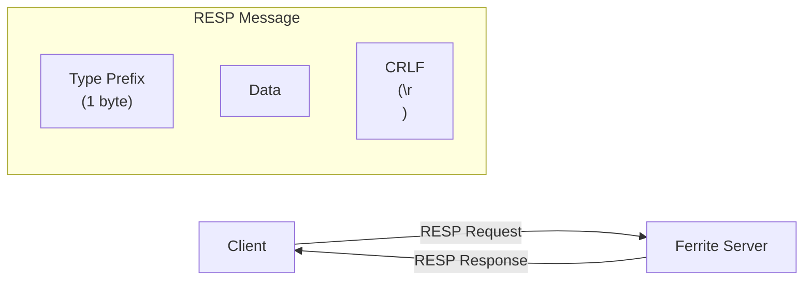
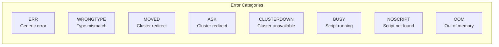
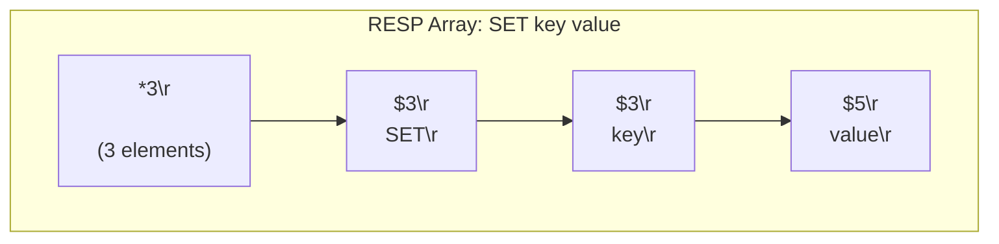
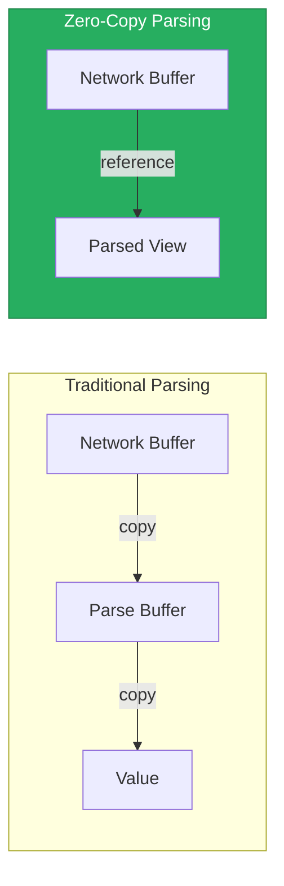
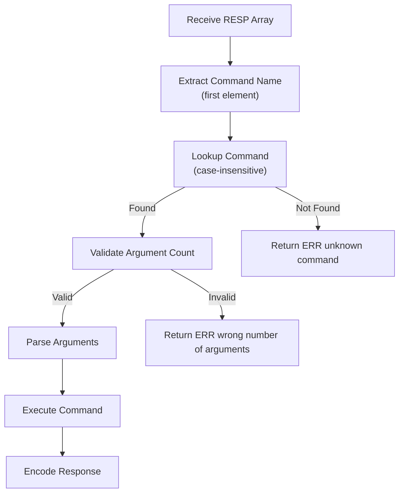
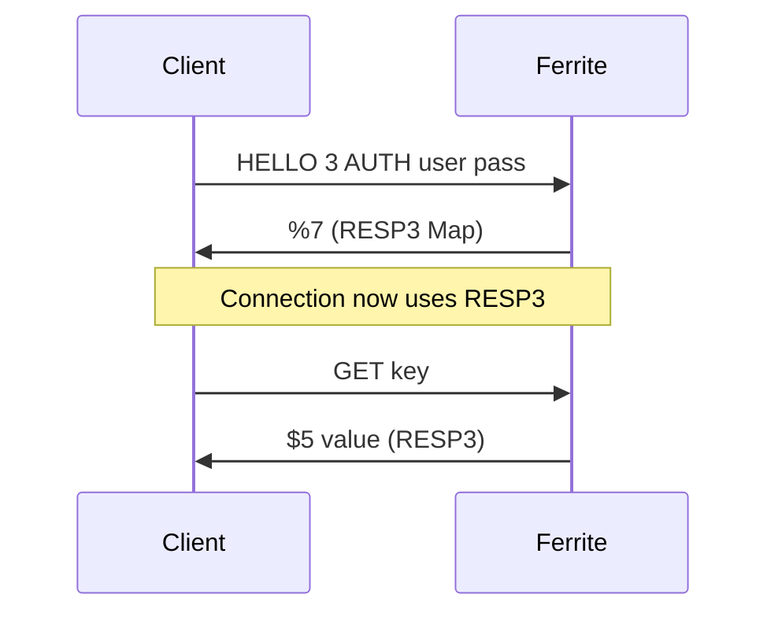
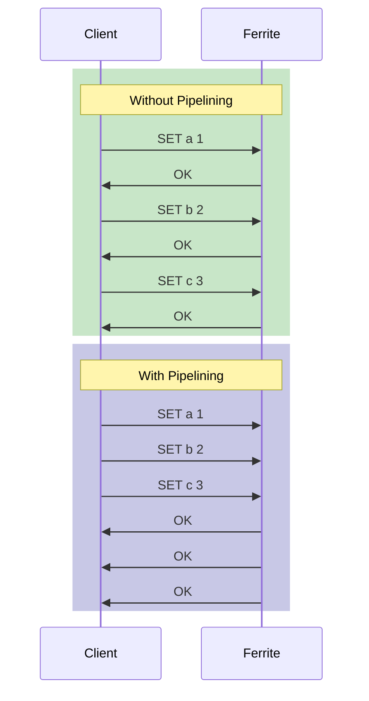

# RESP Protocol Implementation

Ferrite implements the Redis Serialization Protocol (RESP) for wire communication. This document covers the protocol specification and Ferrite's implementation details.

## Overview

RESP is a binary-safe protocol designed for:
- Simplicity of implementation
- Fast parsing
- Human readability



## Protocol Versions

Ferrite supports both RESP2 and RESP3:

| Feature | RESP2 | RESP3 |
|---------|-------|-------|
| Simple types | Yes | Yes |
| Bulk strings | Yes | Yes |
| Arrays | Yes | Yes |
| Maps | No | Yes |
| Sets | No | Yes |
| Booleans | No | Yes |
| Doubles | No | Yes |
| Big numbers | No | Yes |
| Verbatim strings | No | Yes |
| Push messages | No | Yes |
| Attributes | No | Yes |

## RESP2 Data Types

### Simple String

Prefix: `+`

Used for simple, non-binary-safe strings (typically status responses).

```
+OK\r\n
+PONG\r\n
```

```rust
#[derive(Debug, Clone)]
pub enum RespValue {
    SimpleString(String),
    // ...
}

impl RespEncoder {
    pub fn encode_simple_string(s: &str) -> Vec<u8> {
        format!("+{}\r\n", s).into_bytes()
    }
}
```

### Error

Prefix: `-`

Used for error responses. Convention: `ERR` for generic errors, specific prefix for typed errors.

```
-ERR unknown command 'FOO'\r\n
-WRONGTYPE Operation against a key holding the wrong kind of value\r\n
-MOVED 3999 127.0.0.1:6381\r\n
```



### Integer

Prefix: `:`

Used for numeric responses (counts, results of INCR, etc.).

```
:1000\r\n
:-1\r\n
:0\r\n
```

### Bulk String

Prefix: `$`

Binary-safe strings. Length-prefixed.

```
$6\r\nfoobar\r\n
$0\r\n\r\n           // Empty string
$-1\r\n              // Null bulk string
```

```rust
impl RespEncoder {
    pub fn encode_bulk_string(data: &[u8]) -> Vec<u8> {
        let mut result = format!("${}\r\n", data.len()).into_bytes();
        result.extend_from_slice(data);
        result.extend_from_slice(b"\r\n");
        result
    }

    pub fn encode_null_bulk_string() -> &'static [u8] {
        b"$-1\r\n"
    }
}
```

### Array

Prefix: `*`

Ordered collection of RESP values. Used for commands and multi-value responses.

```
*2\r\n$3\r\nGET\r\n$3\r\nkey\r\n       // GET key
*3\r\n:1\r\n:2\r\n:3\r\n                // Array of integers
*-1\r\n                                  // Null array
*0\r\n                                   // Empty array
```



## RESP3 Extensions

### Map

Prefix: `%`

Key-value pairs. More efficient than arrays for structured data.

```
%2\r\n+first\r\n:1\r\n+second\r\n:2\r\n
```

### Set

Prefix: `~`

Unordered collection of unique elements.

```
~3\r\n+a\r\n+b\r\n+c\r\n
```

### Boolean

Prefix: `#`

```
#t\r\n     // true
#f\r\n     // false
```

### Double

Prefix: `,`

IEEE 754 floating point.

```
,1.23\r\n
,-inf\r\n
,inf\r\n
,nan\r\n
```

### Big Number

Prefix: `(`

Arbitrary precision integers.

```
(3492890328409238509324850943850943825024385\r\n
```

### Verbatim String

Prefix: `=`

Like bulk string but with encoding hint.

```
=15\r\ntxt:Some string\r\n
=18\r\nmkd:# Hello World\r\n
```

### Push

Prefix: `>`

Server-initiated messages (pub/sub, invalidation).

```
>3\r\n+message\r\n+channel\r\n+payload\r\n
```

## Parser Implementation

```rust
pub struct RespParser {
    buffer: BytesMut,
    state: ParseState,
}

#[derive(Debug)]
enum ParseState {
    ReadType,
    ReadLine { type_byte: u8 },
    ReadBulk { len: usize },
    ReadArray { count: usize, items: Vec<RespValue> },
}

impl RespParser {
    pub fn parse(&mut self) -> Result<Option<RespValue>> {
        loop {
            match self.state {
                ParseState::ReadType => {
                    if self.buffer.is_empty() {
                        return Ok(None); // Need more data
                    }

                    let type_byte = self.buffer[0];
                    self.buffer.advance(1);

                    match type_byte {
                        b'+' | b'-' | b':' => {
                            self.state = ParseState::ReadLine { type_byte };
                        }
                        b'$' | b'*' | b'%' | b'~' => {
                            self.state = ParseState::ReadLine { type_byte };
                        }
                        _ => return Err(Error::InvalidType(type_byte)),
                    }
                }

                ParseState::ReadLine { type_byte } => {
                    if let Some(line) = self.read_line()? {
                        return self.parse_typed(type_byte, line);
                    }
                    return Ok(None);
                }

                ParseState::ReadBulk { len } => {
                    if self.buffer.len() < len + 2 {
                        return Ok(None);
                    }

                    let data = self.buffer.split_to(len);
                    self.buffer.advance(2); // Skip CRLF
                    self.state = ParseState::ReadType;

                    return Ok(Some(RespValue::BulkString(data.to_vec())));
                }

                ParseState::ReadArray { count, ref mut items } => {
                    while items.len() < count {
                        match self.parse_inner()? {
                            Some(value) => items.push(value),
                            None => return Ok(None),
                        }
                    }

                    let result = std::mem::take(items);
                    self.state = ParseState::ReadType;
                    return Ok(Some(RespValue::Array(result)));
                }
            }
        }
    }

    fn read_line(&mut self) -> Result<Option<&[u8]>> {
        if let Some(pos) = self.buffer.iter().position(|&b| b == b'\r') {
            if pos + 1 < self.buffer.len() && self.buffer[pos + 1] == b'\n' {
                let line = &self.buffer[..pos];
                Ok(Some(line))
            } else {
                Ok(None) // Need \n
            }
        } else {
            Ok(None) // Need more data
        }
    }
}
```

### Zero-Copy Parsing

Ferrite uses zero-copy parsing where possible:



```rust
/// Zero-copy bulk string reference
pub struct BulkStringRef<'a> {
    data: &'a [u8],
}

impl<'a> BulkStringRef<'a> {
    /// Parse without copying
    pub fn parse(buffer: &'a [u8]) -> Result<(Self, usize)> {
        // Parse $<len>\r\n
        let (len, consumed) = parse_length(buffer)?;

        // Return reference to data portion
        let data = &buffer[consumed..consumed + len];

        Ok((BulkStringRef { data }, consumed + len + 2))
    }

    /// Only copy when needed
    pub fn to_vec(&self) -> Vec<u8> {
        self.data.to_vec()
    }

    /// Get reference for comparison
    pub fn as_bytes(&self) -> &[u8] {
        self.data
    }
}
```

## Encoder Implementation

```rust
pub struct RespEncoder {
    buffer: Vec<u8>,
}

impl RespEncoder {
    pub fn new() -> Self {
        Self { buffer: Vec::with_capacity(256) }
    }

    pub fn encode(&mut self, value: &RespValue) -> &[u8] {
        self.buffer.clear();
        self.encode_value(value);
        &self.buffer
    }

    fn encode_value(&mut self, value: &RespValue) {
        match value {
            RespValue::SimpleString(s) => {
                self.buffer.push(b'+');
                self.buffer.extend_from_slice(s.as_bytes());
                self.buffer.extend_from_slice(b"\r\n");
            }

            RespValue::Error(e) => {
                self.buffer.push(b'-');
                self.buffer.extend_from_slice(e.as_bytes());
                self.buffer.extend_from_slice(b"\r\n");
            }

            RespValue::Integer(n) => {
                self.buffer.push(b':');
                self.buffer.extend_from_slice(itoa::Buffer::new().format(*n).as_bytes());
                self.buffer.extend_from_slice(b"\r\n");
            }

            RespValue::BulkString(data) => {
                self.buffer.push(b'$');
                self.buffer.extend_from_slice(itoa::Buffer::new().format(data.len()).as_bytes());
                self.buffer.extend_from_slice(b"\r\n");
                self.buffer.extend_from_slice(data);
                self.buffer.extend_from_slice(b"\r\n");
            }

            RespValue::Null => {
                self.buffer.extend_from_slice(b"$-1\r\n");
            }

            RespValue::Array(items) => {
                self.buffer.push(b'*');
                self.buffer.extend_from_slice(itoa::Buffer::new().format(items.len()).as_bytes());
                self.buffer.extend_from_slice(b"\r\n");
                for item in items {
                    self.encode_value(item);
                }
            }

            // RESP3 types
            RespValue::Map(pairs) => {
                self.buffer.push(b'%');
                self.buffer.extend_from_slice(itoa::Buffer::new().format(pairs.len()).as_bytes());
                self.buffer.extend_from_slice(b"\r\n");
                for (key, value) in pairs {
                    self.encode_value(key);
                    self.encode_value(value);
                }
            }

            RespValue::Boolean(b) => {
                self.buffer.push(b'#');
                self.buffer.push(if *b { b't' } else { b'f' });
                self.buffer.extend_from_slice(b"\r\n");
            }

            RespValue::Double(d) => {
                self.buffer.push(b',');
                self.buffer.extend_from_slice(ryu::Buffer::new().format(*d).as_bytes());
                self.buffer.extend_from_slice(b"\r\n");
            }
        }
    }
}
```

## Command Parsing

Commands are parsed from RESP arrays:



```rust
pub struct CommandParser;

impl CommandParser {
    pub fn parse(frame: RespValue) -> Result<Command> {
        let mut items = match frame {
            RespValue::Array(items) => items.into_iter(),
            _ => return Err(Error::ExpectedArray),
        };

        // Extract command name
        let name = match items.next() {
            Some(RespValue::BulkString(data)) => {
                std::str::from_utf8(&data)?.to_uppercase()
            }
            _ => return Err(Error::InvalidCommand),
        };

        // Parse command-specific arguments
        match name.as_str() {
            "GET" => {
                let key = Self::require_bulk_string(items.next())?;
                Ok(Command::Get { key })
            }

            "SET" => {
                let key = Self::require_bulk_string(items.next())?;
                let value = Self::require_bulk_string(items.next())?;
                let options = Self::parse_set_options(&mut items)?;
                Ok(Command::Set { key, value, options })
            }

            "MGET" => {
                let keys: Vec<_> = items
                    .map(Self::require_bulk_string)
                    .collect::<Result<_>>()?;
                Ok(Command::MGet { keys })
            }

            _ => Err(Error::UnknownCommand(name)),
        }
    }

    fn parse_set_options(
        items: &mut impl Iterator<Item = RespValue>,
    ) -> Result<SetOptions> {
        let mut options = SetOptions::default();

        while let Some(item) = items.next() {
            let opt = Self::require_bulk_string(item)?.to_uppercase();
            match opt.as_str() {
                "EX" => {
                    let seconds = Self::require_integer(items.next()?)?;
                    options.expire = Some(Duration::from_secs(seconds));
                }
                "PX" => {
                    let millis = Self::require_integer(items.next()?)?;
                    options.expire = Some(Duration::from_millis(millis));
                }
                "NX" => options.condition = Some(SetCondition::NotExists),
                "XX" => options.condition = Some(SetCondition::Exists),
                "KEEPTTL" => options.keep_ttl = true,
                "GET" => options.get_previous = true,
                _ => return Err(Error::InvalidOption(opt)),
            }
        }

        Ok(options)
    }
}
```

## Inline Commands

Ferrite also supports inline commands for telnet/debugging:

```
PING
SET foo bar
GET foo
```

```rust
impl RespParser {
    pub fn parse_inline(&mut self) -> Result<Option<Command>> {
        if let Some(line) = self.read_line()? {
            let parts: Vec<&str> = line
                .split_whitespace()
                .collect();

            if parts.is_empty() {
                return Ok(None);
            }

            let items: Vec<RespValue> = parts
                .into_iter()
                .map(|s| RespValue::BulkString(s.as_bytes().to_vec()))
                .collect();

            Ok(Some(CommandParser::parse(RespValue::Array(items))?))
        } else {
            Ok(None)
        }
    }
}
```

## Protocol Negotiation

Clients can upgrade to RESP3 using the `HELLO` command:

```
HELLO 3 AUTH username password
```



```rust
impl Connection {
    pub fn handle_hello(&mut self, version: u32, auth: Option<Auth>) -> Result<RespValue> {
        // Authenticate if provided
        if let Some(auth) = auth {
            self.authenticate(auth)?;
        }

        // Upgrade protocol version
        self.protocol_version = match version {
            2 => ProtocolVersion::Resp2,
            3 => ProtocolVersion::Resp3,
            _ => return Err(Error::UnsupportedProtocol(version)),
        };

        // Return server info (as RESP3 map for v3)
        Ok(RespValue::Map(vec![
            (RespValue::SimpleString("server".into()),
             RespValue::SimpleString("ferrite".into())),
            (RespValue::SimpleString("version".into()),
             RespValue::SimpleString(env!("CARGO_PKG_VERSION").into())),
            (RespValue::SimpleString("proto".into()),
             RespValue::Integer(version as i64)),
            (RespValue::SimpleString("id".into()),
             RespValue::Integer(self.id as i64)),
            (RespValue::SimpleString("mode".into()),
             RespValue::SimpleString(self.mode().into())),
            (RespValue::SimpleString("role".into()),
             RespValue::SimpleString(self.role().into())),
            (RespValue::SimpleString("modules".into()),
             RespValue::Array(vec![])),
        ]))
    }
}
```

## Pipelining

RESP supports pipelining - sending multiple commands without waiting for responses:



```rust
impl Connection {
    pub async fn handle_pipelined(&mut self) -> Result<()> {
        let mut responses = Vec::new();

        // Parse all available commands
        while let Some(cmd) = self.parser.parse()? {
            let response = self.execute(cmd).await?;
            responses.push(response);
        }

        // Write all responses
        for response in responses {
            self.encoder.encode(&response);
        }

        self.flush().await
    }
}
```

## Performance Optimizations

### Buffer Pooling

```rust
static BUFFER_POOL: Lazy<Pool<Vec<u8>>> = Lazy::new(|| {
    Pool::new(|| Vec::with_capacity(4096))
});

impl RespParser {
    pub fn with_pooled_buffer() -> Self {
        Self {
            buffer: BUFFER_POOL.get(),
            // ...
        }
    }
}
```

### Vectored I/O

```rust
impl RespEncoder {
    /// Encode using scatter-gather I/O
    pub fn encode_vectored(&self, value: &RespValue) -> impl Iterator<Item = IoSlice<'_>> {
        match value {
            RespValue::BulkString(data) => {
                vec![
                    IoSlice::new(b"$"),
                    IoSlice::new(self.len_buf),
                    IoSlice::new(b"\r\n"),
                    IoSlice::new(data),
                    IoSlice::new(b"\r\n"),
                ].into_iter()
            }
            // ...
        }
    }
}
```

## Error Handling

```rust
#[derive(Debug, thiserror::Error)]
pub enum RespError {
    #[error("invalid type byte: {0:#x}")]
    InvalidType(u8),

    #[error("invalid bulk string length")]
    InvalidLength,

    #[error("incomplete frame, need more data")]
    Incomplete,

    #[error("protocol violation: {0}")]
    Protocol(String),

    #[error("I/O error: {0}")]
    Io(#[from] std::io::Error),
}

impl From<RespError> for RespValue {
    fn from(err: RespError) -> Self {
        RespValue::Error(format!("ERR {}", err))
    }
}
```

## Configuration

```toml
[protocol]
# Maximum inline command size
max_inline_size = 65536

# Maximum bulk string size (protects against OOM)
max_bulk_size = 536870912  # 512MB

# Maximum array nesting depth
max_array_depth = 32

# Default protocol version for new connections
default_version = 2

# Enable RESP3 by default
resp3_default = false
```

## References

- [Redis Protocol Specification](https://redis.io/docs/reference/protocol-spec/)
- [RESP3 Specification](https://github.com/redis/redis-specifications/blob/master/protocol/RESP3.md)
- [HybridLog Storage](/docs/internals/hybridlog)
- [Command Reference](/docs/reference/commands/strings)
