# Testing Infrastructure

Ferrite maintains high quality through comprehensive testing across multiple levels: unit tests, integration tests, compatibility tests, and performance benchmarks.

## Testing Strategy

```mermaid
flowchart TB
    subgraph Pyramid["Testing Pyramid"]
        direction TB
        E2E["🔗 E2E / Compatibility<br/><small>Redis test suite</small>"]
        Integration["⚙️ Integration Tests<br/><small>Full server, network</small>"]
        Unit["🧪 Unit Tests<br/><small>Per-module</small>"]
        Bench["📊 Benchmarks<br/><small>Criterion</small>"]
    end

    E2E --> Integration
    Integration --> Unit
    Unit --> Bench

    style E2E fill:#e74c3c,stroke:#c0392b,color:#fff
    style Integration fill:#f39c12,stroke:#d68910,color:#fff
    style Unit fill:#27ae60,stroke:#1e8449,color:#fff
    style Bench fill:#3498db,stroke:#2980b9,color:#fff
```



| Test Level | Purpose | Speed | Coverage |
|------------|---------|-------|----------|
| **E2E** | Redis protocol compatibility | Slow | Broad |
| **Integration** | Full server behavior | Medium | Focused |
| **Unit** | Individual functions | Fast | Deep |
| **Benchmarks** | Performance regression | Medium | Critical paths |

## Unit Tests

### Structure

Each module has tests in a `tests` submodule:

```rust
// src/storage/memory.rs

pub struct MemoryStore {
    data: DashMap<Vec<u8>, Value>,
}

impl MemoryStore {
    pub fn get(&self, key: &[u8]) -> Option<Value> {
        self.data.get(key).map(|v| v.clone())
    }

    pub fn set(&self, key: Vec<u8>, value: Value) {
        self.data.insert(key, value);
    }
}

#[cfg(test)]
mod tests {
    use super::*;

    #[test]
    fn test_get_set() {
        let store = MemoryStore::new();

        store.set(b"key".to_vec(), Value::String(b"value".to_vec()));

        let result = store.get(b"key");
        assert_eq!(result, Some(Value::String(b"value".to_vec())));
    }

    #[test]
    fn test_get_nonexistent() {
        let store = MemoryStore::new();
        assert_eq!(store.get(b"nonexistent"), None);
    }

    #[test]
    fn test_overwrite() {
        let store = MemoryStore::new();

        store.set(b"key".to_vec(), Value::String(b"v1".to_vec()));
        store.set(b"key".to_vec(), Value::String(b"v2".to_vec()));

        let result = store.get(b"key");
        assert_eq!(result, Some(Value::String(b"v2".to_vec())));
    }
}
```

### Running Unit Tests

```bash
# Run all unit tests
cargo test

# Run tests for specific module
cargo test storage::memory

# Run with output
cargo test -- --nocapture

# Run specific test
cargo test test_get_set
```

## Integration Tests

### Server Tests

Full server integration tests in `tests/` directory:

```rust
// tests/server_integration.rs

use ferrite::{Server, Config};
use redis::Client;

struct TestServer {
    server: Server,
    port: u16,
}

impl TestServer {
    async fn new() -> Self {
        let port = get_free_port();
        let config = Config {
            port,
            ..Default::default()
        };

        let server = Server::new(config);
        server.start_background().await;

        // Wait for server to be ready
        tokio::time::sleep(Duration::from_millis(100)).await;

        Self { server, port }
    }

    fn client(&self) -> Client {
        Client::open(format!("redis://127.0.0.1:{}", self.port)).unwrap()
    }
}

impl Drop for TestServer {
    fn drop(&mut self) {
        self.server.shutdown();
    }
}

#[tokio::test]
async fn test_string_commands() {
    let server = TestServer::new().await;
    let mut conn = server.client().get_connection().unwrap();

    // SET and GET
    let _: () = redis::cmd("SET")
        .arg("key")
        .arg("value")
        .query(&mut conn)
        .unwrap();

    let result: String = redis::cmd("GET")
        .arg("key")
        .query(&mut conn)
        .unwrap();

    assert_eq!(result, "value");
}

#[tokio::test]
async fn test_expiration() {
    let server = TestServer::new().await;
    let mut conn = server.client().get_connection().unwrap();

    // SET with EX
    let _: () = redis::cmd("SET")
        .arg("key")
        .arg("value")
        .arg("EX")
        .arg("1")
        .query(&mut conn)
        .unwrap();

    // Should exist
    let result: Option<String> = redis::cmd("GET")
        .arg("key")
        .query(&mut conn)
        .unwrap();
    assert!(result.is_some());

    // Wait for expiration
    tokio::time::sleep(Duration::from_secs(2)).await;

    // Should be gone
    let result: Option<String> = redis::cmd("GET")
        .arg("key")
        .query(&mut conn)
        .unwrap();
    assert!(result.is_none());
}
```

### Persistence Tests

```rust
// tests/persistence.rs

#[tokio::test]
async fn test_aof_recovery() {
    let temp_dir = tempdir().unwrap();
    let aof_path = temp_dir.path().join("appendonly.aof");

    // Create server, write data
    {
        let config = Config {
            aof_enabled: true,
            aof_path: aof_path.clone(),
            ..Default::default()
        };
        let server = TestServer::with_config(config).await;
        let mut conn = server.client().get_connection().unwrap();

        redis::cmd("SET").arg("key1").arg("value1").query::<()>(&mut conn).unwrap();
        redis::cmd("SET").arg("key2").arg("value2").query::<()>(&mut conn).unwrap();
        redis::cmd("HSET").arg("hash").arg("field").arg("value").query::<()>(&mut conn).unwrap();

        // Ensure AOF is flushed
        redis::cmd("BGREWRITEAOF").query::<()>(&mut conn).unwrap();
        tokio::time::sleep(Duration::from_millis(500)).await;
    }

    // Restart server, verify data
    {
        let config = Config {
            aof_enabled: true,
            aof_path: aof_path.clone(),
            ..Default::default()
        };
        let server = TestServer::with_config(config).await;
        let mut conn = server.client().get_connection().unwrap();

        let v1: String = redis::cmd("GET").arg("key1").query(&mut conn).unwrap();
        let v2: String = redis::cmd("GET").arg("key2").query(&mut conn).unwrap();
        let hv: String = redis::cmd("HGET").arg("hash").arg("field").query(&mut conn).unwrap();

        assert_eq!(v1, "value1");
        assert_eq!(v2, "value2");
        assert_eq!(hv, "value");
    }
}
```

### Cluster Tests

```rust
// tests/cluster.rs

struct TestCluster {
    nodes: Vec<TestServer>,
}

impl TestCluster {
    async fn new(node_count: usize) -> Self {
        let mut nodes = Vec::new();
        let mut ports = Vec::new();

        for _ in 0..node_count {
            let port = get_free_port();
            ports.push(port);
        }

        for (i, port) in ports.iter().enumerate() {
            let config = Config {
                port: *port,
                cluster_enabled: true,
                cluster_peers: ports.iter()
                    .enumerate()
                    .filter(|(j, _)| *j != i)
                    .map(|(_, p)| format!("127.0.0.1:{}", p))
                    .collect(),
                ..Default::default()
            };
            nodes.push(TestServer::with_config(config).await);
        }

        // Wait for cluster to form
        tokio::time::sleep(Duration::from_secs(2)).await;

        Self { nodes }
    }
}

#[tokio::test]
async fn test_cluster_writes() {
    let cluster = TestCluster::new(3).await;
    let mut conn = cluster.nodes[0].client().get_connection().unwrap();

    // Write to cluster
    for i in 0..100 {
        let key = format!("key:{}", i);
        let _: () = redis::cmd("SET")
            .arg(&key)
            .arg(i)
            .query(&mut conn)
            .unwrap();
    }

    // Verify all keys exist (may be on different nodes)
    for i in 0..100 {
        let key = format!("key:{}", i);
        let result: i32 = redis::cmd("GET")
            .arg(&key)
            .query(&mut conn)
            .unwrap();
        assert_eq!(result, i);
    }
}
```

## Redis Compatibility Tests

### Running Redis Test Suite

```bash
# Clone redis-rs test suite
git clone https://github.com/redis/redis.git /tmp/redis

# Run compatibility tests
cd /tmp/redis
./runtest --host 127.0.0.1 --port 6379

# Or run specific test
./runtest --host 127.0.0.1 --port 6379 --single unit/basic
```

### Custom Compatibility Tests

```rust
// tests/redis_compat.rs

#[tokio::test]
async fn test_redis_commands_compatibility() {
    let server = TestServer::new().await;
    let mut conn = server.client().get_connection().unwrap();

    // Test PING
    let pong: String = redis::cmd("PING").query(&mut conn).unwrap();
    assert_eq!(pong, "PONG");

    // Test ECHO
    let echo: String = redis::cmd("ECHO").arg("hello").query(&mut conn).unwrap();
    assert_eq!(echo, "hello");

    // Test multi-bulk reply
    let keys: Vec<String> = redis::cmd("KEYS").arg("*").query(&mut conn).unwrap();
    assert!(keys.is_empty());

    // Test error handling
    let result: redis::RedisResult<String> = redis::cmd("GET").query(&mut conn);
    assert!(result.is_err());
}

#[tokio::test]
async fn test_transaction_semantics() {
    let server = TestServer::new().await;
    let mut conn = server.client().get_connection().unwrap();

    // MULTI/EXEC
    redis::cmd("SET").arg("x").arg("1").query::<()>(&mut conn).unwrap();

    let _: () = redis::cmd("MULTI").query(&mut conn).unwrap();
    let _: String = redis::cmd("INCR").arg("x").query(&mut conn).unwrap(); // Returns QUEUED
    let _: String = redis::cmd("INCR").arg("x").query(&mut conn).unwrap();
    let results: Vec<i32> = redis::cmd("EXEC").query(&mut conn).unwrap();

    assert_eq!(results, vec![2, 3]);

    // Verify final value
    let x: i32 = redis::cmd("GET").arg("x").query(&mut conn).unwrap();
    assert_eq!(x, 3);
}
```

## Performance Benchmarks

### Criterion Benchmarks

```rust
// benches/throughput.rs

use criterion::{criterion_group, criterion_main, Criterion, BenchmarkId};

fn bench_get_set(c: &mut Criterion) {
    let rt = tokio::runtime::Runtime::new().unwrap();
    let server = rt.block_on(TestServer::new());
    let client = server.client();

    let mut group = c.benchmark_group("get_set");

    for size in [64, 256, 1024, 4096].iter() {
        group.bench_with_input(
            BenchmarkId::from_parameter(size),
            size,
            |b, &size| {
                let mut conn = client.get_connection().unwrap();
                let value = vec![b'x'; size];

                b.iter(|| {
                    let _: () = redis::cmd("SET")
                        .arg("bench_key")
                        .arg(&value)
                        .query(&mut conn)
                        .unwrap();

                    let _: Vec<u8> = redis::cmd("GET")
                        .arg("bench_key")
                        .query(&mut conn)
                        .unwrap();
                });
            },
        );
    }

    group.finish();
}

fn bench_pipeline(c: &mut Criterion) {
    let rt = tokio::runtime::Runtime::new().unwrap();
    let server = rt.block_on(TestServer::new());
    let client = server.client();

    let mut group = c.benchmark_group("pipeline");

    for pipeline_size in [1, 10, 100, 1000].iter() {
        group.bench_with_input(
            BenchmarkId::from_parameter(pipeline_size),
            pipeline_size,
            |b, &size| {
                let mut conn = client.get_connection().unwrap();

                b.iter(|| {
                    let mut pipe = redis::pipe();
                    for i in 0..size {
                        pipe.set(format!("key:{}", i), i);
                    }
                    let _: () = pipe.query(&mut conn).unwrap();
                });
            },
        );
    }

    group.finish();
}

criterion_group!(benches, bench_get_set, bench_pipeline);
criterion_main!(benches);
```

### Running Benchmarks

```bash
# Run all benchmarks
cargo bench

# Run specific benchmark
cargo bench get_set

# Generate HTML report
cargo bench -- --save-baseline main

# Compare with baseline
cargo bench -- --baseline main
```

### Stress Tests

```rust
// tests/stress.rs

#[tokio::test]
async fn stress_concurrent_writes() {
    let server = TestServer::new().await;
    let client = Arc::new(server.client());

    let mut handles = Vec::new();

    for thread_id in 0..10 {
        let client = client.clone();
        handles.push(tokio::spawn(async move {
            let mut conn = client.get_connection().unwrap();

            for i in 0..10_000 {
                let key = format!("thread:{}:key:{}", thread_id, i);
                let _: () = redis::cmd("SET")
                    .arg(&key)
                    .arg(i)
                    .query(&mut conn)
                    .unwrap();
            }
        }));
    }

    for handle in handles {
        handle.await.unwrap();
    }

    // Verify all writes
    let mut conn = server.client().get_connection().unwrap();
    for thread_id in 0..10 {
        for i in 0..10_000 {
            let key = format!("thread:{}:key:{}", thread_id, i);
            let result: i32 = redis::cmd("GET")
                .arg(&key)
                .query(&mut conn)
                .unwrap();
            assert_eq!(result, i);
        }
    }
}

#[tokio::test]
async fn stress_memory_pressure() {
    let mut config = Config::default();
    config.storage.max_memory = 100 * 1024 * 1024;
    let server = TestServer::with_config(config).await;
    let mut conn = server.client().get_connection().unwrap();

    // Write more data than max_memory
    let value = vec![b'x'; 1024]; // 1KB values
    for i in 0..200_000 { // ~200MB
        let key = format!("key:{}", i);
        let _: () = redis::cmd("SET")
            .arg(&key)
            .arg(&value)
            .query(&mut conn)
            .unwrap();
    }

    // Server should still be responsive
    let pong: String = redis::cmd("PING").query(&mut conn).unwrap();
    assert_eq!(pong, "PONG");

    // Memory should be under limit
    let info: String = redis::cmd("INFO").arg("memory").query(&mut conn).unwrap();
    let used_memory = parse_info_field(&info, "used_memory");
    assert!(used_memory < 100 * 1024 * 1024);
}
```

## Property-Based Testing

Using `proptest` for property-based tests:

```rust
// tests/property.rs

use proptest::prelude::*;

proptest! {
    #[test]
    fn test_set_get_roundtrip(key in "[a-z]{1,100}", value in "[a-z]{1,10000}") {
        let rt = tokio::runtime::Runtime::new().unwrap();
        rt.block_on(async {
            let server = TestServer::new().await;
            let mut conn = server.client().get_connection().unwrap();

            let _: () = redis::cmd("SET")
                .arg(&key)
                .arg(&value)
                .query(&mut conn)
                .unwrap();

            let result: String = redis::cmd("GET")
                .arg(&key)
                .query(&mut conn)
                .unwrap();

            prop_assert_eq!(result, value);
            Ok(())
        })?;
    }

    #[test]
    fn test_incr_decr_invariant(initial: i64, ops in prop::collection::vec(prop::bool::ANY, 1..100)) {
        let rt = tokio::runtime::Runtime::new().unwrap();
        rt.block_on(async {
            let server = TestServer::new().await;
            let mut conn = server.client().get_connection().unwrap();

            let _: () = redis::cmd("SET")
                .arg("counter")
                .arg(initial)
                .query(&mut conn)
                .unwrap();

            let mut expected = initial;
            for incr in ops {
                if incr {
                    let _: i64 = redis::cmd("INCR").arg("counter").query(&mut conn).unwrap();
                    expected += 1;
                } else {
                    let _: i64 = redis::cmd("DECR").arg("counter").query(&mut conn).unwrap();
                    expected -= 1;
                }
            }

            let result: i64 = redis::cmd("GET").arg("counter").query(&mut conn).unwrap();
            prop_assert_eq!(result, expected);
            Ok(())
        })?;
    }
}
```

## Continuous Integration

### GitHub Actions

```yaml
# .github/workflows/test.yml

name: Tests

on: [push, pull_request]

jobs:
  test:
    runs-on: ubuntu-latest
    steps:
      - uses: actions/checkout@v3

      - name: Install Rust
        uses: actions-rs/toolchain@v1
        with:
          toolchain: stable

      - name: Run unit tests
        run: cargo test

      - name: Run integration tests
        run: cargo test --test '*'

      - name: Run benchmarks (smoke test)
        run: cargo bench -- --test

  redis-compat:
    runs-on: ubuntu-latest
    steps:
      - uses: actions/checkout@v3

      - name: Build Ferrite
        run: cargo build --release

      - name: Start Ferrite
        run: ./target/release/ferrite &

      - name: Clone Redis
        run: git clone https://github.com/redis/redis.git /tmp/redis

      - name: Run Redis tests
        run: |
          cd /tmp/redis
          ./runtest --host 127.0.0.1 --port 6379 --ignore-encoding
```

## Test Utilities

### Test Fixtures

```rust
// tests/common/mod.rs

pub fn setup_test_data(conn: &mut Connection) {
    // String data
    let _: () = redis::cmd("SET").arg("str:1").arg("value1").query(conn).unwrap();
    let _: () = redis::cmd("SET").arg("str:2").arg("value2").query(conn).unwrap();

    // List data
    let _: () = redis::cmd("RPUSH").arg("list:1").arg("a").arg("b").arg("c").query(conn).unwrap();

    // Hash data
    let _: () = redis::cmd("HSET").arg("hash:1").arg("f1").arg("v1").query(conn).unwrap();

    // Set data
    let _: () = redis::cmd("SADD").arg("set:1").arg("a").arg("b").arg("c").query(conn).unwrap();

    // Sorted set data
    let _: () = redis::cmd("ZADD").arg("zset:1").arg(1).arg("a").arg(2).arg("b").query(conn).unwrap();
}

pub fn get_free_port() -> u16 {
    let listener = TcpListener::bind("127.0.0.1:0").unwrap();
    listener.local_addr().unwrap().port()
}
```

## References

- [cargo test documentation](https://doc.rust-lang.org/cargo/commands/cargo-test.html)
- [Criterion.rs](https://bheisler.github.io/criterion.rs/book/)
- [proptest](https://docs.rs/proptest)
