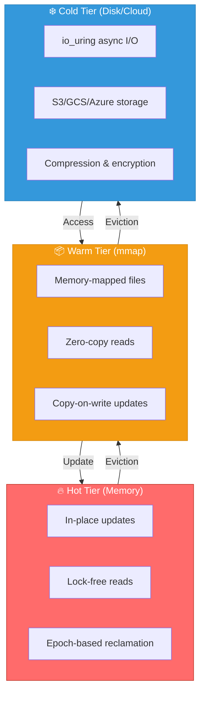

# Introduction to Ferrite

[](https://github.com/ferrite-rs/ferrite/actions)
[](https://crates.io/crates/ferrite)
[](https://docs.rs/ferrite)
[](https://github.com/ferrite-rs/ferrite/blob/main/LICENSE)
[](https://www.rust-lang.org/)

Ferrite is a high-performance, tiered-storage key-value store designed as a drop-in Redis replacement. Built in Rust with epoch-based concurrency and io_uring-first persistence.

**The speed of memory, the capacity of disk, the economics of cloud.**

## What is Ferrite?

Ferrite combines the familiar Redis API with next-generation features designed for the AI/cloud-native era:

- **Redis Compatible**: Full RESP2/RESP3 wire protocol support. Works with any Redis client.
- **Tiered Storage**: Inspired by Microsoft FASTER - hot data in memory, warm data in mmap, cold data on disk.
- **Vector Search**: Native HNSW and IVF indexes for AI/ML workloads.
- **Semantic Caching**: Cache by meaning, not just exact keys - reduces LLM API costs by 40-60%.
- **Embedded Mode**: Use as a library like SQLite - no separate server process.
- **Time-Travel Queries**: Query data at any point in time for debugging and auditing.

## Quick Example

### Server Mode (Redis Compatible)

```bash
$ redis-cli -p 6379
127.0.0.1:6379> SET mykey "Hello, Ferrite!"
OK
127.0.0.1:6379> GET mykey
"Hello, Ferrite!"
```

### Embedded Mode (Library)

```rust
use ferrite::embedded::Database;

fn main() -> anyhow::Result<()> {
    let db = Database::open("./my_data")?;

    db.set("user:1", r#"{"name": "Alice"}"#)?;
    let user = db.get("user:1")?;

    Ok(())
}
```

## Why Ferrite?

| Feature | Redis | Dragonfly | Garnet | Ferrite |
|---------|-------|-----------|--------|---------|
| Multi-threaded | - | + | + | + |
| Tiered Storage | - | - | + | + |
| Vector Search | + | - | - | + |
| Semantic Caching | - | - | - | + |
| Time-Travel Queries | - | - | - | + |
| CRDT Replication | - | - | - | + |
| Embedded Mode | - | - | - | + |
| WASM Functions | - | - | - | + |

## Architecture Overview

Ferrite implements a three-tier storage architecture inspired by Microsoft FASTER:



## Next Steps

- [Installation Guide](/docs/getting-started/installation) - Get Ferrite up and running
- [Quick Start](/docs/getting-started/quick-start) - Your first commands
- [Configuration](/docs/getting-started/configuration) - Configure Ferrite for your needs
