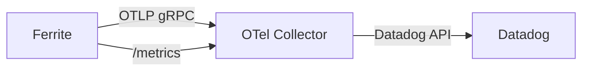

# Datadog Integration

This guide shows how to export Ferrite metrics, traces, and logs to Datadog using the OpenTelemetry Collector as a bridge.

## Architecture



The recommended approach uses the OpenTelemetry Collector with the Datadog exporter. This gives you a single pipeline that forwards both metrics and traces to Datadog without requiring the Datadog Agent on every host.

:::tip
You can also use the Datadog Agent's OTLP ingestion endpoint directly (available since Agent v7.35+). The OTel Collector approach described here offers more flexibility for processing and routing.
:::

## Prerequisites

- **Ferrite** running with OTLP export enabled
- **OpenTelemetry Collector** (Contrib distribution, which includes the Datadog exporter)
- A **Datadog API key** ([create one in Datadog](https://app.datadoghq.com/organization-settings/api-keys))

## Step 1: Configure Ferrite for OTLP Export

Enable OpenTelemetry export in `ferrite.toml`:

```toml title="ferrite.toml"
[otel]
enabled = true
endpoint = "http://otel-collector:4317"
service_name = "ferrite"
traces_enabled = true
metrics_enabled = true

[metrics]
enabled = true
bind = "0.0.0.0"
port = 9090
```

## Step 2: Deploy the OpenTelemetry Collector

Use the **Contrib** distribution of the OTel Collector, which includes the Datadog exporter:

```yaml title="otel-collector-config.yaml"
receivers:
  otlp:
    protocols:
      grpc:
        endpoint: "0.0.0.0:4317"
      http:
        endpoint: "0.0.0.0:4318"
  prometheus:
    config:
      scrape_configs:
        - job_name: "ferrite"
          scrape_interval: 15s
          static_configs:
            - targets: ["ferrite-host:9090"]

processors:
  batch:
    send_batch_size: 1000
    timeout: 10s
  resource:
    attributes:
      - key: deployment.environment
        value: "production"
        action: upsert
      - key: service.name
        value: "ferrite"
        action: upsert

exporters:
  datadog:
    api:
      site: "datadoghq.com"
      key: "${DD_API_KEY}"
    metrics:
      resource_attributes_as_tags: true
      histograms:
        mode: distributions
    traces:
      span_name_as_resource_name: true

service:
  pipelines:
    metrics:
      receivers: [otlp, prometheus]
      processors: [batch, resource]
      exporters: [datadog]
    traces:
      receivers: [otlp]
      processors: [batch, resource]
      exporters: [datadog]
```

Run the collector:

```bash
# Using Docker
docker run -d \
  --name otel-collector \
  -e DD_API_KEY="your-datadog-api-key" \
  -v $(pwd)/otel-collector-config.yaml:/etc/otelcol-contrib/config.yaml \
  -p 4317:4317 \
  -p 4318:4318 \
  otel/opentelemetry-collector-contrib:latest
```

:::warning
Never hard-code your Datadog API key in configuration files. Use environment variables or a secrets manager.
:::

## Step 3: Datadog-Specific Metric Tags

Ferrite metrics appear in Datadog with the `ferrite.` prefix. The following tags are automatically applied:

| Tag | Source | Example |
|-----|--------|---------|
| `service` | `service.name` resource attribute | `ferrite` |
| `env` | `deployment.environment` resource attribute | `production` |
| `command` | Metric label | `GET`, `SET` |
| `db` | Metric label | `0` |
| `host` | Collector host detection | `ferrite-prod-01` |

### Custom Tags

Add custom tags via the OTel Collector's resource processor:

```yaml
processors:
  resource:
    attributes:
      - key: team
        value: "platform"
        action: upsert
      - key: region
        value: "us-east-1"
        action: upsert
```

## Step 4: Set Up Datadog Dashboards

### Create a Dashboard

1. In Datadog, go to **Dashboards → New Dashboard**
2. Choose **New Screenboard** or **New Timeboard**
3. Add widgets using the following metric queries:

### Recommended Widgets

**Commands per Second:**
```
sum:ferrite.commands.total.rate{*} by {command}
```

**P99 Latency:**
```
p99:ferrite.command.duration.seconds{*} by {command}
```

**Memory Usage:**
```
avg:ferrite.memory.used.bytes{*} / avg:ferrite.memory.max.bytes{*}
```

**Active Connections:**
```
avg:ferrite.connections.active{*}
```

**Key Eviction Rate:**
```
sum:ferrite.evicted.keys.total.rate{*}
```

### Dashboard JSON (Import)

You can import this dashboard definition in Datadog via **Dashboards → New Dashboard → Import from JSON**:

```json
{
  "title": "Ferrite Overview",
  "description": "Key operational metrics for Ferrite",
  "widgets": [
    {
      "definition": {
        "title": "Commands/sec by Type",
        "type": "timeseries",
        "requests": [
          {
            "q": "sum:ferrite.commands.total.rate{*} by {command}",
            "display_type": "line"
          }
        ]
      }
    },
    {
      "definition": {
        "title": "P99 Command Latency",
        "type": "timeseries",
        "requests": [
          {
            "q": "p99:ferrite.command.duration.seconds{*}",
            "display_type": "line"
          }
        ],
        "yaxis": { "label": "seconds" }
      }
    },
    {
      "definition": {
        "title": "Memory Utilization",
        "type": "query_value",
        "requests": [
          {
            "q": "avg:ferrite.memory.used.bytes{*} / avg:ferrite.memory.max.bytes{*} * 100"
          }
        ],
        "precision": 1,
        "autoscale": false,
        "custom_unit": "%"
      }
    }
  ],
  "layout_type": "ordered"
}
```

## Step 5: Configure Datadog Monitors

Create monitors for critical Ferrite metrics:

### High Latency Monitor

```
Monitor Type: Metric
Query: p99:ferrite.command.duration.seconds{env:production} > 0.01
Alert: Warning at 10ms, Critical at 50ms
Message: "Ferrite P99 latency is {{ value }}s on {{ host }}"
```

### Memory Pressure Monitor

```
Monitor Type: Metric
Query: avg:ferrite.memory.used.bytes{*} / avg:ferrite.memory.max.bytes{*} > 0.9
Alert: Warning at 80%, Critical at 90%
Message: "Ferrite memory at {{ value | percentage }}. Evictions may increase."
```

### Instance Down Monitor

```
Monitor Type: Integration
Check: custom check or process monitoring
Alert: No data for 2 minutes
Message: "Ferrite instance {{ host }} is not reporting metrics."
```

## Troubleshooting

### Metrics Not Appearing

1. Verify Ferrite's metrics endpoint: `curl http://ferrite-host:9090/metrics`
2. Check the OTel Collector logs: `docker logs otel-collector`
3. Confirm the API key is set: ensure `DD_API_KEY` is exported
4. Verify the Datadog site matches your account region (`datadoghq.com` vs `datadoghq.eu`)

### Trace Data Missing

1. Confirm `traces_enabled = true` in `ferrite.toml`
2. Check that the OTLP endpoint is reachable from Ferrite
3. Look for connection errors in Ferrite's logs: `RUST_LOG=ferrite=debug`

## Next Steps

- [New Relic Integration](./newrelic) — Alternative observability backend
- [Grafana Integration](./grafana) — Open-source dashboarding
- [Observability Overview](./overview) — Full observability feature set
