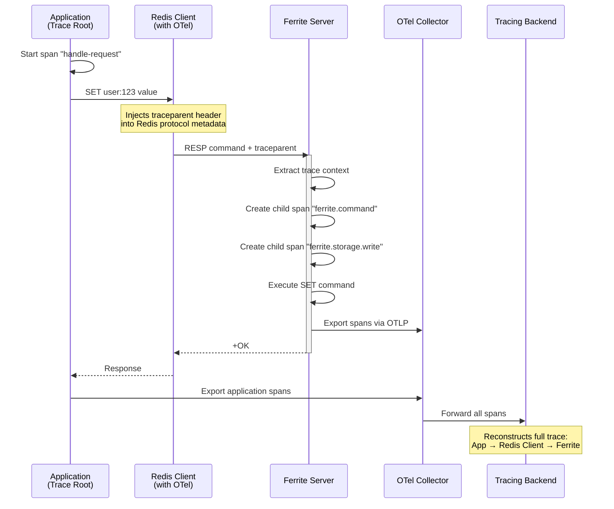
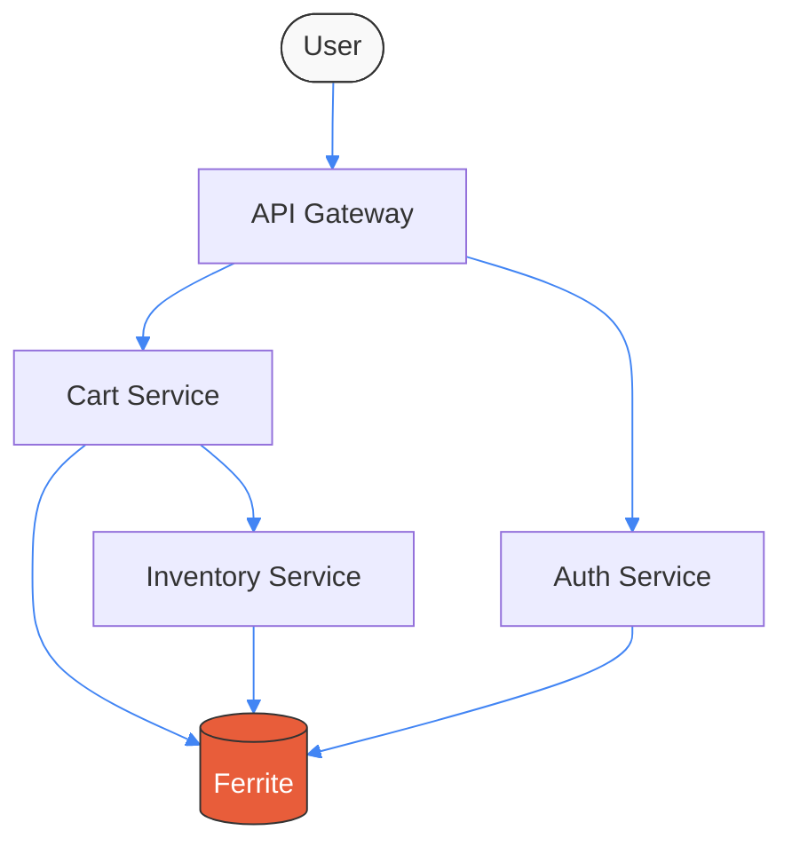
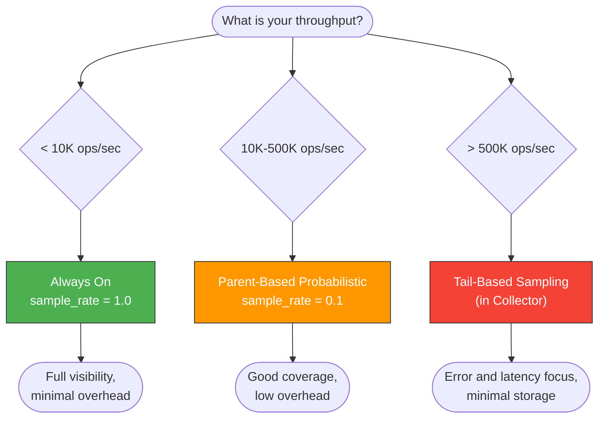
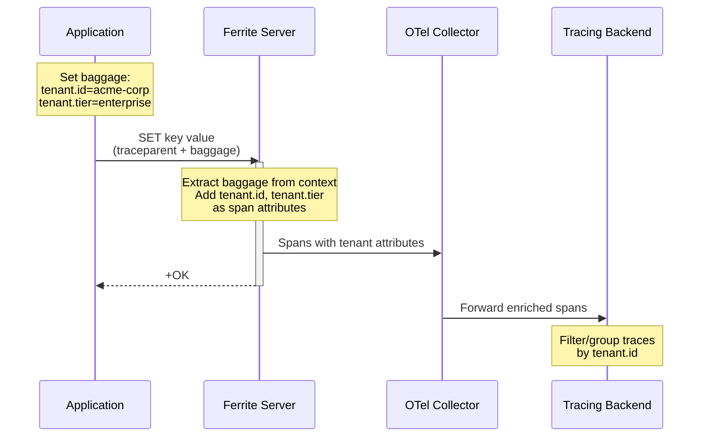
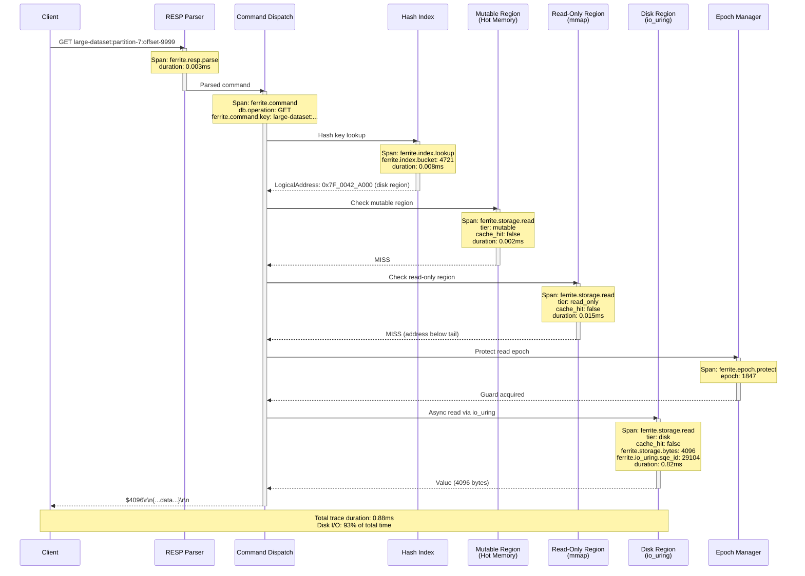
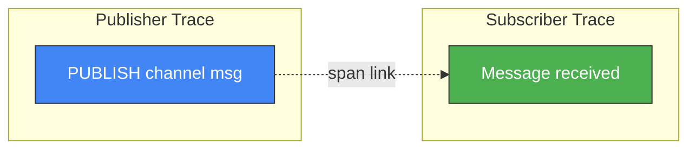

# Distributed Tracing Deep Dive

This guide goes beyond basic OpenTelemetry configuration and explores how Ferrite propagates trace context, the available sampling strategies, advanced patterns like baggage propagation for multi-tenant tracing, and integration with popular APM platforms.

## How Ferrite Propagates Trace Context

### W3C Trace Context Standard

Ferrite implements the [W3C Trace Context](https://www.w3.org/TR/trace-context/) specification for distributed trace propagation. When a client sends a command with a `traceparent` header, Ferrite extracts the trace context and creates child spans that are linked to the caller's trace.

The `traceparent` header follows this format:

```
traceparent: {version}-{trace-id}-{parent-span-id}-{trace-flags}
```

| Field | Length | Description |
|-------|--------|-------------|
| `version` | 2 hex chars | Always `00` for the current spec |
| `trace-id` | 32 hex chars | Globally unique trace identifier |
| `parent-span-id` | 16 hex chars | Span ID of the calling service |
| `trace-flags` | 2 hex chars | `01` = sampled, `00` = not sampled |

Example:

```
traceparent: 00-4bf92f3577b34da6a3ce929d0e0e4736-00f067aa0ba902b7-01
```

### Propagation Flow

When a request arrives at Ferrite with trace context:



### Without Client Trace Context

When no `traceparent` header is present, Ferrite creates a new root trace for the command. These traces still provide valuable visibility into Ferrite internals but cannot be correlated with the calling application.

:::tip
For full end-to-end visibility, always use an OTel-instrumented Redis client library. See the [client-side propagation examples](./opentelemetry#client-side-trace-propagation) in the OpenTelemetry guide.
:::

---

## Cross-Service Tracing with Microservices

In a microservices architecture, a single user request may traverse multiple services before reaching Ferrite. Distributed tracing connects all these hops into a single trace.

### Architecture Example



In this architecture, a single `traceparent` flows through:

1. **API Gateway** -- creates the root span, injects `traceparent` into downstream requests
2. **Auth Service** -- validates the token, caches the session in Ferrite (child span)
3. **Cart Service** -- reads cart data from Ferrite, checks inventory (child spans)
4. **Inventory Service** -- reads stock levels from Ferrite (child span)

All Ferrite operations across all services appear as leaves in the same trace tree, making it straightforward to identify which service caused a slow Ferrite call.

### Extracting Cross-Service Insights

With cross-service tracing enabled, you can answer questions such as:

- **Which service generates the most Ferrite traffic?** Group Ferrite spans by `service.name` of the parent span.
- **What is the end-to-end latency including Ferrite?** Measure from the root span to the Ferrite response span.
- **Is Ferrite the bottleneck?** Compare Ferrite span durations to the total request duration.
- **Are there N+1 query patterns?** Look for traces with many sequential Ferrite calls from a single service.

---

## Sampling Strategies

Sampling controls which traces are recorded and exported. Choosing the right strategy balances observability coverage against performance overhead and storage cost.

### Available Samplers

Ferrite supports the standard OpenTelemetry sampler types via configuration and environment variables:

| Sampler | Config | Description | Use Case |
|---------|--------|-------------|----------|
| **Always On** | `sample_rate = 1.0` | Record every trace | Development, low-traffic staging |
| **Always Off** | `sample_rate = 0.0` | Record no traces | Disable tracing without recompile |
| **Probabilistic** | `sample_rate = 0.1` | Record N% of traces randomly | Production with moderate traffic |
| **Parent-Based** | `OTEL_TRACES_SAMPLER=parentbased_traceidratio` | Respect parent's sampling decision | Microservices (recommended) |
| **Rate-Limited** | Configured in Collector | Cap traces per second | High-traffic production |

### Configuration Examples

#### Probabilistic Sampling (10%)

```toml title="ferrite.toml"
[telemetry]
enabled = true
endpoint = "http://localhost:4317"
sample_rate = 0.1
```

Or via environment variable:

```bash
export OTEL_TRACES_SAMPLER="traceidratio"
export OTEL_TRACES_SAMPLER_ARG="0.1"
```

#### Parent-Based Sampling

Parent-based sampling is the recommended strategy for microservice architectures. Ferrite inherits the sampling decision from the incoming trace context. If the parent span is sampled, Ferrite's spans are also sampled. If no parent context exists, the fallback sampler (probabilistic) is used.

```bash
export OTEL_TRACES_SAMPLER="parentbased_traceidratio"
export OTEL_TRACES_SAMPLER_ARG="0.1"
```

With this configuration:
- Incoming requests **with** a sampled `traceparent` are always traced in Ferrite
- Incoming requests **without** trace context are sampled at 10%

#### Rate-Limited Sampling (Collector-Side)

For very high-throughput deployments, implement rate limiting in the OTel Collector's tail sampling processor:

```yaml title="otel-collector-config.yaml"
processors:
  tail_sampling:
    decision_wait: 10s
    num_traces: 100000
    policies:
      # Always sample errors
      - name: errors-policy
        type: status_code
        status_code:
          status_codes: [ERROR]

      # Always sample slow operations (> 50ms)
      - name: latency-policy
        type: latency
        latency:
          threshold_ms: 50

      # Rate-limit everything else to 100 traces/sec
      - name: rate-limit-policy
        type: probabilistic
        probabilistic:
          sampling_percentage: 5

service:
  pipelines:
    traces:
      receivers: [otlp]
      processors: [tail_sampling, batch]
      exporters: [otlp/jaeger]
```

:::warning
Tail-based sampling requires the Collector to buffer traces until all spans arrive. This increases memory usage. Set `num_traces` and `decision_wait` appropriately for your throughput.
:::

### Choosing a Sampling Strategy



---

## Baggage Propagation for Multi-Tenant Tracing

[W3C Baggage](https://www.w3.org/TR/baggage/) allows you to attach key-value pairs to trace context that propagate across service boundaries. In multi-tenant Ferrite deployments, baggage enables per-tenant visibility without modifying application code.

### How It Works

Your application sets baggage values (e.g., `tenant.id`, `tenant.tier`) on the current context. These values propagate to Ferrite through the Redis client and appear as attributes on Ferrite's spans.



### Configuration

Enable baggage extraction in `ferrite.toml`:

```toml title="ferrite.toml"
[telemetry]
enabled = true
endpoint = "http://localhost:4317"

# Extract W3C baggage and add as span attributes
baggage_extraction = true

# Only extract specific baggage keys (security: avoid unbounded attribute growth)
baggage_allowed_keys = ["tenant.id", "tenant.tier", "user.id", "request.id"]
```

### Setting Baggage in Client Code

#### Python

```python
from opentelemetry import baggage, context
from opentelemetry.propagate import inject

# Set tenant baggage before making Ferrite calls
ctx = baggage.set_baggage("tenant.id", "acme-corp")
ctx = baggage.set_baggage("tenant.tier", "enterprise", context=ctx)

# Attach the context so all subsequent calls inherit it
token = context.attach(ctx)
try:
    # Ferrite calls made here carry tenant baggage
    client.set("tenant:acme-corp:config", '{"max_keys": 1000000}')
    client.get("tenant:acme-corp:config")
finally:
    context.detach(token)
```

#### Node.js

```javascript
const { propagation, context } = require("@opentelemetry/api");

// Set tenant baggage
const baggage = propagation.createBaggage({
  "tenant.id": { value: "acme-corp" },
  "tenant.tier": { value: "enterprise" },
});

// Run Ferrite operations with baggage context
context.with(propagation.setBaggage(context.active(), baggage), async () => {
  await client.set("tenant:acme-corp:config", '{"max_keys": 1000000}');
  await client.get("tenant:acme-corp:config");
});
```

### Querying Traces by Tenant

With tenant baggage propagated, you can filter traces in your tracing backend:

**Jaeger:**
Search by tag `tenant.id=acme-corp`

**Grafana Tempo (TraceQL):**
```
{ span.tenant.id = "acme-corp" && span.ferrite.command.name = "GET" }
```

**Datadog:**
```
service:ferrite @tenant.id:acme-corp
```

---

## Integration with Popular APM Tools

### Datadog

Datadog supports OTLP ingestion natively. See the [Datadog Integration guide](./datadog) for full setup. Key tracing features:

- **Service Map:** Visualize dependencies between your services and Ferrite
- **Flame Graph:** Drill into individual Ferrite command execution
- **Error Tracking:** Automatically detect and group Ferrite errors
- **Watchdog:** AI-powered anomaly detection on Ferrite latency

Datadog-specific trace queries:

```
service:ferrite env:production @ferrite.command.name:GET @duration:>10ms
```

### New Relic

New Relic supports direct OTLP ingestion. See the [New Relic Integration guide](./newrelic) for full setup. Key tracing features:

- **Distributed Tracing UI:** End-to-end request visualization
- **Service Maps:** Auto-discovered topology including Ferrite
- **Errors Inbox:** Group and triage Ferrite errors

NRQL trace query example:

```sql
SELECT average(duration.ms)
FROM Span
WHERE service.name = 'ferrite' AND name = 'ferrite.command'
FACET ferrite.command.name
SINCE 1 hour ago
```

### Honeycomb

Honeycomb excels at high-cardinality trace analysis. Configure via the OTel Collector:

```yaml title="otel-collector-config.yaml"
exporters:
  otlp/honeycomb:
    endpoint: "api.honeycomb.io:443"
    headers:
      "x-honeycomb-team": "${HONEYCOMB_API_KEY}"
      "x-honeycomb-dataset": "ferrite"

service:
  pipelines:
    traces:
      receivers: [otlp]
      processors: [batch]
      exporters: [otlp/honeycomb]
```

Honeycomb query examples:

- **Heatmap of Ferrite latency by command:** Group by `ferrite.command.name`, visualize `duration_ms`
- **Bubble Up on slow traces:** Compare slow vs. fast traces to find which attributes differ
- **SLO on P99 latency:** Set a burn rate alert on `ferrite.command.duration`

### Grafana Tempo

Tempo is Grafana's native trace backend and pairs naturally with Ferrite's Prometheus metrics and Loki logs. Configure the Collector to export to Tempo:

```yaml title="otel-collector-config.yaml"
exporters:
  otlp/tempo:
    endpoint: "tempo:4317"
    tls:
      insecure: true

service:
  pipelines:
    traces:
      receivers: [otlp]
      processors: [batch]
      exporters: [otlp/tempo]
```

In Grafana, use TraceQL to query Ferrite traces:

```
{ resource.service.name = "ferrite" && span.ferrite.storage.tier = "disk" && duration > 5ms }
```

:::tip
Enable "Trace to Logs" and "Trace to Metrics" correlations in Grafana's Tempo data source settings. This lets you jump from a slow Ferrite trace to the corresponding log lines and metric charts with a single click.
:::

---

## Example: Tracing a Cache Miss Through Tiered Storage

This example demonstrates the full trace produced when a GET request results in a cache miss in the mutable region and falls through to the disk tier via io_uring.

### The Request

```bash
# Application issues a GET for a key that has been flushed to disk
redis-cli -h localhost -p 6379 GET large-dataset:partition-7:offset-9999
```

### The Trace



### Span Tree

The trace backend reconstructs this as a span tree:

```
ferrite.command (0.88ms)
  |-- db.system: ferrite
  |-- db.operation: GET
  |-- ferrite.command.key: large-dataset:partition-7:offset-9999
  |-- ferrite.command.result: OK
  |
  +-- ferrite.resp.parse (0.003ms)
  |
  +-- ferrite.index.lookup (0.008ms)
  |     |-- ferrite.index.bucket: 4721
  |
  +-- ferrite.storage.read [mutable] (0.002ms)
  |     |-- ferrite.storage.tier: mutable
  |     |-- ferrite.storage.cache_hit: false
  |
  +-- ferrite.storage.read [read_only] (0.015ms)
  |     |-- ferrite.storage.tier: read_only
  |     |-- ferrite.storage.cache_hit: false
  |
  +-- ferrite.epoch.protect (0.001ms)
  |     |-- ferrite.storage.epoch: 1847
  |
  +-- ferrite.storage.read [disk] (0.82ms)
        |-- ferrite.storage.tier: disk
        |-- ferrite.storage.cache_hit: false
        |-- ferrite.storage.bytes: 4096
        |-- ferrite.io_uring.sqe_id: 29104
```

### What This Trace Tells You

1. **The bottleneck is disk I/O.** The `disk` tier read accounts for 93% of total latency (0.82ms out of 0.88ms).
2. **The key has been flushed out of hot memory.** Both mutable and read-only regions returned misses.
3. **io_uring is working correctly.** The disk read completed asynchronously without blocking the event loop.
4. **Epoch protection is cheap.** The epoch guard acquisition took only 0.001ms.

**Actionable insight:** If you see many traces like this, consider increasing the mutable region size (`[storage] mutable_region_size_mb`) or enabling the read cache to promote frequently accessed cold keys back into memory.

---

## Advanced Patterns

### Correlating Traces with Slow Log

Ferrite's `SLOWLOG` command records commands that exceed a configurable latency threshold. When OTel is enabled, each slow log entry includes the `trace_id`, enabling direct navigation from the slow log to the full trace.

```bash
# Enable slow log for commands > 10ms
CONFIG SET slowlog-log-slower-than 10000

# View slow log
SLOWLOG GET 10
```

Example output with trace correlation:

```
1) 1) (integer) 14
   2) (integer) 1705312800
   3) (integer) 15230
   4) 1) "ZRANGEBYSCORE"
      2) "leaderboard:global"
      3) "-inf"
      4) "+inf"
      5) "WITHSCORES"
      6) "LIMIT"
      7) "0"
      8) "100"
   5) "192.168.1.10:54321"
   6) "0af7651916cd43dd8448eb211c80319c"
```

The last field (`0af7651916cd43dd...`) is the `trace_id`. Paste it into your tracing backend to see the full span tree.

### Span Links for Pub/Sub and Streams

For asynchronous patterns like Pub/Sub and Streams, Ferrite uses **span links** instead of parent-child relationships. A span link connects the publishing span to the consuming span without implying a direct causal relationship.



### Custom Span Attributes via Lua Scripting

When using Lua scripting in Ferrite, you can add custom attributes to the current span:

```lua
-- Add custom business attributes to the trace
redis.call('OTEL.SPAN.SET_ATTRIBUTE', 'order.id', KEYS[1])
redis.call('OTEL.SPAN.SET_ATTRIBUTE', 'order.total', ARGV[1])
redis.call('OTEL.SPAN.ADD_EVENT', 'order.validated')

-- Your business logic
redis.call('HSET', KEYS[1], 'status', 'confirmed', 'total', ARGV[1])
return redis.call('HGETALL', KEYS[1])
```

---

## Troubleshooting

### Traces Are Incomplete (Missing Child Spans)

**Cause:** The Collector is dropping spans due to the batch timeout expiring before all spans in a trace arrive.

**Solution:** Increase `decision_wait` in the tail sampling processor or switch to head-based sampling:

```yaml
processors:
  tail_sampling:
    decision_wait: 30s  # Increase from default 10s
```

### Spans Have Wrong Service Name

**Cause:** The `service.name` resource attribute is not set or is overridden.

**Solution:** Verify in `ferrite.toml`:
```toml
[telemetry]
service_name = "ferrite"
```

Check that the Collector's resource processor is not overwriting it unintentionally.

### Baggage Not Appearing as Span Attributes

1. Confirm `baggage_extraction = true` in `ferrite.toml`
2. Verify the baggage key is in `baggage_allowed_keys`
3. Check that the client is actually setting baggage on the context (not just trace context)

### Traces Do Not Connect Across Services

1. Verify the client library is injecting the `traceparent` header
2. Confirm all services use the same `trace-id` format (W3C)
3. Check that no intermediate proxy is stripping the `traceparent` header

---

## Next Steps

- [OpenTelemetry Integration](./opentelemetry) -- Full OTel setup guide with Collector, Docker Compose, and Kubernetes
- [Grafana Integration](./grafana) -- Dashboards for Ferrite metrics and traces
- [Datadog Integration](./datadog) -- Export traces to Datadog
- [New Relic Integration](./newrelic) -- Export traces to New Relic
- [Observability Overview](./overview) -- Summary of all observability features
