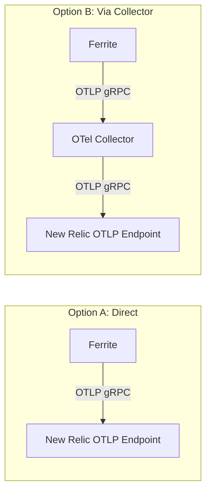

# New Relic Integration

This guide shows how to export Ferrite metrics and traces to New Relic using the native OTLP endpoint or the OpenTelemetry Collector.

## Architecture

New Relic supports direct OTLP ingestion, so you have two options:



:::tip
**Option A** (direct) is simpler for single-instance deployments. **Option B** (via Collector) is recommended for production because it lets you batch, filter, and route telemetry data before sending it to New Relic.
:::

## Prerequisites

- **Ferrite** running with OTLP export enabled
- A **New Relic account** with an [Ingest License Key](https://docs.newrelic.com/docs/apis/intro-apis/new-relic-api-keys/#license-key)
- (Option B) **OpenTelemetry Collector** (Contrib distribution)

## Option A: Direct OTLP Export

### Step 1: Configure Ferrite

Point Ferrite's OTLP exporter directly at New Relic's endpoint:

```toml title="ferrite.toml"
[otel]
enabled = true
endpoint = "https://otlp.nr-data.net:4317"
service_name = "ferrite"
traces_enabled = true
metrics_enabled = true

# New Relic requires the license key as a header
[otel.headers]
api-key = "${NEW_RELIC_LICENSE_KEY}"
```

:::warning
Store your New Relic license key in an environment variable. Never commit it to version control.
:::

### Step 2: Set the Environment Variable

```bash
export NEW_RELIC_LICENSE_KEY="your-license-key-here"
```

### Step 3: Verify in New Relic

1. Go to **New Relic → APM & Services**
2. Look for a service named `ferrite`
3. Check **Metrics** and **Distributed Tracing** sections

## Option B: Via OpenTelemetry Collector

### Step 1: Configure Ferrite

Point Ferrite at your local OTel Collector:

```toml title="ferrite.toml"
[otel]
enabled = true
endpoint = "http://otel-collector:4317"
service_name = "ferrite"
traces_enabled = true
metrics_enabled = true

[metrics]
enabled = true
bind = "0.0.0.0"
port = 9090
```

### Step 2: Configure the OTel Collector

```yaml title="otel-collector-config.yaml"
receivers:
  otlp:
    protocols:
      grpc:
        endpoint: "0.0.0.0:4317"
      http:
        endpoint: "0.0.0.0:4318"
  prometheus:
    config:
      scrape_configs:
        - job_name: "ferrite"
          scrape_interval: 15s
          static_configs:
            - targets: ["ferrite-host:9090"]

processors:
  batch:
    send_batch_size: 1000
    timeout: 10s
  resource:
    attributes:
      - key: deployment.environment
        value: "production"
        action: upsert
      - key: service.name
        value: "ferrite"
        action: upsert

exporters:
  otlp/newrelic:
    endpoint: "https://otlp.nr-data.net:4317"
    headers:
      api-key: "${NEW_RELIC_LICENSE_KEY}"
    compression: gzip

service:
  pipelines:
    metrics:
      receivers: [otlp, prometheus]
      processors: [batch, resource]
      exporters: [otlp/newrelic]
    traces:
      receivers: [otlp]
      processors: [batch, resource]
      exporters: [otlp/newrelic]
```

Run the collector:

```bash
docker run -d \
  --name otel-collector \
  -e NEW_RELIC_LICENSE_KEY="your-license-key" \
  -v $(pwd)/otel-collector-config.yaml:/etc/otelcol-contrib/config.yaml \
  -p 4317:4317 \
  -p 4318:4318 \
  otel/opentelemetry-collector-contrib:latest
```

## New Relic Dashboard Setup

### Using NRQL Queries

Once data is flowing, create dashboards in New Relic using NRQL:

**Commands per Second:**
```sql
SELECT rate(sum(ferrite.commands.total), 1 minute)
FROM Metric
FACET command
SINCE 1 hour ago
TIMESERIES
```

**P99 Command Latency:**
```sql
SELECT percentile(ferrite.command.duration.seconds, 99)
FROM Metric
FACET command
SINCE 1 hour ago
TIMESERIES
```

**Memory Utilization:**
```sql
SELECT latest(ferrite.memory.used.bytes) / latest(ferrite.memory.max.bytes) * 100 AS 'Memory %'
FROM Metric
SINCE 1 hour ago
TIMESERIES
```

**Active Connections:**
```sql
SELECT latest(ferrite.connections.active)
FROM Metric
SINCE 1 hour ago
TIMESERIES
```

**Key Eviction Rate:**
```sql
SELECT rate(sum(ferrite.evicted.keys.total), 1 minute) AS 'Evictions/min'
FROM Metric
SINCE 1 hour ago
TIMESERIES
```

### Create a Dashboard

1. Go to **Dashboards → Create a dashboard**
2. Add widgets using the NRQL queries above
3. Arrange into a layout that suits your team

## Alert Configuration

### Create Alert Conditions in New Relic

**High Latency:**
```sql
SELECT percentile(ferrite.command.duration.seconds, 99)
FROM Metric
WHERE service.name = 'ferrite'
```
- Critical threshold: above 0.05 for at least 5 minutes
- Warning threshold: above 0.01 for at least 5 minutes

**Memory Pressure:**
```sql
SELECT latest(ferrite.memory.used.bytes) / latest(ferrite.memory.max.bytes) * 100
FROM Metric
WHERE service.name = 'ferrite'
```
- Critical threshold: above 90 for at least 5 minutes
- Warning threshold: above 80 for at least 5 minutes

**No Data (Instance Down):**
```sql
SELECT count(*)
FROM Metric
WHERE service.name = 'ferrite'
```
- Alert when query returns no data for 2 minutes

### Set Up Notification Channels

1. Go to **Alerts → Destinations**
2. Configure Slack, PagerDuty, email, or webhook destinations
3. Create a **Workflow** that routes Ferrite alerts to the appropriate channel

## Regional Endpoints

New Relic has different OTLP endpoints depending on your account region:

| Region | OTLP Endpoint |
|--------|---------------|
| US | `https://otlp.nr-data.net:4317` |
| EU | `https://otlp.eu01.nr-data.net:4317` |

:::warning
Using the wrong regional endpoint will result in authentication failures. Check your account settings to confirm your region.
:::

## Troubleshooting

### No Data in New Relic

1. Verify the license key is valid and has Ingest permissions
2. Check Ferrite logs for OTLP export errors: `RUST_LOG=ferrite=debug`
3. If using the Collector, check its logs: `docker logs otel-collector`
4. Ensure you're using the correct regional endpoint

### Metrics Appear but Traces Don't

1. Confirm `traces_enabled = true` in `ferrite.toml`
2. Check that the OTLP endpoint accepts trace data (port 4317 for gRPC)
3. In New Relic, check **Distributed Tracing** (not APM Transactions)

## Next Steps

- [Datadog Integration](./datadog) — Alternative: export to Datadog
- [Grafana Integration](./grafana) — Open-source dashboarding with Prometheus
- [Observability Overview](./overview) — Full observability feature set
