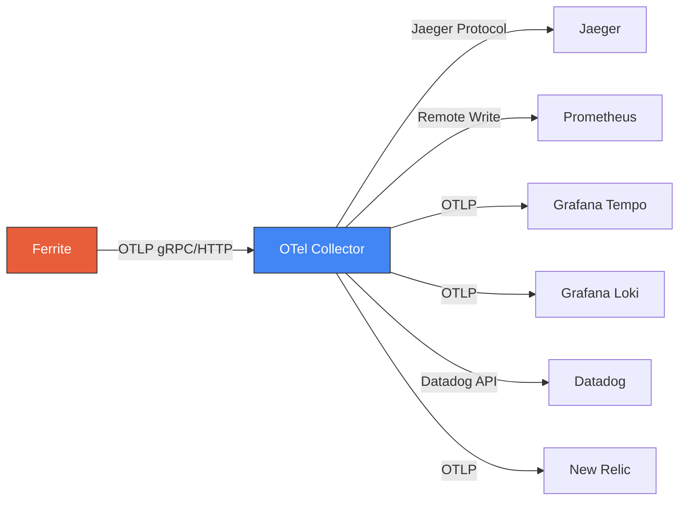
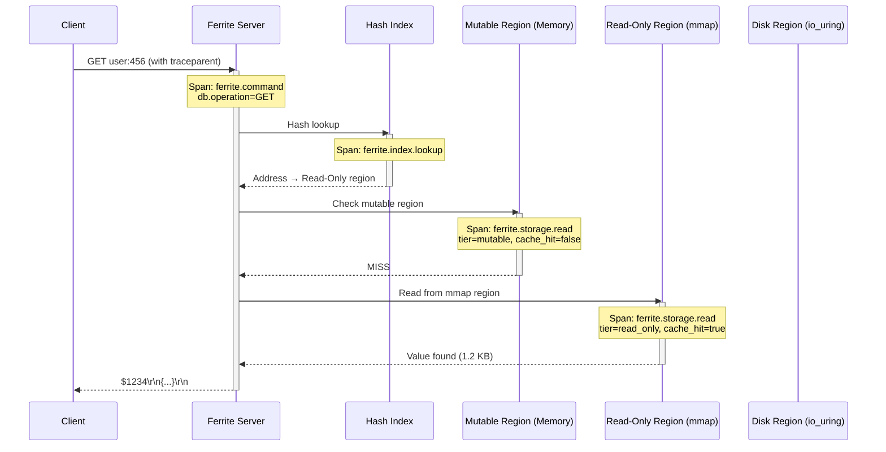

# OpenTelemetry Integration

Ferrite provides native OpenTelemetry (OTel) support across all three observability pillars -- traces, metrics, and logs. This guide covers everything from basic configuration to production deployment patterns.

## Overview

When compiled with the `otel` feature flag, Ferrite can export telemetry data using the OpenTelemetry Protocol (OTLP) to any compatible backend. This includes:

| Signal | Transport | Format | Backends |
|--------|-----------|--------|----------|
| **Traces** | OTLP gRPC / HTTP | Protobuf | Jaeger, Grafana Tempo, Zipkin, Datadog, New Relic, Honeycomb |
| **Metrics** | OTLP gRPC / HTTP | Protobuf | Prometheus (via Collector), Grafana Mimir, Datadog, New Relic |
| **Logs** | OTLP gRPC / HTTP | Protobuf | Grafana Loki, Elasticsearch, Splunk, Datadog |



:::tip
Using the OpenTelemetry Collector as an intermediary is the recommended production pattern. It decouples Ferrite from specific backends and lets you fan-out, sample, filter, and transform telemetry data without changing Ferrite's configuration.
:::

## Prerequisites

### Feature Flag

Ferrite must be compiled with the `otel` feature flag. This is included in the default feature set but excluded from the `lite` profile:

```bash
# Build with OTel support (included in default features)
cargo build --release

# Explicitly enable if using a custom feature set
cargo build --release --features otel

# Verify OTel support is compiled in
ferrite --version --features
# Output: ferrite 1.x.x (features: otel, io-uring, tls, ...)
```

### Dependencies

| Component | Minimum Version | Purpose |
|-----------|----------------|---------|
| Ferrite | 1.0+ with `otel` feature | Telemetry source |
| OTel Collector | 0.96+ | Telemetry pipeline (recommended) |
| Jaeger | 1.50+ | Trace visualization (optional) |
| Grafana | 10.0+ | Dashboard and visualization (optional) |
| Prometheus | 2.47+ | Metrics storage (optional) |

## Configuration

### Basic Configuration

Enable OpenTelemetry export in `ferrite.toml`:

```toml title="ferrite.toml"
[telemetry]
enabled = true
endpoint = "http://localhost:4317"
protocol = "grpc"  # or "http"
service_name = "ferrite"
sample_rate = 1.0
```

### Full Configuration Reference

```toml title="ferrite.toml"
[telemetry]
# Master switch for all OTel export
enabled = true

# OTLP endpoint (Collector or backend)
endpoint = "http://localhost:4317"

# Transport protocol: "grpc" (port 4317) or "http" (port 4318)
protocol = "grpc"

# Service identity
service_name = "ferrite"
service_version = "1.0.0"          # defaults to Ferrite build version
service_namespace = "production"

# Sampling: 1.0 = 100%, 0.1 = 10%, 0.0 = off
sample_rate = 1.0

# Per-signal toggles
traces_enabled = true
metrics_enabled = true
logs_enabled = true

# Export interval for metrics (seconds)
metrics_export_interval = 60

# Batch export settings
batch_size = 512
batch_timeout_ms = 5000

# Resource attributes added to all signals
[telemetry.resource_attributes]
"deployment.environment" = "production"
"host.name" = "ferrite-prod-01"
"service.instance.id" = "i-0abc123"

# Custom headers (e.g., for authentication)
[telemetry.headers]
"Authorization" = "Bearer ${OTEL_AUTH_TOKEN}"
```

### Environment Variable Overrides

All configuration values can be overridden with environment variables, following the standard OTel SDK conventions:

```bash
# Endpoint
export OTEL_EXPORTER_OTLP_ENDPOINT="http://collector:4317"

# Protocol
export OTEL_EXPORTER_OTLP_PROTOCOL="grpc"

# Service name
export OTEL_SERVICE_NAME="ferrite"

# Resource attributes
export OTEL_RESOURCE_ATTRIBUTES="deployment.environment=production,service.instance.id=i-0abc123"

# Trace sampling
export OTEL_TRACES_SAMPLER="parentbased_traceidratio"
export OTEL_TRACES_SAMPLER_ARG="0.1"

# Headers
export OTEL_EXPORTER_OTLP_HEADERS="Authorization=Bearer token123"
```

:::info
Environment variables take precedence over `ferrite.toml` values. This makes it easy to customize behavior per deployment without changing configuration files.
:::

## Collector Setup

### Docker Compose with OTel Collector

A minimal setup with the OpenTelemetry Collector receiving data from Ferrite and exporting to Jaeger (traces) and Prometheus (metrics):

```yaml title="otel-collector-config.yaml"
receivers:
  otlp:
    protocols:
      grpc:
        endpoint: "0.0.0.0:4317"
      http:
        endpoint: "0.0.0.0:4318"

processors:
  batch:
    send_batch_size: 1024
    timeout: 5s
  memory_limiter:
    check_interval: 1s
    limit_mib: 512
    spike_limit_mib: 128
  resource:
    attributes:
      - key: deployment.environment
        value: "production"
        action: upsert

exporters:
  otlp/jaeger:
    endpoint: "jaeger:4317"
    tls:
      insecure: true
  prometheus:
    endpoint: "0.0.0.0:8889"
    namespace: ferrite
  logging:
    loglevel: info

service:
  pipelines:
    traces:
      receivers: [otlp]
      processors: [memory_limiter, batch, resource]
      exporters: [otlp/jaeger, logging]
    metrics:
      receivers: [otlp]
      processors: [memory_limiter, batch, resource]
      exporters: [prometheus, logging]
    logs:
      receivers: [otlp]
      processors: [memory_limiter, batch]
      exporters: [logging]
```

```yaml title="docker-compose.yaml"
version: "3.9"

services:
  ferrite:
    image: ghcr.io/ferrite-rs/ferrite:latest
    ports:
      - "6379:6379"    # Redis-compatible port
      - "9090:9090"    # Prometheus metrics
    volumes:
      - ./ferrite.toml:/etc/ferrite/ferrite.toml
      - ferrite-data:/var/lib/ferrite
    environment:
      - RUST_LOG=ferrite=info
    depends_on:
      - otel-collector

  otel-collector:
    image: otel/opentelemetry-collector-contrib:0.96.0
    command: ["--config", "/etc/otelcol/config.yaml"]
    ports:
      - "4317:4317"    # OTLP gRPC
      - "4318:4318"    # OTLP HTTP
      - "8889:8889"    # Prometheus exporter
    volumes:
      - ./otel-collector-config.yaml:/etc/otelcol/config.yaml

  jaeger:
    image: jaegertracing/all-in-one:1.53
    ports:
      - "16686:16686"  # Jaeger UI
      - "14250:14250"  # gRPC receiver
    environment:
      - COLLECTOR_OTLP_ENABLED=true

  prometheus:
    image: prom/prometheus:v2.48.0
    ports:
      - "9091:9090"
    volumes:
      - ./prometheus.yml:/etc/prometheus/prometheus.yml

  grafana:
    image: grafana/grafana:10.2.0
    ports:
      - "3000:3000"
    environment:
      - GF_AUTH_ANONYMOUS_ENABLED=true
      - GF_AUTH_ANONYMOUS_ORG_ROLE=Admin
    volumes:
      - grafana-data:/var/lib/grafana

volumes:
  ferrite-data:
  grafana-data:
```

```yaml title="prometheus.yml"
global:
  scrape_interval: 15s

scrape_configs:
  # Scrape Ferrite's native Prometheus endpoint
  - job_name: "ferrite"
    static_configs:
      - targets: ["ferrite:9090"]

  # Scrape the OTel Collector's Prometheus exporter
  - job_name: "otel-collector"
    static_configs:
      - targets: ["otel-collector:8889"]
```

Start the full stack:

```bash
docker compose up -d
```

After starting, the following UIs are available:

| Service | URL | Purpose |
|---------|-----|---------|
| Jaeger | http://localhost:16686 | Trace visualization |
| Grafana | http://localhost:3000 | Dashboards |
| Prometheus | http://localhost:9091 | Metrics queries |

---

## Distributed Tracing

### Trace Context Propagation

Ferrite supports **W3C Trace Context** propagation. When a client sends the `traceparent` header alongside a command, Ferrite creates child spans under the incoming trace context. This enables end-to-end distributed tracing across your entire application stack.

```
traceparent: 00-<trace-id>-<parent-span-id>-<trace-flags>
```

Example:

```
traceparent: 00-0af7651916cd43dd8448eb211c80319c-b7ad6b7169203331-01
```

### Span Hierarchy

Every command processed by Ferrite produces a hierarchy of spans that captures the full request lifecycle:

```mermaid
gantt
    title Trace Waterfall: SET user:123 '{"name":"Alice"}'
    dateFormat X
    axisFormat %L ms

    section Client
    Application request           :a1, 0, 45

    section Ferrite Server
    RESP parse                    :a2, 2, 5
    Command dispatch              :a3, 5, 8
    SET command execute           :a4, 8, 38

    section Storage Engine
    Key hash + index lookup       :a5, 9, 14
    HybridLog mutable insert      :a6, 14, 22
    Epoch advance                 :a7, 22, 25
    AOF append                    :a8, 25, 35

    section Network
    Response serialize            :a9, 35, 38
    TCP write                     :a10, 38, 42
```



### Command Execution Spans

Every command creates a span with the following attributes:

| Attribute | Type | Description | Example |
|-----------|------|-------------|---------|
| `db.system` | string | Always `"ferrite"` | `"ferrite"` |
| `db.operation` | string | Command name | `"SET"` |
| `db.statement` | string | Full command (redacted keys optional) | `"SET user:123 ..."` |
| `ferrite.command.name` | string | Normalized command name | `"SET"` |
| `ferrite.command.key` | string | Primary key (if applicable) | `"user:123"` |
| `ferrite.command.result` | string | Result status | `"OK"`, `"NIL"`, `"ERR"` |
| `ferrite.command.args_count` | int | Number of arguments | `3` |

### Storage Operation Spans

Storage spans provide visibility into Ferrite's tiered HybridLog engine:

| Attribute | Type | Description | Example |
|-----------|------|-------------|---------|
| `ferrite.storage.operation` | string | Read or write | `"read"`, `"write"` |
| `ferrite.storage.tier` | string | HybridLog tier accessed | `"mutable"`, `"read_only"`, `"disk"` |
| `ferrite.storage.cache_hit` | bool | Whether the value was in the mutable region | `true` |
| `ferrite.storage.bytes` | int | Size of value in bytes | `1024` |
| `ferrite.storage.epoch` | int | Current epoch number | `42` |

### Network Spans

Network-level spans capture connection and replication activity:

| Attribute | Type | Description | Example |
|-----------|------|-------------|---------|
| `net.peer.ip` | string | Client IP address | `"192.168.1.10"` |
| `net.peer.port` | int | Client port | `54321` |
| `ferrite.connection.id` | int | Internal connection ID | `42` |
| `ferrite.replication.role` | string | Role in replication | `"primary"`, `"replica"` |
| `ferrite.replication.offset` | int | Replication offset | `123456789` |

### Example: Tracing a Cache Miss

The following diagram shows how a GET request flows through Ferrite's tiered storage when the value is not in the mutable region:



---

## Metrics via OTLP

In addition to the Prometheus `/metrics` endpoint, Ferrite can push metrics directly to any OTLP-compatible backend via the OpenTelemetry Collector. This eliminates the need for Prometheus scraping in environments that prefer push-based metrics.

### Exported Metrics

| Metric | Type | Unit | Description |
|--------|------|------|-------------|
| `ferrite.commands.total` | Counter | `{commands}` | Total commands processed, labeled by `command` |
| `ferrite.command.duration` | Histogram | `s` | Command latency distribution, labeled by `command` |
| `ferrite.memory.used` | Gauge | `By` | Current memory consumption in bytes |
| `ferrite.memory.max` | Gauge | `By` | Configured maximum memory |
| `ferrite.connections.active` | Gauge | `{connections}` | Current active client connections |
| `ferrite.connections.total` | Counter | `{connections}` | Total connections opened since start |
| `ferrite.cache.hit.rate` | Gauge | `1` | Ratio of mutable-region hits to total reads (0.0-1.0) |
| `ferrite.cache.hits.total` | Counter | `{hits}` | Total mutable-region cache hits |
| `ferrite.cache.misses.total` | Counter | `{misses}` | Total mutable-region cache misses |
| `ferrite.hybridlog.tier.size` | Gauge | `By` | Size of each HybridLog tier, labeled by `tier` |
| `ferrite.keys.total` | Gauge | `{keys}` | Total keys stored, labeled by `db` |
| `ferrite.keys.expired.total` | Counter | `{keys}` | Keys removed by TTL expiration |
| `ferrite.keys.evicted.total` | Counter | `{keys}` | Keys evicted due to memory pressure |
| `ferrite.network.bytes.received` | Counter | `By` | Total bytes received from clients |
| `ferrite.network.bytes.sent` | Counter | `By` | Total bytes sent to clients |
| `ferrite.replication.lag` | Gauge | `By` | Replication lag in bytes, labeled by `replica` |
| `ferrite.aof.sync.duration` | Histogram | `s` | AOF fsync latency distribution |
| `ferrite.epoch.current` | Gauge | `{epoch}` | Current epoch number |

### Grafana Dashboard with OTLP Data Source

When using the OTel Collector's Prometheus exporter, Ferrite OTLP metrics appear in Prometheus with the `ferrite_` prefix (dots converted to underscores). Add the following data sources in Grafana:

1. **Prometheus** -- for scraped and OTLP-exported metrics
2. **Jaeger** or **Tempo** -- for trace data
3. **Loki** -- for log data (if forwarding logs through the Collector)

Example Grafana panel queries using OTLP-exported metrics:

```promql
# Commands per second by type
sum(rate(ferrite_commands_total[1m])) by (command)

# P99 command latency
histogram_quantile(0.99, sum(rate(ferrite_command_duration_bucket[5m])) by (le, command))

# Cache hit rate
ferrite_cache_hit_rate

# HybridLog tier sizes
ferrite_hybridlog_tier_size

# Memory utilization percentage
ferrite_memory_used / ferrite_memory_max * 100
```

---

## Logs

### Structured Logging with Trace Correlation

When OTel is enabled, Ferrite automatically injects `trace_id` and `span_id` into every structured log line. This enables one-click navigation from a log entry to its corresponding trace in Jaeger or Tempo.

```json
{
  "timestamp": "2025-07-15T10:30:00.123Z",
  "level": "INFO",
  "target": "ferrite::commands::strings",
  "message": "Command executed",
  "trace_id": "0af7651916cd43dd8448eb211c80319c",
  "span_id": "b7ad6b7169203331",
  "fields": {
    "command": "SET",
    "key": "user:123",
    "duration_us": 45,
    "result": "OK",
    "client_addr": "192.168.1.10:54321"
  }
}
```

### Log Export to OTel Collector

To forward structured logs through the OTel Collector (instead of or in addition to stdout), enable log export in your configuration:

```toml title="ferrite.toml"
[telemetry]
enabled = true
endpoint = "http://localhost:4317"
logs_enabled = true

[logging]
level = "info"
format = "json"
```

Add a logs pipeline to your Collector configuration:

```yaml title="otel-collector-config.yaml"
receivers:
  otlp:
    protocols:
      grpc:
        endpoint: "0.0.0.0:4317"

exporters:
  loki:
    endpoint: "http://loki:3100/loki/api/v1/push"
    labels:
      attributes:
        service.name: "service_name"
        level: "level"
      resource:
        deployment.environment: "environment"

service:
  pipelines:
    logs:
      receivers: [otlp]
      processors: [batch]
      exporters: [loki]
```

In Grafana, use the Loki data source to query Ferrite logs and correlate them with traces:

```logql
{service_name="ferrite"} | json | trace_id != "" | line_format "{{.message}}"
```

:::tip
In Grafana, configure a derived field on the Loki data source to link `trace_id` values to your Jaeger or Tempo data source. This enables one-click navigation from log lines to full trace views.
:::

---

## Examples

### Full Docker Compose Stack

This complete example deploys Ferrite with the OTel Collector, Jaeger, Prometheus, Grafana, and Loki for a full observability stack:

```yaml title="docker-compose-full-otel.yaml"
version: "3.9"

services:
  # --- Ferrite ---
  ferrite:
    image: ghcr.io/ferrite-rs/ferrite:latest
    ports:
      - "6379:6379"
      - "9090:9090"
    volumes:
      - ./ferrite.toml:/etc/ferrite/ferrite.toml
      - ferrite-data:/var/lib/ferrite
    environment:
      - RUST_LOG=ferrite=info
      - OTEL_EXPORTER_OTLP_ENDPOINT=http://otel-collector:4317
      - OTEL_SERVICE_NAME=ferrite
    depends_on:
      otel-collector:
        condition: service_started

  # --- OpenTelemetry Collector ---
  otel-collector:
    image: otel/opentelemetry-collector-contrib:0.96.0
    command: ["--config", "/etc/otelcol/config.yaml"]
    ports:
      - "4317:4317"
      - "4318:4318"
      - "8889:8889"
    volumes:
      - ./otel-collector-config.yaml:/etc/otelcol/config.yaml
    depends_on:
      - jaeger
      - loki

  # --- Jaeger (Tracing) ---
  jaeger:
    image: jaegertracing/all-in-one:1.53
    ports:
      - "16686:16686"
      - "4317"
    environment:
      - COLLECTOR_OTLP_ENABLED=true

  # --- Prometheus (Metrics) ---
  prometheus:
    image: prom/prometheus:v2.48.0
    ports:
      - "9091:9090"
    volumes:
      - ./prometheus.yml:/etc/prometheus/prometheus.yml
      - prometheus-data:/prometheus

  # --- Grafana (Dashboards) ---
  grafana:
    image: grafana/grafana:10.2.0
    ports:
      - "3000:3000"
    environment:
      - GF_AUTH_ANONYMOUS_ENABLED=true
      - GF_AUTH_ANONYMOUS_ORG_ROLE=Admin
    volumes:
      - grafana-data:/var/lib/grafana
      - ./grafana/provisioning:/etc/grafana/provisioning
    depends_on:
      - prometheus
      - jaeger
      - loki

  # --- Loki (Logs) ---
  loki:
    image: grafana/loki:2.9.0
    ports:
      - "3100:3100"
    command: -config.file=/etc/loki/local-config.yaml
    volumes:
      - loki-data:/loki

volumes:
  ferrite-data:
  prometheus-data:
  grafana-data:
  loki-data:
```

The corresponding full Collector configuration:

```yaml title="otel-collector-config.yaml"
receivers:
  otlp:
    protocols:
      grpc:
        endpoint: "0.0.0.0:4317"
      http:
        endpoint: "0.0.0.0:4318"

processors:
  batch:
    send_batch_size: 1024
    timeout: 5s
  memory_limiter:
    check_interval: 1s
    limit_mib: 512
    spike_limit_mib: 128
  resource:
    attributes:
      - key: deployment.environment
        value: "production"
        action: upsert

exporters:
  otlp/jaeger:
    endpoint: "jaeger:4317"
    tls:
      insecure: true
  prometheus:
    endpoint: "0.0.0.0:8889"
    namespace: ferrite
  loki:
    endpoint: "http://loki:3100/loki/api/v1/push"
    labels:
      attributes:
        service.name: "service_name"
        level: "level"
  logging:
    loglevel: warn

service:
  telemetry:
    logs:
      level: info
  pipelines:
    traces:
      receivers: [otlp]
      processors: [memory_limiter, batch, resource]
      exporters: [otlp/jaeger, logging]
    metrics:
      receivers: [otlp]
      processors: [memory_limiter, batch, resource]
      exporters: [prometheus, logging]
    logs:
      receivers: [otlp]
      processors: [memory_limiter, batch]
      exporters: [loki, logging]
```

### Kubernetes Deployment with OTel Operator

The [OpenTelemetry Operator](https://opentelemetry.io/docs/kubernetes/operator/) simplifies Collector management in Kubernetes. Install it first, then create an `OpenTelemetryCollector` resource:

```bash
# Install the OTel Operator (requires cert-manager)
kubectl apply -f https://github.com/cert-manager/cert-manager/releases/download/v1.13.3/cert-manager.yaml
kubectl apply -f https://github.com/open-telemetry/opentelemetry-operator/releases/latest/download/opentelemetry-operator.yaml
```

```yaml title="otel-collector-k8s.yaml"
apiVersion: opentelemetry.io/v1alpha1
kind: OpenTelemetryCollector
metadata:
  name: ferrite-collector
  namespace: ferrite
spec:
  mode: deployment   # or daemonset, sidecar
  replicas: 2
  config: |
    receivers:
      otlp:
        protocols:
          grpc:
            endpoint: "0.0.0.0:4317"
          http:
            endpoint: "0.0.0.0:4318"

    processors:
      batch:
        send_batch_size: 1024
        timeout: 5s
      memory_limiter:
        check_interval: 1s
        limit_mib: 512
      k8sattributes:
        extract:
          metadata:
            - k8s.namespace.name
            - k8s.deployment.name
            - k8s.pod.name
            - k8s.node.name
        pod_association:
          - sources:
              - from: resource_attribute
                name: k8s.pod.ip

    exporters:
      otlp/tempo:
        endpoint: "tempo.monitoring:4317"
        tls:
          insecure: true
      prometheusremotewrite:
        endpoint: "http://mimir.monitoring:9009/api/v1/push"
      loki:
        endpoint: "http://loki.monitoring:3100/loki/api/v1/push"

    service:
      pipelines:
        traces:
          receivers: [otlp]
          processors: [memory_limiter, k8sattributes, batch]
          exporters: [otlp/tempo]
        metrics:
          receivers: [otlp]
          processors: [memory_limiter, k8sattributes, batch]
          exporters: [prometheusremotewrite]
        logs:
          receivers: [otlp]
          processors: [memory_limiter, k8sattributes, batch]
          exporters: [loki]
```

Update the Ferrite Helm values to point at the Collector:

```yaml title="values.yaml"
ferrite:
  config:
    telemetry:
      enabled: true
      endpoint: "http://ferrite-collector-collector.ferrite:4317"
      protocol: "grpc"
      service_name: "ferrite"
      sample_rate: 1.0
      traces_enabled: true
      metrics_enabled: true
      logs_enabled: true

  env:
    - name: OTEL_RESOURCE_ATTRIBUTES
      value: "k8s.namespace.name=ferrite,k8s.deployment.name=ferrite"
```

Deploy:

```bash
helm install ferrite ferrite-ops/charts/ferrite -f values.yaml -n ferrite
kubectl apply -f otel-collector-k8s.yaml -n ferrite
```

### Client-Side Trace Propagation

To get end-to-end traces that include your application code and Ferrite, propagate the W3C `traceparent` header from your application when connecting to Ferrite. Below are examples for popular languages.

#### Python (with `opentelemetry-sdk`)

```python
import redis
from opentelemetry import trace
from opentelemetry.sdk.trace import TracerProvider
from opentelemetry.sdk.trace.export import BatchSpanExporter
from opentelemetry.exporter.otlp.proto.grpc.trace_exporter import OTLPSpanExporter
from opentelemetry.propagate import inject
from opentelemetry.instrumentation.redis import RedisInstrumentor

# Set up OTel tracing
provider = TracerProvider()
provider.add_span_processor(
    BatchSpanExporter(OTLPSpanExporter(endpoint="http://localhost:4317"))
)
trace.set_tracer_provider(provider)
tracer = trace.get_tracer("my-application")

# Auto-instrument the redis client
RedisInstrumentor().instrument()

# Create a Redis client pointing at Ferrite
client = redis.Redis(host="localhost", port=6379)

# All Redis operations are now automatically traced
with tracer.start_as_current_span("handle-user-request") as span:
    span.set_attribute("user.id", "user-123")

    # These calls create child spans linked to the parent
    client.set("user:123:session", "session-data-here", ex=3600)
    session = client.get("user:123:session")
    client.hset("user:123:profile", mapping={
        "name": "Alice",
        "email": "alice@example.com"
    })
```

#### Node.js (with `@opentelemetry/sdk-node`)

```javascript
const { NodeSDK } = require("@opentelemetry/sdk-node");
const {
  OTLPTraceExporter,
} = require("@opentelemetry/exporter-trace-otlp-grpc");
const {
  RedisInstrumentation,
} = require("@opentelemetry/instrumentation-redis-4");
const { trace } = require("@opentelemetry/api");

// Initialize OTel SDK with Redis auto-instrumentation
const sdk = new NodeSDK({
  traceExporter: new OTLPTraceExporter({
    url: "http://localhost:4317",
  }),
  instrumentations: [new RedisInstrumentation()],
  serviceName: "my-node-app",
});
sdk.start();

const Redis = require("ioredis");
const client = new Redis({ host: "localhost", port: 6379 });

const tracer = trace.getTracer("my-node-app");

async function handleRequest(userId) {
  return tracer.startActiveSpan("handle-user-request", async (span) => {
    try {
      span.setAttribute("user.id", userId);

      // Auto-instrumented: creates child spans for each Ferrite call
      await client.set(`user:${userId}:session`, "session-data", "EX", 3600);
      const session = await client.get(`user:${userId}:session`);
      await client.hset(`user:${userId}:profile`, {
        name: "Alice",
        email: "alice@example.com",
      });

      return session;
    } finally {
      span.end();
    }
  });
}
```

#### Rust (with `tracing` and `opentelemetry`)

```rust
use opentelemetry::global;
use opentelemetry_otlp::WithExportConfig;
use opentelemetry_sdk::trace::TracerProvider;
use tracing::{info_span, Instrument};
use tracing_opentelemetry::OpenTelemetryLayer;
use tracing_subscriber::{layer::SubscriberExt, Registry};

#[tokio::main]
async fn main() -> Result<(), Box<dyn std::error::Error>> {
    // Configure OTLP trace exporter
    let exporter = opentelemetry_otlp::new_exporter()
        .tonic()
        .with_endpoint("http://localhost:4317");

    let tracer_provider = TracerProvider::builder()
        .with_batch_exporter(
            opentelemetry_otlp::new_pipeline()
                .tracing()
                .with_exporter(exporter)
                .build_batch_exporter()?,
            opentelemetry_sdk::runtime::Tokio,
        )
        .build();

    let tracer = tracer_provider.tracer("my-rust-app");

    // Set up tracing subscriber with OTel layer
    let subscriber = Registry::default()
        .with(OpenTelemetryLayer::new(tracer));
    tracing::subscriber::set_global_default(subscriber)?;

    // Connect to Ferrite using the redis crate
    let client = redis::Client::open("redis://127.0.0.1:6379/")?;
    let mut conn = client.get_multiplexed_async_connection().await?;

    // All operations inside this span are correlated
    async {
        redis::cmd("SET")
            .arg("user:123:session")
            .arg("session-data")
            .arg("EX")
            .arg(3600)
            .query_async::<_, ()>(&mut conn)
            .await?;

        let session: Option<String> = redis::cmd("GET")
            .arg("user:123:session")
            .query_async(&mut conn)
            .await?;

        tracing::info!(session = ?session, "Retrieved session");
        Ok::<_, Box<dyn std::error::Error>>(())
    }
    .instrument(info_span!("handle_user_request", user.id = "user-123"))
    .await?;

    // Ensure all spans are flushed before exit
    global::shutdown_tracer_provider();
    Ok(())
}
```

---

## Troubleshooting

### Ferrite Reports "OTel not available"

**Cause:** Ferrite was compiled without the `otel` feature flag.

**Solution:**
```bash
# Rebuild with otel feature
cargo build --release --features otel

# Or use the default feature set (includes otel)
cargo build --release
```

### No Traces Appearing in Jaeger

| Check | Command |
|-------|---------|
| Is `telemetry.enabled` set to `true`? | Inspect `ferrite.toml` |
| Is the OTLP endpoint reachable? | `curl -v http://localhost:4317` |
| Is the Collector running? | `docker logs otel-collector` |
| Are traces enabled? | Confirm `traces_enabled = true` in `ferrite.toml` |
| Is the sample rate > 0? | Confirm `sample_rate` is not `0.0` |

Enable debug logging to see OTLP export activity:

```bash
RUST_LOG=ferrite=debug,opentelemetry=debug ferrite --config ferrite.toml
```

### Metrics Not Arriving via OTLP

1. Confirm `metrics_enabled = true` in `ferrite.toml`
2. Check the Collector's Prometheus exporter is reachable: `curl http://localhost:8889/metrics`
3. Verify the Collector pipeline includes the `metrics` pipeline
4. Look for batch timeout or memory limiter drops in Collector logs

### High Memory Usage in OTel Collector

The Collector may accumulate data if backends are slow or unreachable:

```yaml
processors:
  memory_limiter:
    check_interval: 1s
    limit_mib: 512          # Hard limit
    spike_limit_mib: 128    # Spike buffer
  batch:
    send_batch_size: 512    # Reduce batch size
    timeout: 2s             # Reduce timeout
```

### Trace Context Not Propagating

Ensure your client library sends the `traceparent` header. Most Redis client libraries do not propagate HTTP headers natively -- you need OTel auto-instrumentation for your language (see the [Client-Side Trace Propagation](#client-side-trace-propagation) section above).

---

## Performance Impact

OpenTelemetry instrumentation adds minimal overhead to Ferrite operations. The following measurements were taken on a 16-core AMD EPYC with 64 GB RAM running Ferrite under a sustained 500K ops/sec workload:

| Configuration | Throughput Impact | P99 Latency Impact | Memory Overhead |
|---------------|-------------------|---------------------|-----------------|
| OTel disabled | Baseline | Baseline | Baseline |
| Traces only (100% sampling) | -2.1% | +0.05 ms | +45 MB |
| Traces only (10% sampling) | -0.3% | +0.01 ms | +8 MB |
| Metrics only | -0.5% | +0.01 ms | +12 MB |
| All signals (100% sampling) | -3.0% | +0.08 ms | +60 MB |
| All signals (10% sampling) | -0.8% | +0.02 ms | +20 MB |

:::tip
For high-throughput production deployments, use probabilistic sampling at 1-10% rather than 100%. The `sample_rate` configuration option or the `OTEL_TRACES_SAMPLER_ARG` environment variable controls the trace sampling ratio. Metrics and logs are unaffected by trace sampling.
:::

**Recommendations:**

1. **Development/staging:** Use `sample_rate = 1.0` for full visibility
2. **Production (< 100K ops/sec):** Use `sample_rate = 1.0` -- the overhead is negligible
3. **Production (100K-1M ops/sec):** Use `sample_rate = 0.1` (10% sampling)
4. **Production (> 1M ops/sec):** Use `sample_rate = 0.01` (1% sampling) or implement tail-based sampling in the Collector

---

## Next Steps

- [Distributed Tracing Deep Dive](./distributed-tracing) -- Sampling strategies, baggage propagation, and APM integrations
- [Grafana Integration](./grafana) -- Set up dashboards with Prometheus and Tempo
- [Datadog Integration](./datadog) -- Export telemetry to Datadog via the Collector
- [New Relic Integration](./newrelic) -- Connect Ferrite to New Relic's OTLP endpoint
- [Monitoring](../operations/monitoring) -- Built-in metrics endpoint and INFO command
