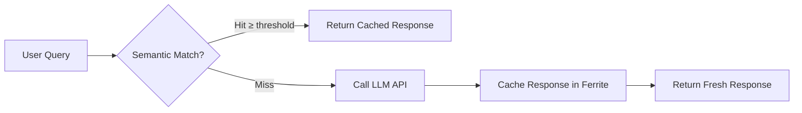
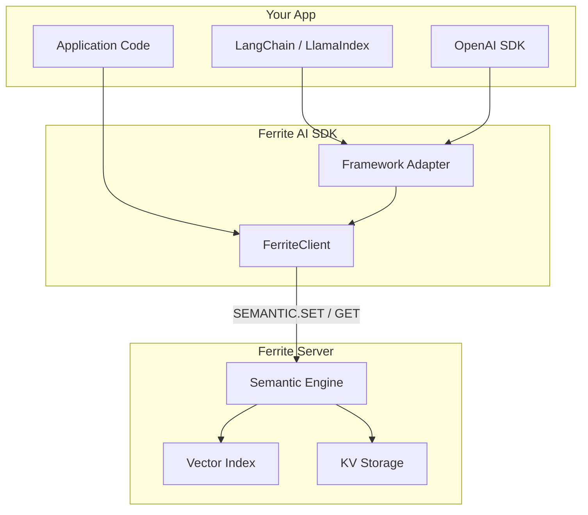

# AI SDK Overview

Ferrite provides dedicated **AI SDKs** for Python and TypeScript that wrap the semantic caching engine, giving LLM frameworks like LangChain, LlamaIndex, and OpenAI a high-performance cache layer with zero boilerplate.

## Why Semantic Caching?

Traditional caches match on exact keys. Semantic caching matches on **meaning** — so "What is the capital of France?" and "France's capital city?" share the same cache entry. This typically reduces LLM API costs by **40–60 %** while keeping response quality high.



## Available SDKs

| SDK | Package | Frameworks |
|-----|---------|------------|
| [Python SDK](./python-ai-sdk) | `ferrite-ai` | LangChain, LlamaIndex, OpenAI |
| [TypeScript SDK](./typescript-ai-sdk) | `@ferrite/ai` | LangChain.js, OpenAI |

Both SDKs share the same design:

1. **`FerriteClient`** — core semantic `set` / `get` / `delete` / `stats` operations.
2. **Framework adapters** — drop-in cache classes for LangChain, LlamaIndex, etc.
3. **OpenAI wrapper** — transparent caching around `chat.completions.create`.

## Choosing a SDK

| Use case | Recommended |
|----------|-------------|
| Python + LangChain / LlamaIndex | [Python SDK](./python-ai-sdk) |
| Python + OpenAI directly | [Python SDK](./python-ai-sdk) |
| Node.js / TypeScript + LangChain.js | [TypeScript SDK](./typescript-ai-sdk) |
| Node.js / TypeScript + OpenAI | [TypeScript SDK](./typescript-ai-sdk) |
| Direct Ferrite commands (any language) | [Base client SDKs](./overview) |

## Quick Comparison

```python
# Python
from ferrite_ai import FerriteClient

client = FerriteClient()
client.semantic_set("What is Python?", "A programming language.")
result = client.semantic_get("Tell me about Python")
```

```typescript
// TypeScript
import { FerriteClient } from "@ferrite/ai";

const client = new FerriteClient();
await client.semanticSet("What is Python?", "A programming language.");
const result = await client.semanticGet("Tell me about Python");
```

## Configuration

All SDKs accept the same core options:

| Parameter | Python | TypeScript | Default | Description |
|-----------|--------|------------|---------|-------------|
| Host | `host` | `host` | `127.0.0.1` | Ferrite server address |
| Port | `port` | `port` | `6380` | Ferrite server port |
| Threshold | `threshold` | `threshold` | `0.85` | Min similarity for a hit |
| TTL | `ttl` | `ttl` | `None` | Entry time-to-live (seconds) |
| Namespace | `namespace` | `namespace` | `"sem"` | Key prefix for isolation |

## Architecture

The AI SDKs build on Ferrite's `SEMANTIC.SET` / `SEMANTIC.GET` / `SEMANTIC.DEL` commands, which combine vector embedding with key-value storage. The server handles embedding generation, similarity search, and storage — the SDKs provide a thin, typed wrapper.


