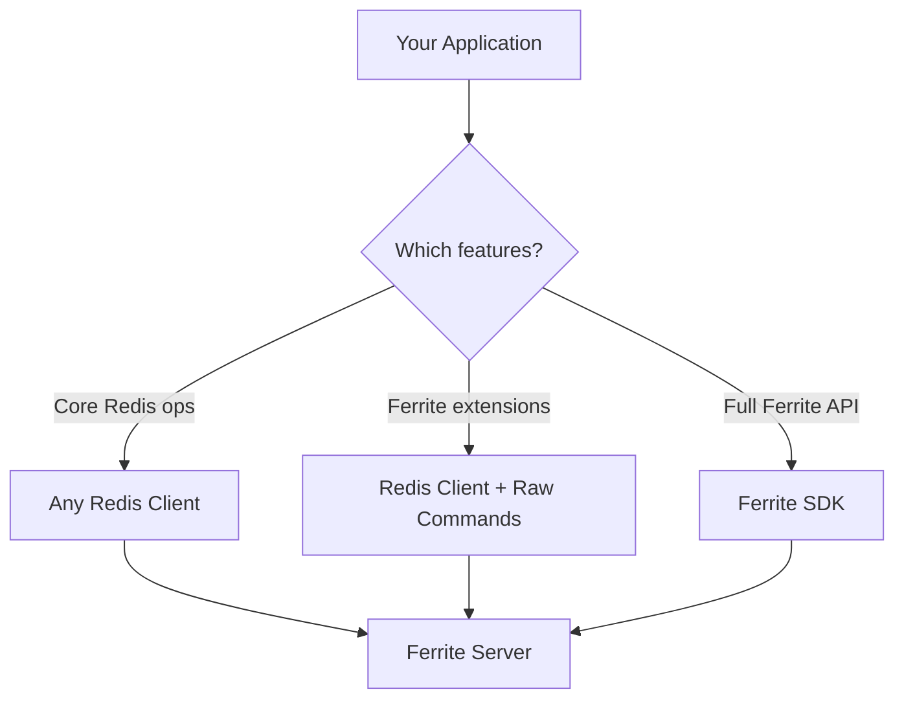

# Client SDKs Overview

Ferrite implements the Redis Serialization Protocol (RESP), which means **any standard Redis client library works with Ferrite** for core operations. For Ferrite-specific features like vector search, semantic caching, time series, and graph queries, you'll need to use raw commands or Ferrite-aware client extensions.

## Compatibility Approach

### Standard Redis Clients

These clients work with Ferrite immediately for all Redis-compatible commands:

| Language | Client | Install |
|----------|--------|---------|
| Python | `redis-py` | `pip install redis` |
| Node.js | `ioredis` | `npm install ioredis` |
| Go | `go-redis` | `go get github.com/redis/go-redis/v9` |
| Rust | `redis-rs` | `cargo add redis` |
| Java | Jedis / Lettuce | Maven/Gradle |
| C# | StackExchange.Redis | NuGet |

### Ferrite-Specific Commands

Ferrite extends the Redis command set with additional commands. Use your client's raw/custom command interface to access them:

| Feature | Command Prefix | Example |
|---------|---------------|---------|
| Vector Search | `VECTOR.*` | `VECTOR.SEARCH index query_vec K 10` |
| Semantic Cache | `SEMANTIC.*` | `SEMANTIC.SET key "natural language text"` |
| Time Series | `TS.*` | `TS.ADD key * 23.5` |
| Document Store | `DOC.*` | `DOC.INSERT collection id {...}` |
| Graph | `GRAPH.*` | `GRAPH.QUERY social "MATCH (n) RETURN n"` |
| Full-Text Search | `FT.*` | `FT.SEARCH index "query string"` |

:::tip
All Ferrite-specific commands are accessible via any Redis client's generic command execution method (e.g., `execute_command` in redis-py, `call` in ioredis, `Do` in go-redis).
:::

## Choosing a Client

For most applications, use the standard Redis client for your language. You get:

- **Battle-tested stability** — these clients have years of production use
- **Connection pooling** — built-in for all major clients
- **Cluster support** — automatic slot routing
- **Full Redis compatibility** — all standard commands work

If you need Ferrite-specific features, the guides below show how to use raw commands with each client, plus examples of common patterns like vector search and semantic caching.

## Language Guides

| Language | Guide | Covers |
|----------|-------|--------|
| Python | [Python SDK Guide](./python) | redis-py, aioredis, connection pooling, vector search |
| Node.js | [Node.js SDK Guide](./nodejs) | ioredis, TypeScript types, custom commands |
| Go | [Go SDK Guide](./go) | go-redis, context handling, generics |
| Rust | [Rust SDK Guide](./rust) | redis-rs, embedded mode, deadpool-redis |

:::tip
For the official Ferrite SDK libraries with full type-safe APIs, see the [SDK reference](/docs/sdk/rust).
:::

## Next Steps

- [Python SDK Guide](./python) — Get started with Python
- [Node.js SDK Guide](./nodejs) — Get started with Node.js
- [Go SDK Guide](./go) — Get started with Go
- [Rust SDK Guide](./rust) — Get started with Rust
