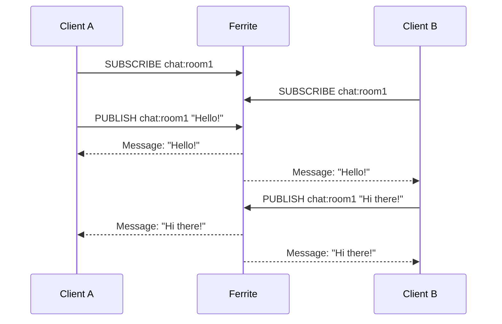

# Build a Real-Time Chat Application

Learn how to build a scalable real-time chat application using Ferrite's Pub/Sub and data structures.

## What You'll Build

A fully-functional chat application with:
- Real-time messaging via Pub/Sub
- Multiple chat rooms
- Message history
- User presence tracking
- Typing indicators

## Prerequisites

- Ferrite server running locally
- Rust installed (or your preferred language with a Redis client)
- Basic understanding of async programming

## Architecture Overview



## Step 1: Data Model Design

### Key Patterns

```
# User data
user:{user_id}                    → Hash (name, avatar, status)
user:{user_id}:rooms              → Set of room IDs

# Room data
room:{room_id}                    → Hash (name, description, created_at)
room:{room_id}:members            → Set of user IDs
room:{room_id}:messages           → List of message IDs
room:{room_id}:typing             → Set of user IDs currently typing

# Message data
message:{message_id}              → Hash (content, user_id, timestamp)

# Pub/Sub channels
chat:room:{room_id}               → Channel for room messages
presence:{room_id}                → Channel for presence updates
typing:{room_id}                  → Channel for typing indicators
```

## Step 2: Setting Up the Rust Project

```bash
cargo new ferrite-chat
cd ferrite-chat
```

Add dependencies to `Cargo.toml`:

```toml
[dependencies]
ferrite-client = "0.1"
tokio = { version = "1", features = ["full"] }
serde = { version = "1", features = ["derive"] }
serde_json = "1"
uuid = { version = "1", features = ["v4"] }
chrono = { version = "0.4", features = ["serde"] }
```

## Step 3: Define Data Structures

```rust
// src/models.rs
use chrono::{DateTime, Utc};
use serde::{Deserialize, Serialize};

#[derive(Debug, Clone, Serialize, Deserialize)]
pub struct User {
    pub id: String,
    pub name: String,
    pub avatar: Option<String>,
    pub status: UserStatus,
}

#[derive(Debug, Clone, Serialize, Deserialize)]
pub enum UserStatus {
    Online,
    Away,
    Offline,
}

#[derive(Debug, Clone, Serialize, Deserialize)]
pub struct Room {
    pub id: String,
    pub name: String,
    pub description: Option<String>,
    pub created_at: DateTime<Utc>,
}

#[derive(Debug, Clone, Serialize, Deserialize)]
pub struct Message {
    pub id: String,
    pub room_id: String,
    pub user_id: String,
    pub content: String,
    pub timestamp: DateTime<Utc>,
}

#[derive(Debug, Clone, Serialize, Deserialize)]
#[serde(tag = "type")]
pub enum ChatEvent {
    Message(Message),
    UserJoined { user_id: String, room_id: String },
    UserLeft { user_id: String, room_id: String },
    TypingStarted { user_id: String },
    TypingStopped { user_id: String },
}
```

## Step 4: Implement the Chat Service

```rust
// src/chat_service.rs
use crate::models::*;
use ferrite_client::Client;
use chrono::Utc;
use uuid::Uuid;

pub struct ChatService {
    client: Client,
}

impl ChatService {
    pub async fn new(addr: &str) -> Result<Self, Box<dyn std::error::Error>> {
        let client = Client::connect(addr).await?;
        Ok(Self { client })
    }

    // User Management
    pub async fn create_user(&self, name: &str) -> Result<User, Box<dyn std::error::Error>> {
        let user = User {
            id: Uuid::new_v4().to_string(),
            name: name.to_string(),
            avatar: None,
            status: UserStatus::Online,
        };

        self.client.hset(
            &format!("user:{}", user.id),
            &[
                ("name", &user.name),
                ("status", "online"),
            ],
        ).await?;

        Ok(user)
    }

    pub async fn get_user(&self, user_id: &str) -> Result<Option<User>, Box<dyn std::error::Error>> {
        let data: Option<HashMap<String, String>> = self.client
            .hgetall(&format!("user:{}", user_id))
            .await?;

        Ok(data.map(|d| User {
            id: user_id.to_string(),
            name: d.get("name").cloned().unwrap_or_default(),
            avatar: d.get("avatar").cloned(),
            status: match d.get("status").map(|s| s.as_str()) {
                Some("online") => UserStatus::Online,
                Some("away") => UserStatus::Away,
                _ => UserStatus::Offline,
            },
        }))
    }

    pub async fn set_user_status(&self, user_id: &str, status: UserStatus)
        -> Result<(), Box<dyn std::error::Error>>
    {
        let status_str = match status {
            UserStatus::Online => "online",
            UserStatus::Away => "away",
            UserStatus::Offline => "offline",
        };

        self.client.hset(
            &format!("user:{}", user_id),
            &[("status", status_str)],
        ).await?;

        // Publish presence update to all rooms the user is in
        let rooms: Vec<String> = self.client
            .smembers(&format!("user:{}:rooms", user_id))
            .await?;

        for room_id in rooms {
            self.client.publish(
                &format!("presence:{}", room_id),
                &serde_json::to_string(&serde_json::json!({
                    "user_id": user_id,
                    "status": status_str
                }))?,
            ).await?;
        }

        Ok(())
    }

    // Room Management
    pub async fn create_room(&self, name: &str, description: Option<&str>)
        -> Result<Room, Box<dyn std::error::Error>>
    {
        let room = Room {
            id: Uuid::new_v4().to_string(),
            name: name.to_string(),
            description: description.map(|s| s.to_string()),
            created_at: Utc::now(),
        };

        self.client.hset(
            &format!("room:{}", room.id),
            &[
                ("name", &room.name),
                ("description", room.description.as_deref().unwrap_or("")),
                ("created_at", &room.created_at.to_rfc3339()),
            ],
        ).await?;

        // Add to room index
        self.client.sadd("rooms", &[&room.id]).await?;

        Ok(room)
    }

    pub async fn join_room(&self, user_id: &str, room_id: &str)
        -> Result<(), Box<dyn std::error::Error>>
    {
        // Add user to room members
        self.client.sadd(&format!("room:{}:members", room_id), &[user_id]).await?;

        // Add room to user's rooms
        self.client.sadd(&format!("user:{}:rooms", user_id), &[room_id]).await?;

        // Publish join event
        let event = ChatEvent::UserJoined {
            user_id: user_id.to_string(),
            room_id: room_id.to_string(),
        };

        self.client.publish(
            &format!("chat:room:{}", room_id),
            &serde_json::to_string(&event)?,
        ).await?;

        Ok(())
    }

    pub async fn leave_room(&self, user_id: &str, room_id: &str)
        -> Result<(), Box<dyn std::error::Error>>
    {
        // Remove user from room
        self.client.srem(&format!("room:{}:members", room_id), &[user_id]).await?;
        self.client.srem(&format!("user:{}:rooms", user_id), &[room_id]).await?;

        // Publish leave event
        let event = ChatEvent::UserLeft {
            user_id: user_id.to_string(),
            room_id: room_id.to_string(),
        };

        self.client.publish(
            &format!("chat:room:{}", room_id),
            &serde_json::to_string(&event)?,
        ).await?;

        Ok(())
    }

    pub async fn get_room_members(&self, room_id: &str)
        -> Result<Vec<String>, Box<dyn std::error::Error>>
    {
        let members: Vec<String> = self.client
            .smembers(&format!("room:{}:members", room_id))
            .await?;
        Ok(members)
    }

    // Messaging
    pub async fn send_message(&self, room_id: &str, user_id: &str, content: &str)
        -> Result<Message, Box<dyn std::error::Error>>
    {
        let message = Message {
            id: Uuid::new_v4().to_string(),
            room_id: room_id.to_string(),
            user_id: user_id.to_string(),
            content: content.to_string(),
            timestamp: Utc::now(),
        };

        // Store message
        self.client.hset(
            &format!("message:{}", message.id),
            &[
                ("room_id", &message.room_id),
                ("user_id", &message.user_id),
                ("content", &message.content),
                ("timestamp", &message.timestamp.to_rfc3339()),
            ],
        ).await?;

        // Add to room message list (keep last 1000 messages)
        self.client.lpush(&format!("room:{}:messages", room_id), &[&message.id]).await?;
        self.client.ltrim(&format!("room:{}:messages", room_id), 0, 999).await?;

        // Publish message to room channel
        let event = ChatEvent::Message(message.clone());
        self.client.publish(
            &format!("chat:room:{}", room_id),
            &serde_json::to_string(&event)?,
        ).await?;

        // Clear typing indicator
        self.client.srem(&format!("room:{}:typing", room_id), &[user_id]).await?;

        Ok(message)
    }

    pub async fn get_message_history(&self, room_id: &str, limit: i64)
        -> Result<Vec<Message>, Box<dyn std::error::Error>>
    {
        let message_ids: Vec<String> = self.client
            .lrange(&format!("room:{}:messages", room_id), 0, limit - 1)
            .await?;

        let mut messages = Vec::new();
        for id in message_ids {
            let data: HashMap<String, String> = self.client
                .hgetall(&format!("message:{}", id))
                .await?
                .unwrap_or_default();

            if !data.is_empty() {
                messages.push(Message {
                    id,
                    room_id: data.get("room_id").cloned().unwrap_or_default(),
                    user_id: data.get("user_id").cloned().unwrap_or_default(),
                    content: data.get("content").cloned().unwrap_or_default(),
                    timestamp: data.get("timestamp")
                        .and_then(|t| DateTime::parse_from_rfc3339(t).ok())
                        .map(|t| t.with_timezone(&Utc))
                        .unwrap_or_else(Utc::now),
                });
            }
        }

        // Reverse to get chronological order
        messages.reverse();
        Ok(messages)
    }

    // Typing Indicators
    pub async fn start_typing(&self, room_id: &str, user_id: &str)
        -> Result<(), Box<dyn std::error::Error>>
    {
        self.client.sadd(&format!("room:{}:typing", room_id), &[user_id]).await?;

        // Set expiration on typing indicator
        self.client.expire(&format!("room:{}:typing", room_id), 10).await?;

        // Publish typing event
        let event = ChatEvent::TypingStarted {
            user_id: user_id.to_string(),
        };

        self.client.publish(
            &format!("typing:{}", room_id),
            &serde_json::to_string(&event)?,
        ).await?;

        Ok(())
    }

    pub async fn stop_typing(&self, room_id: &str, user_id: &str)
        -> Result<(), Box<dyn std::error::Error>>
    {
        self.client.srem(&format!("room:{}:typing", room_id), &[user_id]).await?;

        let event = ChatEvent::TypingStopped {
            user_id: user_id.to_string(),
        };

        self.client.publish(
            &format!("typing:{}", room_id),
            &serde_json::to_string(&event)?,
        ).await?;

        Ok(())
    }

    pub async fn get_typing_users(&self, room_id: &str)
        -> Result<Vec<String>, Box<dyn std::error::Error>>
    {
        let users: Vec<String> = self.client
            .smembers(&format!("room:{}:typing", room_id))
            .await?;
        Ok(users)
    }
}
```

## Step 5: Implement Real-Time Subscriptions

```rust
// src/subscriber.rs
use crate::models::ChatEvent;
use ferrite_client::Client;
use tokio::sync::mpsc;

pub struct ChatSubscriber {
    client: Client,
}

impl ChatSubscriber {
    pub async fn new(addr: &str) -> Result<Self, Box<dyn std::error::Error>> {
        let client = Client::connect(addr).await?;
        Ok(Self { client })
    }

    pub async fn subscribe_to_room(
        &self,
        room_id: &str,
        tx: mpsc::Sender<ChatEvent>,
    ) -> Result<(), Box<dyn std::error::Error>> {
        let channels = vec![
            format!("chat:room:{}", room_id),
            format!("typing:{}", room_id),
            format!("presence:{}", room_id),
        ];

        let mut pubsub = self.client.subscribe(&channels).await?;

        tokio::spawn(async move {
            while let Some(msg) = pubsub.next().await {
                if let Ok(event) = serde_json::from_str::<ChatEvent>(&msg.payload) {
                    if tx.send(event).await.is_err() {
                        break;
                    }
                }
            }
        });

        Ok(())
    }
}
```

## Step 6: Main Application

```rust
// src/main.rs
mod models;
mod chat_service;
mod subscriber;

use chat_service::ChatService;
use subscriber::ChatSubscriber;
use tokio::sync::mpsc;

#[tokio::main]
async fn main() -> Result<(), Box<dyn std::error::Error>> {
    // Initialize chat service
    let chat = ChatService::new("localhost:6379").await?;

    // Create a user
    let user = chat.create_user("Alice").await?;
    println!("Created user: {:?}", user);

    // Create a room
    let room = chat.create_room("General", Some("General discussion")).await?;
    println!("Created room: {:?}", room);

    // Join the room
    chat.join_room(&user.id, &room.id).await?;
    println!("User {} joined room {}", user.name, room.name);

    // Set up subscription
    let (tx, mut rx) = mpsc::channel(100);
    let subscriber = ChatSubscriber::new("localhost:6379").await?;
    subscriber.subscribe_to_room(&room.id, tx).await?;

    // Spawn message receiver
    tokio::spawn(async move {
        while let Some(event) = rx.recv().await {
            match event {
                models::ChatEvent::Message(msg) => {
                    println!("[{}] {}: {}", msg.room_id, msg.user_id, msg.content);
                }
                models::ChatEvent::UserJoined { user_id, room_id } => {
                    println!("User {} joined room {}", user_id, room_id);
                }
                models::ChatEvent::TypingStarted { user_id } => {
                    println!("{} is typing...", user_id);
                }
                _ => {}
            }
        }
    });

    // Send a message
    let message = chat.send_message(&room.id, &user.id, "Hello, everyone!").await?;
    println!("Sent message: {:?}", message);

    // Get message history
    let history = chat.get_message_history(&room.id, 50).await?;
    println!("Message history: {} messages", history.len());

    // Keep running for demo
    tokio::time::sleep(tokio::time::Duration::from_secs(30)).await;

    Ok(())
}
```

## Step 7: Adding Direct Messages

Extend the service for private messaging:

```rust
impl ChatService {
    pub async fn send_direct_message(
        &self,
        from_user_id: &str,
        to_user_id: &str,
        content: &str,
    ) -> Result<Message, Box<dyn std::error::Error>> {
        // Create sorted conversation ID to ensure consistency
        let conversation_id = if from_user_id < to_user_id {
            format!("dm:{}:{}", from_user_id, to_user_id)
        } else {
            format!("dm:{}:{}", to_user_id, from_user_id)
        };

        let message = Message {
            id: Uuid::new_v4().to_string(),
            room_id: conversation_id.clone(),
            user_id: from_user_id.to_string(),
            content: content.to_string(),
            timestamp: Utc::now(),
        };

        // Store message
        self.client.hset(
            &format!("message:{}", message.id),
            &[
                ("room_id", &message.room_id),
                ("user_id", &message.user_id),
                ("content", &message.content),
                ("timestamp", &message.timestamp.to_rfc3339()),
            ],
        ).await?;

        // Add to conversation messages
        self.client.lpush(&format!("{}:messages", conversation_id), &[&message.id]).await?;
        self.client.ltrim(&format!("{}:messages", conversation_id), 0, 999).await?;

        // Publish to both users' DM channels
        let event = ChatEvent::Message(message.clone());
        let payload = serde_json::to_string(&event)?;

        self.client.publish(&format!("dm:{}", from_user_id), &payload).await?;
        self.client.publish(&format!("dm:{}", to_user_id), &payload).await?;

        Ok(message)
    }
}
```

## Performance Optimizations

### 1. Connection Pooling

```rust
use ferrite_client::ConnectionPool;

let pool = ConnectionPool::builder()
    .max_connections(10)
    .build("localhost:6379")
    .await?;

// Use connection from pool
let conn = pool.get().await?;
conn.set("key", "value").await?;
```

### 2. Pipelining for Batch Operations

```rust
// Get multiple users efficiently
let mut pipe = self.client.pipeline();
for user_id in &user_ids {
    pipe.hgetall(&format!("user:{}", user_id));
}
let results: Vec<HashMap<String, String>> = pipe.execute().await?;
```

### 3. Lua Scripts for Atomic Operations

```rust
// Atomic send message
let script = r#"
    local message_id = ARGV[1]
    local room_id = ARGV[2]
    local user_id = ARGV[3]
    local content = ARGV[4]
    local timestamp = ARGV[5]

    -- Store message
    redis.call('HSET', 'message:' .. message_id,
        'room_id', room_id,
        'user_id', user_id,
        'content', content,
        'timestamp', timestamp
    )

    -- Add to room messages
    redis.call('LPUSH', 'room:' .. room_id .. ':messages', message_id)
    redis.call('LTRIM', 'room:' .. room_id .. ':messages', 0, 999)

    -- Clear typing
    redis.call('SREM', 'room:' .. room_id .. ':typing', user_id)

    -- Publish event
    redis.call('PUBLISH', 'chat:room:' .. room_id, ARGV[6])

    return message_id
"#;

self.client.eval(script, &[], &[
    &message.id,
    &message.room_id,
    &message.user_id,
    &message.content,
    &message.timestamp.to_rfc3339(),
    &serde_json::to_string(&ChatEvent::Message(message.clone()))?,
]).await?;
```

## Testing

```rust
#[cfg(test)]
mod tests {
    use super::*;

    #[tokio::test]
    async fn test_create_user() {
        let chat = ChatService::new("localhost:6379").await.unwrap();
        let user = chat.create_user("TestUser").await.unwrap();

        assert!(!user.id.is_empty());
        assert_eq!(user.name, "TestUser");
    }

    #[tokio::test]
    async fn test_send_message() {
        let chat = ChatService::new("localhost:6379").await.unwrap();
        let user = chat.create_user("TestUser").await.unwrap();
        let room = chat.create_room("TestRoom", None).await.unwrap();

        chat.join_room(&user.id, &room.id).await.unwrap();
        let message = chat.send_message(&room.id, &user.id, "Hello!").await.unwrap();

        assert_eq!(message.content, "Hello!");

        let history = chat.get_message_history(&room.id, 10).await.unwrap();
        assert!(!history.is_empty());
    }
}
```

## Next Steps

- Add WebSocket support for browser clients
- Implement message reactions
- Add file attachments using Ferrite's binary storage
- Implement read receipts
- Add message search using full-text search
- Scale with Ferrite clustering

## Related Resources

- [Pub/Sub Commands](/docs/reference/commands/pubsub) - Pub/Sub reference
- [Lists Commands](/docs/reference/commands/lists) - Lists for message history
- [Sets Commands](/docs/reference/commands/sets) - Sets for members
